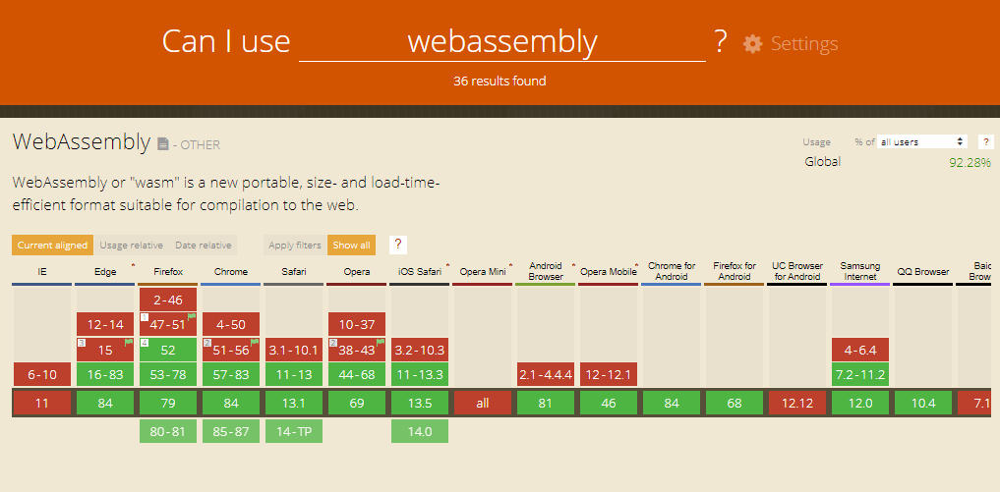
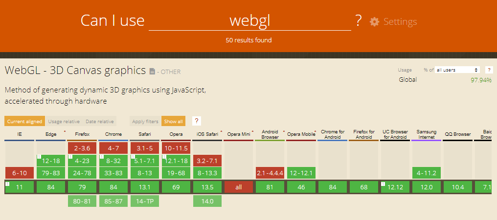
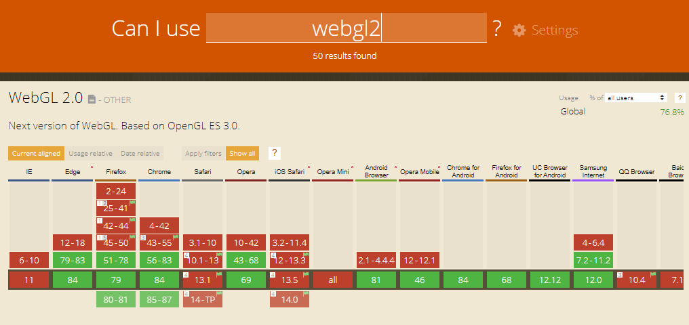

# Minimum Browser Requirements

Are you new to SciChart? Check out our most popular pages to get started
below:

- [SciChart.js Vanilla JavaScript
  Tutorials](Tutorial%2001%20-%20Setting%20up%20a%20Project%20with%20SciChart.js.html)   
- [The SciChartSurface Type](SciChartSurface.html)               
- [Series or Chart Types](What%20is%20a%20RenderableSeries.html)
- [Axis Types and Configuration](StartHere-AxisOverview.html)
- [Zooming & Panning](ZoomPanModifier.html)
- [Tooltips](RolloverModifier.html)
- [Annotations and Markers](The%20Annotations%20API%20Overview.html)
- [Styling and Themeing](Chart%20Styling%20-%20ThemeManager%20API.html)
- [Chart Synchronization APIs](Synchronizing%20Multiple%20Charts.html)
- [3D charts Basics](Creating%20your%20first%20SciChartSurface3D.html) 

SciChart.js is a cutting-edge next-generation JavaScript Chart Library.
As a result, we are using the latest technologies to draw our fast,
real-time and interactive JavaScript charts.

Minimum requirement for deployment of an application with SciChart.js is
**your browser must support WebAssembly (wasm) and WebGL 1 (preferably
WebGL 2).**

A full table of which browsers are supported can be found at
the [caniuse.com](https://caniuse.com/) website.

## WebAssembly (wasm) Minimum Browser Support

According
to [caniuse.com](https://caniuse.com/#search=webassembly),
95.12% of web modern browsers worldwide can use WebAssembly. This
includes all major browsers: Chrome, Edge, Firefox, Safari, Opera on
Windows, macOS, Linux as well as Android, iOS devices.

This compatibility % is set to increase as wasm becomes a standard
across browsers, led by Google Chrome and adopted by others.

Minimum versions are found below:

WebAssembly is supported on

- IE Edge v16 or later
- Firefox v52 or later
- Chrome v57 or later
- Safari v11 or later
- Opera v44 or later.
- Almost all modern mobile and desktop browsers support WebAssembly.

WebAssembly can be enabled in some earlier browsers can by adjusting
settings.
See [caniuse.com](https://caniuse.com/#search=webassembly)
for more information.

Note: WebAssembly support is not available on Internet Explorer 11, but
is available on IE Edge 16 or later, Google Chrome, FireFox and Safari

## WebGL 1 Minimum Browser Support

According
to [caniuse.com](https://caniuse.com/#search=webgl),
97.94% of web browsers worldwide support WebGL 1. SciChart achieves the
best performance with a WebGL 2 browser support, but all features are
available on WebGL 1.

Minimum versions can be found below

WebGL 1 is supported on

- IE Edge v12 or later
- Firefox v4 or later
- Chrome v8 or later
- Safari v5 or later
- Opera v12 or later.
- Almost all modern mobile and desktop browsers support WebGL 1

## WebGL 2 Minimum Browser Support

According
to [caniuse.com](https://caniuse.com/#search=webgl),
92.85% of web browsers worldwide now support WebGL 2. SciChart achieves
superior performance with WebGL 2, but will automatically drop down to
WebGL 1 where this latest API is not available.

 

WebGL 2 is supported on

- IE Edge v79 or later
- Firefox v51 or later
- Chrome v56 or later
- Safari iOS v 15 or later
- Safari mac v15 or later
- Firefox for Android v107
- Android Browser v108
- Opera mobile v72

Note: WebGL 2 support is not available on earlier versions of Safari
(Desktop or mobile), but in cases where WebGL 2 is not available
SciChart.js will automatically downgrade to WebGL 1.

 

 

 
