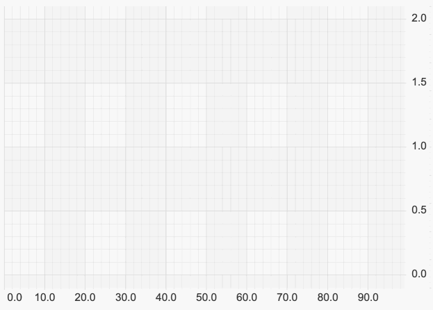

# Animations API Overview

Animations API Fundamentals
---------------------------

In SciChart.js you can use the Animations API to animate [RenderableSeries (Chart Types)](/2d-charts/chart-types/renderable-series-api-overview). The Animations API allows you to define a number of different transforms you your chart series during the render pass.

Additionally there are [Generic Animations](/2d-charts/animations-api/generic-animations), which are run on the SciChartSurface rather than a particular series, and can be coded to animate almost anything, such as annotations, data, and even things outside the chart.

The reset of this page introduces Series Animations.

For example. here is a Wave startup animation:

<CodeSnippetBlock labels={["Wave animation"]}>
    ```ts
const lineSeries = new FastLineRenderableSeries(wasmContext, {
    animation: new WaveAnimation({
        zeroLine: 0,
        pointDurationFraction: 0.5,
        duration: 2000,
        fadeEffect: true,
        delay: 1000
    })
});
    ```
</CodeSnippetBlock>



Types of Animation in SciChart.js
---------------------------------

There are three types of series animations in the SciChart.js library:

*   **[A start-up animation](/2d-charts/animations-api/series-startup-animations)**, which runs on start (when a series is shown)
*   **[A style animation](/2d-charts/animations-api/style-transition-animations)**, which animates style properties like stroke, strokeThickness and fill
*   **[A dataset animation](/2d-charts/animations-api/dataset-animations)**, which animates changing data.

Articles above cover these animation types and give you examples of how to use them.

Running or Queueing an Animation
--------------------------------

The API to run any of those animations is the same.

You can either run an animation immediately, or add it to the queue.

### Adding Animations to the Queue

Internally each renderable series has an animation queue which allows chaining animations. In order to add an animation to the queue call **enqueueAnimation:**

<CodeSnippetBlock labels={["Queue Animation"]}>
    ```ts
const someAnimation = new WaveAnimation({
    zeroLine: 0,
    pointDurationFraction: 0.5,
    duration: 2000,
    fadeEffect: true,
    delay: 1000
});
const lineSeries = new FastLineRenderableSeries(wasmContext);
lineSeries.enqueueAnimation(someAnimation);
    ```
</CodeSnippetBlock>

### Running an Animation Right Away

If there is a need to cancel all already running animations and run another animation use **runAnimation** method, or, alternatively setting the **BaseRenderableSeries.animation** property or passing the animation to the series constructor.


<CodeSnippetBlock labels={["Run Animation"]}>
    ```ts
// Cancels running animations and executes a new one immediately
lineSeries.runAnimation(someAnimation);

// or alternatively
lineSeries.animation = someAnimation;

// or alternatively
lineSeries = new FastLineRenderableSeries(wasmContext, { animation: someAnimation });
    ```
</CodeSnippetBlock>


See the articles in the **See Also** section below for examples of how to use the different animation types.

#### See Also

* [Style Transition Animations](/2d-charts/animations-api/style-transition-animations)
* [Dataset Animations](/2d-charts/animations-api/dataset-animations)
* [Series Startup Animations](/2d-charts/animations-api/series-startup-animations)
* [Generic Animations](/2d-charts/animations-api/generic-animations)
