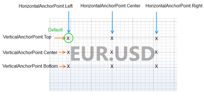

# Annotations API Overview

SciChart.js features a rich Annotations API, that allows you to place annotations (boxes, markers, text labels and custom shapes) over a chart: 

<ChartFromSciChartDemo src="https://www.scichart.com/demo/iframe/chart-annotations" title="Chart Annotations" description="" />

Annotations can provide **interactive** event/news bullets, horizontal/vertical lines (thresholds), text/callouts as well as measurements such as Peak-to-peak or cycle duration. Annotations can be edited by click & drag, added by touching a screen, or, simply created programmatically. SciChart provides a number of built-in annotations, but you can also create your own.

Annotation Types
----------------

The following annotation types are available out of the box in SciChart:

| Type | Description | Supported Chart Types |
|------|-------------|-----------------------|
| [BoxAnnotation](/2d-charts/annotations-api/box-annotation) | Draws a **rectangle** at specific X1, X2, Y1, Y2 coordinates. | Cartesian |
| [LineAnnotation](/2d-charts/annotations-api/line-annotation) | Draws a **line** between X1, Y1 and X2, Y2 positions. | Cartesian and Polar |
| [TextAnnotation](/2d-charts/annotations-api/text-annotation) | Allows to place a piece of **text** at a specific location on a chart. | Cartesian and Polar |
| [CustomAnnotation](/2d-charts/annotations-api/custom-annotation) | Allows to place any SVG Content at a specific location on a chart. | Cartesian and Polar |
| [VerticalLineAnnotation](/2d-charts/annotations-api/vertical-line-annotation) | Draws a vertical line at a given x position, with various labelling options | Cartesian |
| [HorizontalLineAnnotation](/2d-charts/annotations-api/horizontal-line-annotation) | Draws a horizontal line at a given y position, with various labelling options | Cartesian |
| [LineArrowAnnotation](/2d-charts/annotations-api/line-arrow-annotation) | Allows to place line arrows at a specific location on a chart | Cartesian and Polar |
| [AxisMarkerAnnotation](/2d-charts/annotations-api/axis-marker-annotation/axis-marker-annotation-overview) | Allows to place a marker at a specific location on an axis | Cartesian |
| [CustomAxisMarkerAnnotation](/2d-charts/annotations-api/axis-marker-annotation/image-axis-marker-annotation) | Uses an image instead of text for an axis marker | Cartesian |
| [NativeTextAnnotation](/2d-charts/annotations-api/native-text-annotation) | Draws text natively rather than using svg, supporting rotation, multiline, wordwrap and scaling | Cartesian and Polar |
| [HtmlCustomAnnotation](/2d-charts/annotations-api/html-annotation) | Allows to render arbitrary HTML content within a chart | Cartesian |
| [HtmlTextAnnotation](/2d-charts/annotations-api/html-annotation) | Allows to place HTML text at a specific location on a chart | Cartesian |
| [ArcAnnotation](/2d-charts/annotations-api/arc-annotation) | Allows to place arc element at a specific location on a cartesian chart. | Cartesian |
| [PolarArcAnnotation](/2d-charts/annotations-api/polar-arc-annotation) | Allows to place arc element at a specific location on a polar chart. | Polar |
| [PolarPointerAnnotation](/2d-charts/annotations-api/polar-pointer-annotation) | Allows to place a pointer on a polar chart. Is used for gauge charts | Polar |

Annotations have [surfaceTypes:blue_book:](https://www.scichart.com/documentation/js/v4/typedoc/interfaces/iannotation.html#surfacetypes) property, which defines list of compatible surface types. [ESurfaceType.SciChartSurfaceType:blue_book:](https://www.scichart.com/documentation/js/v4/typedoc/enums/esurfacetype.html#scichartsurfacetype) stands for regular (Cartesian) chart and [ESurfaceType.SciChartPolarSurfaceType:blue_book:](https://www.scichart.com/documentation/js/v4/typedoc/enums/esurfacetype.html#scichartpolarsurfacetype) stands for Polar chart.

:::tip
If an annotation is only compatible with Polar surfaces it has prefix "Polar" in the name. For example, PolarArcAnnotation works only with Polar surfaces. Annotations without the "Polar" prefix can be compatible with both surface types or only with Cartesian surfaces. For example, LineAnnotation is compatible with both surface types and BoxAnnotation is compatible only with Cartesian. 
:::

To learn more about any annotation type, please refer to the corresponding article.

Adding an Annotation to a Chart
-------------------------------

The [SciChartSurface:blue_book:](https://www.scichart.com/documentation/js/current/typedoc/classes/scichartsurface.html) stores all its annotations in the [SciChartSurface.annotations:blue_book:](https://www.scichart.com/documentation/js/current/typedoc/classes/scichartsurface.html#annotations) collection. The following code can be used to add an annotation to a chart:

<CodeSnippetBlock labels={["TS", "Builder API (JSON Config)"]}>
    ```ts {23} showLineNumbers file=./Basic/demo.ts start=region_A_start end=region_A_end

    ```
    ```ts {5} showLineNumbers file=./Basic/demo.ts start=region_B_start end=region_B_end

    ```
</CodeSnippetBlock>

This results in the following output:

<LiveDocSnippet maxWidth={"100%"} name="./Basic/demo" />

Individual Annotation features are discussed in greater detail in the following pages:

*   The [BoxAnnotation](/2d-charts/annotations-api/box-annotation) Type
*   The [LineAnnotation](/2d-charts/annotations-api/line-annotation) Type
*   The [TextAnnotation](/2d-charts/annotations-api/text-annotation) Type
*   The [CustomAnnotation](/2d-charts/annotations-api/custom-annotation) Type

Common Annotation Properties
----------------------------

All annotations in SciChart.js are derived from the [AnnotationBase:blue_book:](https://www.scichart.com/documentation/js/current/typedoc/classes/annotationbase.html) **type. Individual Annotations have additional properties however the following common properties of the [AnnotationBase:blue_book:](https://www.scichart.com/documentation/js/current/typedoc/classes/annotationbase.html) class listed below can be used to control all annotation types.**

| Property | Description |
|----------|-------------|
| **[annotationLayer:blue_book:](https://www.scichart.com/documentation/js/current/typedoc/classes/annotationbase.html#annotationlayer)** | Determines which canvas the annotation should be placed on. The default is [EAnnotationLayer.AboveChart:blue_book:](https://www.scichart.com/documentation/js/current/typedoc/enums/eannotationlayer.html), where annotations are displayed above the chart series. Setting this property to [EAnnotationLayer.BelowChart:blue_book:](https://www.scichart.com/documentation/js/current/typedoc/enums/eannotationlayer.html) places an annotation below series but above gridlines, axis bands and axis labels. Note that this method doesn't work with SVG based annotations such as [TextAnnotation:blue_book:](https://www.scichart.com/documentation/js/current/typedoc/classes/textannotation.html) and [CustomAnnotation:blue_book:](https://www.scichart.com/documentation/js/current/typedoc/classes/customannotation.html). Setting the property to [EAnnotationLayer.Background:blue_book:](https://www.scichart.com/documentation/js/current/typedoc/enums/eannotationlayer.html#background) places an annotation below all elements on the chart (series, axis bands, gridlines, axis labels). This method works with all annotation types including SVG, and is useful for placing watermarks on the chart. |
| **[xCoordinateMode:blue_book:](https://www.scichart.com/documentation/js/current/typedoc/classes/annotationbase.html#xcoordinatemode), [yCoordinateMode:blue_book:](https://www.scichart.com/documentation/js/current/typedoc/classes/annotationbase.html#ycoordinatemode)** | Determines how coordinates x1,y2,x2,y2 are used when placing the annotation. The default is [ECoordinateMode.DataValue:blue_book:](https://www.scichart.com/documentation/js/current/typedoc/enums/ecoordinatemode.html) where coordinates correspond to Data-values. [ECoordinateMode.Relative:blue_book:](https://www.scichart.com/documentation/js/current/typedoc/enums/ecoordinatemode.html) means coordinates are relative to the viewport. [ECoordinateMode.Pixel:blue_book:](https://www.scichart.com/documentation/js/current/typedoc/enums/ecoordinatemode.html) means coordinates are pixel values relative to the top-left of the viewport. |
| **[horizontalAnchorPoint:blue_book:](https://www.scichart.com/documentation/js/current/typedoc/classes/svgannotationbase.html#horizontalanchorpoint), [verticalAnchorPoint:blue_book:](https://www.scichart.com/documentation/js/current/typedoc/classes/svgannotationbase.html#verticalanchorpointproperty)** | Used to adjust the alignment of certain annotations.  Above: HorizontalAnchorPoint, VerticalAnchorPoint when applied to a TextAnnotation |
| **[isHidden:blue_book:](https://www.scichart.com/documentation/js/current/typedoc/classes/annotationbase.html#ishidden)** | Can be set to show or hide an annotation. |
| **[hovered:blue_book:](https://www.scichart.com/documentation/js/current/typedoc/classes/annotationbase.html#hovered), [isHovered:blue_book:](https://www.scichart.com/documentation/js/current/typedoc/classes/annotationbase.html#ishovered), [selectedChanged:blue_book:](https://www.scichart.com/documentation/js/current/typedoc/classes/annotationbase.html#selectedchanged), [isSelected:blue_book:](https://www.scichart.com/documentation/js/current/typedoc/classes/annotationbase.html#isselected)** | Annotations can be made interactive with selection and hover callbacks. See [Annotation Hover](/2d-charts/annotations-api/annotation-hover) for details. |
| **[resizeDirections:blue_book:](https://www.scichart.com/documentation/js/current/typedoc/classes/annotationbase.html#resizedirections)** | Allows you to specify which direction (X, Y, Xy) an annotation may be resized in. |
| **[dragStarted:blue_book:](https://www.scichart.com/documentation/js/current/typedoc/classes/annotationbase.html#dragstarted), [dragDelta:blue_book:](https://www.scichart.com/documentation/js/current/typedoc/classes/annotationbase.html#dragdelta), [dragEnded:blue_book:](https://www.scichart.com/documentation/js/current/typedoc/classes/annotationbase.html#dragended)** | Callbacks may be registered when an annotation is dragged by the user. |
| **[x1:blue_book:](https://www.scichart.com/documentation/js/current/typedoc/classes/annotationbase.html#x1), [x2:blue_book:](https://www.scichart.com/documentation/js/current/typedoc/classes/annotationbase.html#x2), [y1:blue_book:](https://www.scichart.com/documentation/js/current/typedoc/classes/annotationbase.html#y1), [y2:blue_book:](https://www.scichart.com/documentation/js/current/typedoc/classes/annotationbase.html#y2)** | Define the position of the annotation on the parent chart. Note that annotation position is also defined by the xCoordinateMode, yCoordinateMode properties. |
| **[xAxisId:blue_book:](https://www.scichart.com/documentation/js/current/typedoc/classes/annotationbase.html#xaxisid), [yAxisId:blue_book:](https://www.scichart.com/documentation/js/current/typedoc/classes/annotationbase.html#yaxisid)** | In a multiple-axis scenario, used to bind the annotation to a specific X or Y-Axis. <br/> **NOTE:** If the value is not supplied it will use the first axis. |
| **[isEditable:blue_book:](https://www.scichart.com/documentation/js/current/typedoc/classes/annotationbase.html#iseditable)** | If true, this annotation can be selected and dragged/resized. See [Editable Annotations](/2d-charts/annotations-api/editable-annotations) for more details. |
| **[clicked:blue_book:](https://www.scichart.com/documentation/js/current/typedoc/classes/annotationbase.html#clicked) / [onClick:blue_book:](https://www.scichart.com/documentation/js/current/typedoc/interfaces/iannotationbaseoptions.html#onclick)** | Event fired when the annotation is clicked. Works for both editable and non-editable annotations. The event arguments contain a point which gives the coordinates of where on the annotation it was clicked, relative to the top left corner. <br/>**NOTE:** If an editable annotation is already selected, clicking on it will fire **dragStarted**, but not **clicked**. |

More annotation properties and the inheritence hierachy may be viewed at the [AnnotationBase Typedoc page:blue_book:](https://www.scichart.com/documentation/js/current/typedoc/classes/annotationbase.html).

#### See Also

* [BoxAnnotation](/2d-charts/annotations-api/box-annotation)
* [LineAnnotation](/2d-charts/annotations-api/line-annotation)
* [CustomAnnotation](/2d-charts/annotations-api/custom-annotation)
* [TextAnnotation](/2d-charts/annotations-api/text-annotation)
