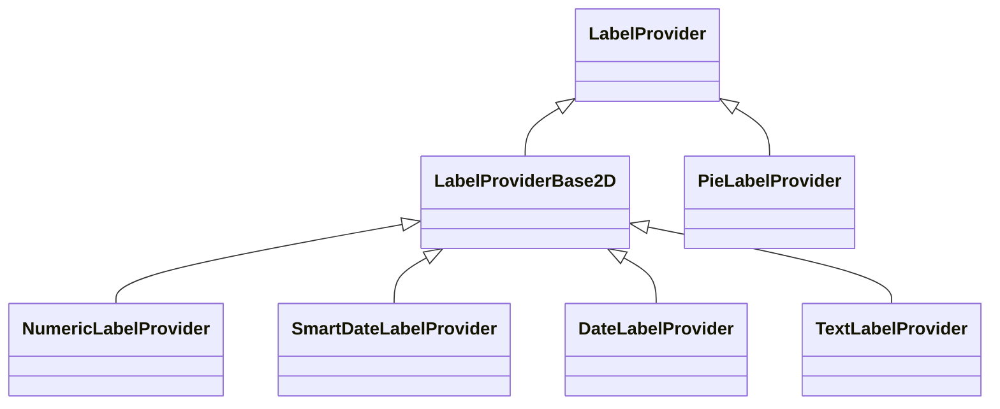

# ✅ Axis LabelProvider API Overview

All Axis Types include the [AxisCore.labelProvider:blue_book:](https://www.scichart.com/documentation/js/current/typedoc/classes/axiscore.html#labelprovider) property, which formats axis and cursor labels. Built in to SciChart.js are a number of labelProvider types, and you can even create your own.

The inheritance diagram for LabelProviders in SciChart.js looks like this:




All of these classes inherit LabelProviderBase2D. Below there is a mapping between which axis type has which labelprovider:

| Axis Type | LabelProvider Type |
|-----------|--------------------|
| **[NumericAxis](/docs/2d-charts/axis-api/axis-types/numeric-axis/index.md)** and **[PolarNumericAxis](/docs/2d-charts/axis-api/axis-types/polar-numeric-axis/index.mdx)** | [NumericLabelProvider:blue_book:](https://www.scichart.com/documentation/js/current/typedoc/classes/numericlabelprovider.html) |
| **[DateTimeNumericAxis](/docs/2d-charts/axis-api/axis-types/date-time-numeric-axis/index.md)** | [SmartDateLabelProvider:blue_book:](https://www.scichart.com/documentation/js/current/typedoc/classes/smartdatelabelprovider.html) |
| **[CategoryAxis](/docs/2d-charts/axis-api/axis-types/category-axis/index.md)** and **[PolarCategoryAxis](/docs/2d-charts/axis-api/axis-types/polar-category-axis/index.mdx)** | [DateLabelProvider:blue_book:](https://www.scichart.com/documentation/js/current/typedoc/classes/datelabelprovider.html) |
| **[LogarithmicAxis](/docs/2d-charts/axis-api/axis-types/logarithmic-axis/index.md)** | [LogarithmicLabelProvider:blue_book:](https://www.scichart.com/documentation/js/current/typedoc/classes/logarithmiclabelprovider.html) |

We've included examples of how to format labels via the built-in label providers in the above articles. Click on **NumericAxis** or **DateTimeNumericAxis** above for more info and a code sample.

Applying a LabelProvider to an axis
-----------------------------------

All axis (above) have a built-in LabelProvider. You can also apply a labelprovider to an axis with the following code:

**SmartDate Formatting Example**

<CodeSnippetBlock labels={["TS"]}>
    ```ts showLineNumbers
import { CategoryAxis, SmartDateLabelProvider  } from "scichart";  
sciChartSurface.xAxes.add(new CategoryAxis(wasmContext, {
             labelProvider: new SmartDateLabelProvider()
}));
    ```

</CodeSnippetBlock>

If you have an axis where the date range can change as the user zooms, the **SmartDateLabelProvider** provides dynamic date labels which automatically adjust based on the axis range. You can also create custom dynamic labelproviders. See the rest of this article for steps how to do this.

LabelProvider & LabelProviderBase2D
-----------------------------------

These are the base classes for all labelproviders in SciChart.js. Some of the properties they include can be found below.

The properties common to the **LabelProviderBase2D** / **LabelProvider** classes can be found in the [TypeDoc API documentation:blue_book:](https://www.scichart.com/documentation/js/current/typedoc/classes/labelproviderbase2d.html).

There are many options to format axis labels in SciChart.js via the labelProvider.

**In particular:**

* SciChart.js calls [axis.labelProvider.formatLabel(dataValue):blue_book:](https://www.scichart.com/documentation/js/current/typedoc/classes/labelproviderbase2d.html#formatlabel) to format each label on the axis and [axis.labelProvider.formatCursorLabel(dataValue):blue_book:](https://www.scichart.com/documentation/js/current/typedoc/classes/labelproviderbase2d.html#formatcursorlabel) to format each cursor label.

* The built-in implementation of formatLabel provides text formatting based on the [labelProvider.numericFormat:blue_book:](https://www.scichart.com/documentation/js/current/typedoc/classes/labelproviderbase2d.html#numericformat) & [labelProvider.cursorNumericFormat:blue_book:](https://www.scichart.com/documentation/js/current/typedoc/classes/labelproviderbase2d.html#cursornumericformat) properties.

* The number of decimal places (if applicable numericFormat is chosen) is specified by [labelProvider.precision:blue_book:](https://www.scichart.com/documentation/js/current/typedoc/classes/labelproviderbase2d.html#precision) property.

* A string prefix and postfix are provided by the [labelProvider.prefix:blue_book:](https://www.scichart.com/documentation/js/current/typedoc/classes/labelproviderbase2d.html#prefix) and [labelProvider.postFix:blue_book:](https://www.scichart.com/documentation/js/current/typedoc/classes/labelproviderbase2d.html#postfix) properties.

* A rotation angle may be specified by [labelProvider.rotation:blue_book:](https://www.scichart.com/documentation/js/current/typedoc/classes/labelproviderbase2d.html#rotation).

* Caching and native text (WebGL enabled text) may be turned on or off via the [labelProvider.useCache:blue_book:](https://www.scichart.com/documentation/js/current/typedoc/classes/labelproviderbase2d.html#usecache) or [useNativeText:blue_book:](https://www.scichart.com/documentation/js/current/typedoc/classes/labelproviderbase2d.html#usenativetext) property.

Setting LabelProvider properties
--------------------------------

LabelProvider properties can be set either on the labelProvider itself, or, in many cases can be set via the axis constructor options. The following code is equivalent:

<CodeSnippetBlock labels={["TS", "Builder API (Config)"]}>
    ```ts showLineNumbers file=./Properties/demo.ts start=region_A_start end=region_A_end

    ```
    ```ts showLineNumbers file=./Properties/demo.ts start=region_B_start end=region_B_end

    ```

</CodeSnippetBlock>

This code sample configures label providers on the X & Y axis with exactly the same properties:

<LiveDocSnippet maxWidth={"100%"} name="./Properties/demo" />

Overriding the formatLabel function
-----------------------------------

Say you wanted further customisation in the axis labels than what [axis.labelProvider.numericFormat:blue_book:](https://www.scichart.com/documentation/js/current/typedoc/classes/labelproviderbase2d.html#numericformat) offers, you can start by overriding the formatLabel and formatCursorLabel functions.

Take a look at the code sample below:

<CodeSnippetBlock labels={["TS", "Builder API (Config)"]}>
    ```ts showLineNumbers file=./FormatLabel/demo.ts start=region_A_start end=region_A_end

    ```
    ```ts showLineNumbers file=./FormatLabel/demo.ts start=region_B_start end=region_B_end

    ```

</CodeSnippetBlock>

The function formatLabel is overridden and called for each label on the xAxis. In this function we return a string format as hexadecimal to show how to customise labels even further.

<LiveDocSnippet maxWidth={"100%"} name="./FormatLabel/demo" />

Axis labels are formatted by [formatLabel:blue_book:](https://www.scichart.com/documentation/js/current/typedoc/classes/labelprovider.html#formatlabel). Tooltip values are formated by [formatCursorLabel:blue_book:](https://www.scichart.com/documentation/js/current/typedoc/classes/textlabelprovider.html#formatcursorlabel). This allows you to have different label formats for tooltips and axis.

Custom LabelProviders
---------------------

See the following sections with worked examples on how to create custom label providers:

#### See Also

* [Axis Label Formatting - Text / String Axis](/docs/2d-charts/axis-api/axis-types/text-string-axis/index.md)


