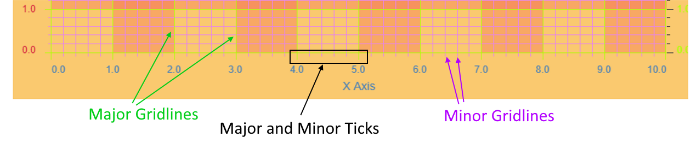
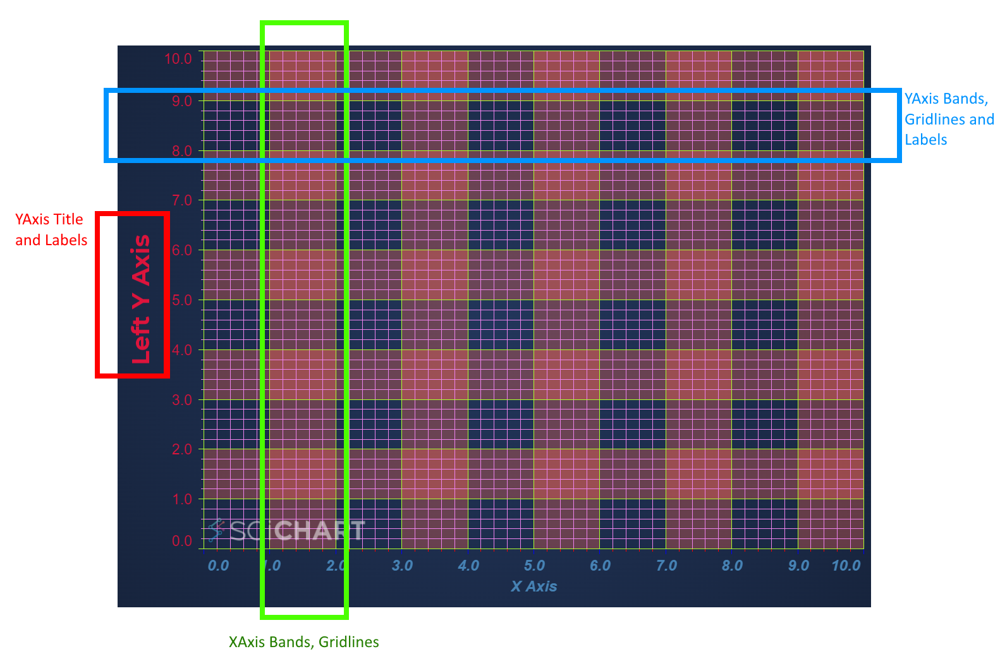

# Title, Labels, Gridlines and Axis Band Style

An Axis is responsible for drawing its labels, title but also the gridlines facing away from it. Gridlines are subdivided into four categories:

*   Major Gridlines (aligned with labels)
*   Minor Gridlines (between labels)
*   Major Ticks (small marks, outside the axis, aligned with labels)
*   Minor Ticks (small marks, outside the axis, between labels)

In addition to this an axis has:

*   Axis Labels (positioned at every major gridline)
*   Axis Title (positioned once, central on the axis)



Every aspect of the axis can be styled, including major and minor gridlines, tick lines, axis labels and the title. An outline of the chart parts can be found below:



Styling Axis Gridlines, Labels and Titles
-----------------------------------------

To recreate the image above, we can use the following code. We've chosen colours deliberately so you can see what parts are styled by which lines of code!

**Note:** Gridlines support dashed line via the [majorGridLineStyle.strokeDashArray:blue_book:](https://www.scichart.com/documentation/js/current/typedoc/classes/axiscore.html#majorgridlinestyleproperty.strokedasharray) and [minorGridLineStyle.strokeDashArray:blue_book:](https://www.scichart.com/documentation/js/current/typedoc/classes/axiscore.html#minorgridlinestyleproperty.strokedasharray) property. For more info about stroke dash to create dotted or dashed line patterns, see [Series Styling - Dash Line Patterns](/docs/2d-charts/styling-and-theming/dash-line-patterns)

**Note:** All colors in SciChart.js are strings, which are HTML color codes. Supported values are 6-digit hex codes e.g. "#ADFF2F", 8-digit hex codes in RGBA format where the last two digits are opacity e.g. "#AAFF2F33" and rgba CSS color codes e.g. "rgba(173, 255, 47, 0.3)" as well as "Red", "White" etc...

:::warning
In SciChart.js version 4 the default behavior has been changed to use [Native Text](/docs/2d-charts/axis-api/axis-labels/performance-considerations-native-text-axis-abels) for axis labels as it is more performant. However, the Native Text does not support bold and italic. If you need to apply this kind of styling for the axis labels set `useNativeText: false` in the constructor options.
:::

<CodeSnippetBlock labels={["TS", "Builder API (Config)"]}>
    ```ts showLineNumbers file=./Basic/demo.ts start=region_A_start end=region_A_end

    ```
    ```ts showLineNumbers file=./Basic/demo.ts start=region_B_start end=region_B_end

    ```

</CodeSnippetBlock>

This results in the following output:

<LiveDocSnippet maxWidth={"100%"} name="./Basic/demo" />

Rotation on labels and titles can be achieved by setting the rotation property. For more info read [Rotating Axis Labels](/docs/2d-charts/axis-api/axis-labels/rotating-axis-labels)

Finally, when using Axis NativeText for performance reasons, there are other considerations about fonts. Read the [Native Text article](/docs/2d-charts/axis-api/axis-labels/performance-considerations-native-text-axis-abels) for more info.

#### See Also

* [Styling a JavaScript Chart in code](https://demo.scichart.com/javascript-chart-styling-theming-in-code)
