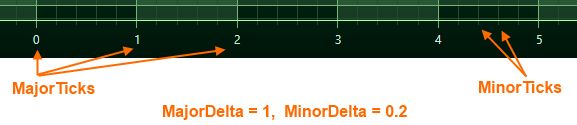

# Gridline and Label Spacing (Interval)

Axis Ticks, Labels and Grid Lines
---------------------------------

In SciChart.js, the **Ticks** are small marks around the chart on an axis. There are **Minor** and **Major** **Ticks**, where Minor Ticks are placed in between Major ones. **Axis Labels** appears for every Major Tick, and **Grid Lines** correspond to **Ticks** on an axis. 

In SciChart, **axes are responsible** not only for drawing Ticks and Labels, but also **for the chart grid**. So if you want to change the spacing of gridlines, labels or tick marks, you need to use the APIs to change Axis Tick spacing.



Automatic Gridline, Label or Tick Spacing
-----------------------------------------

In SciChart.js, the difference between two Major Gridlines is defined by [axisCore.MajorDelta:blue_book:](https://www.scichart.com/documentation/js/current/typedoc/classes/axiscore.html#majordelta). The difference between two minor gridlines is defined by [axisCore.MinorDelta:blue_book:](https://www.scichart.com/documentation/js/current/typedoc/classes/axiscore.html#minordelta).

By default, **MajorDelta** and **MinorDelta** values are calculated automatically when [axis.autoTicks:blue_book:](https://www.scichart.com/documentation/js/current/typedoc/classes/axiscore.html#autoticks) = true. Major/Minor deltas are calculated dynamically according to the [VisibleRange](/docs/2d-charts/axis-api/ranging-scaling/set-range-zoom-to-fit/) and size of an axis in pixels. This means as you zoom and pan, these properties are updated and you get a dynamic gridline spacing effect.

### Configuring Automatic Tick Spacing

If you want to congigure Automatic Tick Spacing, do the following:

*   set [axis.autoTicks:blue_book:](https://www.scichart.com/documentation/js/current/typedoc/classes/axiscore.html#autoticks) = true
*   set [axis.maxAutoTicks:blue_book:](https://www.scichart.com/documentation/js/current/typedoc/classes/axiscore.html#maxautoticks) = a numeric value (e.g. 10)
*   set [axis.minorsPerMajor:blue_book:](https://www.scichart.com/documentation/js/current/typedoc/classes/axiscore.html#minorspermajor) property = a numeric value (e.g. 5)

With a configuration like the above, SciChart.js will calculate tick spacing on the axis with up to 10 major gridlines / labels and 5 minor gridlines per major.

Note: [axis.maxAutoTicks:blue_book:](https://www.scichart.com/documentation/js/current/typedoc/classes/axiscore.html#maxautoticks) is a hint. The axis will not output this exact number of ticks, but rather dynamically vary gridline spacing depending on zoom up to this amount.

<CodeSnippetBlock labels={["TS", "Builder API (Config)"]}>
    ```ts showLineNumbers file=./AutoTicks/demo.ts start=region_A_start end=region_A_end

    ```
    ```ts showLineNumbers file=./AutoTicks/demo.ts start=region_B_start end=region_B_end

    ```

</CodeSnippetBlock>

This results in the following output:

<LiveDocSnippet maxWidth={"100%"} name="./AutoTicks/demo" />

Specifying Major & Minor Deltas
-------------------------------

There are two methods to control gridline & label spacing in SciChart.js. The first is the simplest, by specifying axis major & minor delta.

*   set [axis.autoTicks:blue_book:](https://www.scichart.com/documentation/js/current/typedoc/classes/axiscore.html#autoticks) = **false**
*   set [axis.majorDelta:blue_book:](https://www.scichart.com/documentation/js/current/typedoc/classes/axiscore.html#maxautoticks) = a numeric value (e.g. 2)
*   set [axis.minorDelta:blue_book:](https://www.scichart.com/documentation/js/current/typedoc/classes/axiscore.html#minorspermajor) = a numeric value (e.g. 0.4)

With a configuration like the above, SciChart.js will calculate tick spacing on the axis exactly an interval of 2 between major gridlines / labels and 0.4 between minor gridlines.

<CodeSnippetBlock labels={["TS", "Builder API (Config)"]}>
    ```ts showLineNumbers file=./AutoTicksFalse/demo.ts start=region_A_start end=region_A_end

    ```
    ```ts showLineNumbers file=./AutoTicksFalse/demo.ts start=region_B_start end=region_B_end

    ```

</CodeSnippetBlock>

This results in the following output:

<LiveDocSnippet maxWidth={"100%"} name="./AutoTicksFalse/demo" />

**Note**: that Major/Minor Delta behaves differently for the Logarithmic Axis.

Dynamic Control of Gridline, Label & Tick Spacing on Zoom
---------------------------------------------------------

The above method of setting Major/Minor Delta could be dynamic if you combine with [Listening to Axis Range Changes](/docs/2d-charts/axis-api/ranging-scaling/listen-to-visible-range-changes).

However, if you want to have finer grained control over axis gridline, label or minor gridline spacing, then read [The Tick Provider API Documentation](/docs/2d-charts/axis-api/axis-tick-label-interval/tick-provider-api).
