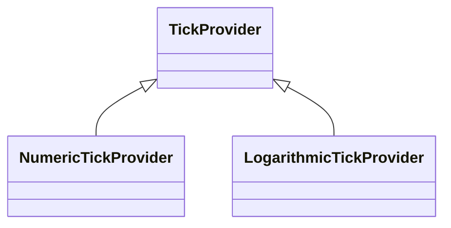

# The TickProvider API

If you want to have absolute control over the gridlines, labels and minor gridline spacing in SciChart.js, you can use the **TickProvider API**.

Every axis implementation has an [axisCore.tickProvider:blue_book:](https://www.scichart.com/documentation/js/current/typedoc/classes/axiscore.html#tickprovider) property. This accepts a class which inherits [TickProvider:blue_book:](https://www.scichart.com/documentation/js/current/typedoc/classes/tickprovider.html). Several classes are built-in such as [NumericTickProvider:blue_book:](https://www.scichart.com/documentation/js/current/typedoc/classes/numerictickprovider.html) and [LogarithmicTickProvider:blue_book:](https://www.scichart.com/documentation/js/current/typedoc/classes/logarithmictickprovider.html) which SciChart uses internally.

The inheritance diagram for TickProviders in SciChart.js looks like this:



You can create your own TickProvider if you want to have absolute control over the axis gridlines and label spacing. This API allows you to create some pretty advanced customisations with SciChart.js that are hard to achieve otherwise.

Example 1: Our NumericTickProvider  
------------------------------------

Below here how our [NumericTickProvider:blue_book:](https://www.scichart.com/documentation/js/current/typedoc/classes/numerictickprovider.html) is implemented. This code is shared for example purposes so you can see the inner workings of this class. **For a worked example, scroll down**.

In the code below:

*   The method [getMajorTicks():blue_book:](https://www.scichart.com/documentation/js/current/typedoc/classes/numerictickprovider.html#getmajorticks) returns an array of values where you want to place major gridlines and labels.
*   The method [getMinorTicks():blue_book:](https://www.scichart.com/documentation/js/current/typedoc/classes/numerictickprovider.html#getminorticks) returns an array of values where you want to place minor gridlines.

Both arrays are in data-coordinates, not pixels. E.g. if your Chart has data between 0..10 then you want to set major gridlines at 2,4,6,8 then return [2, 4, 6, 8] as an array from getMajorTicks.

<CodeSnippetBlock labels={["NumericTickProvider source code v4.0"]}>
    ```ts showLineNumbers
export class NumericTickProvider extends TickProvider {
        private readonly minDeltaValue: number = 1e-13;
        private webAssemblyContext: TSciChart | TSciChart3D;

        /**
        * Creates an instance of a NumericTickProvider
        * @param webAssemblyContext The {@link TSciChart | SciChart 2D WebAssembly Context} or {@link TSciChart | SciChart 3D WebAssembly Context}
        * containing native methods and access to our WebGL2 WebAssembly Rendering Engine
        */
        constructor(webAssemblyContext: TSciChart | TSciChart3D) {
            super();
            this.webAssemblyContext = webAssemblyContext;
        }

        /**
        * @inheritDoc
        */
        public getMinorTicks(minorDelta: number, majorDelta: number, visibleRange: NumberRange): number[] {
            const deltaRange = new NumberRange(minorDelta, majorDelta);
            const tickRange = visibleRange;
            if (!this.isParamsValid(tickRange, deltaRange)) {
                return [];
            }
            return this.calculateTicks(tickRange, deltaRange.min, deltaRange.max);
        }

        /**
        * @inheritDoc
        */
        public getMajorTicks(minorDelta: number, majorDelta: number, visibleRange: NumberRange): number[] {
            const deltaRange = new NumberRange(minorDelta, majorDelta);
            const tickRange = visibleRange;
            if (!this.isParamsValid(tickRange, deltaRange)) {
                return [];
            }
            return this.calculateTicks(tickRange, deltaRange.max, deltaRange.max);
        }

        /**
        * @summary Performs sanity checks to see if parameters are valid.
        * @description If this method returns false, then we should not process or compute major/minor gridlines, but instead should
        * return empty array ```[]``` in {@link getMajorTicks} / {@link getMinorTicks}
        * @param visibleRange The current {@link AxisCore.visibleRange} which is the minimum / maximum range visible on the Axis.
        * @param deltaRange The current {@link AxisCore.minorDelta} and {@link AxisCore.majorDelta} which is the difference between minor
        * and major gridlines requested by the {@link AxisCore | Axis}
        */
        protected isParamsValid(visibleRange: NumberRange, deltaRange: NumberRange): boolean {
            Guard.notNull(visibleRange, "visibleRange");
            Guard.notNull(deltaRange, "deltaRange");

            return (
                isRealNumber(visibleRange.min) && isRealNumber(visibleRange.max) && deltaRange.min > 0 && deltaRange.max > 0
            );
        }

        /**
        * @summary Performs the Numeric tick calculation
        * @param visibleRange The current {@link AxisCore.visibleRange} which is the minimum / maximum range visible on the Axis.
        * @param delta The delta we are calculating for (could be major or minor delta)
        * @param majorDelta The current {@link AxisCore.majorDelta} which is the difference between major
        * gridlines requested by the {@link AxisCore | Axis}
        */
        protected calculateTicks(visibleRange: NumberRange, delta: number, majorDelta: number): number[] {
            const results: number[] = [];
            const min = visibleRange.min;
            const max = visibleRange.max;

            const calcMajorTicks = delta === majorDelta;

            const numberUtil = this.webAssemblyContext.NumberUtil;
            // Skip the divisiblity check here as it can return true if the min is within epsilon of being divisible,
            // but false for min + delta, leading to only one tick being output.
            let current = numberUtil.RoundUp(min, delta);

            const start = current;
            let tickCount = 0;
            while (current <= max) {
                // TRUE if major ticks are calculated && Current is divisible by MajorDelta
                // or if minor ticks are calculated && Current is NOT divisible by MajorDelta
                if (!(numberUtil.IsDivisibleBy(current, majorDelta) !== calcMajorTicks)) {
                    results.push(current);
                }
                current = start + ++tickCount * delta;
            }

            return results;
        }
}
    ```

</CodeSnippetBlock>

Example 2: Custom TickProvider
------------------------------

Below we've included a worked example of a custom tickprovider. This is a very simplistic implementation that returns hard-coded spacings for major & minor gridlines. However, it could be easily customised to behave dynamically based on the minorDelta, majorDelta and visibleRange passed into the getMajorTicks/getMinorTicks functions.

First, create the TickProvider class and implement getMajorTicks/getMinorTicks:

<CodeSnippetBlock labels={["TS"]}>
    ```ts showLineNumbers file=./TickProvider/demo.ts start=region_A_start end=region_A_end

    ```

</CodeSnippetBlock>

Then, apply the TickProvider to an axis like this:

<CodeSnippetBlock labels={["TS", "Builder API (Config)"]}>
    ```ts showLineNumbers file=./TickProvider/demo.ts start=region_B_start end=region_B_end

    ```
    ```ts showLineNumbers file=./TickProvider/demo.ts start=region_C_start end=region_C_end

    ```

</CodeSnippetBlock>

This results in an uneven spacing of ticklines or gridlines in SciChart which looks like this:

<LiveDocSnippet maxWidth={"100%"} name="./TickProvider/demo" />

You can customize TickProviders further and even return dynamic arrays. For example, if you wanted to ensure an equally sized grid independent of zoom level, or to dynamically change the number of gridlines on screen, you can do it with the TickProvider API.
