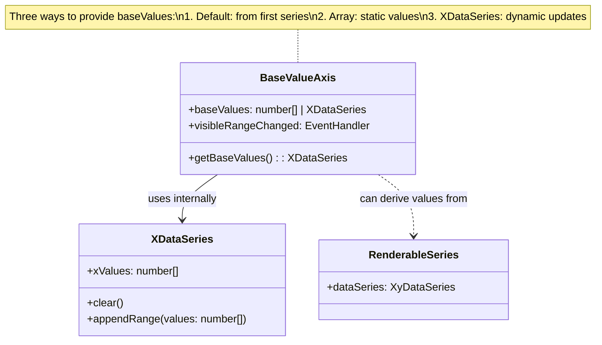
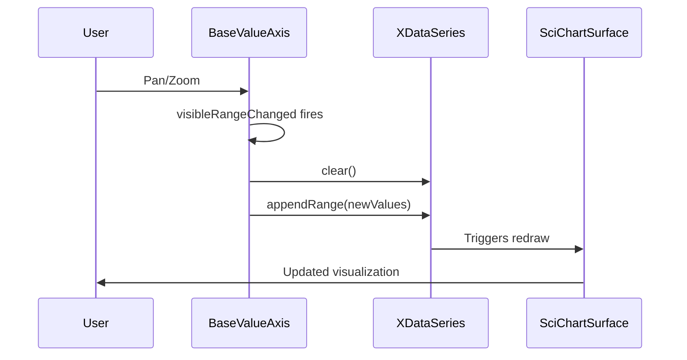

# Base Value Axis

## Overview

The `BaseValueAxis` is a specialized axis type in SciChart.js that allows you to define a non-linear coordinate system by specifying custom "base values" that determine how data is mapped to screen coordinates. This is useful for creating distorted or magnified views of specific data regions.

## Providing Base Values

There are three ways to provide base values to a `BaseValueAxis`:

### 1. Default Behavior: X Values from First Series

If you don't specify any `baseValues`, the axis will automatically use the x-values from the first renderable series attached to it. This is the simplest approach when your data points naturally define the coordinate mapping you want.

```typescript
const xAxis = new BaseValueAxis(wasmContext, {
    visibleRange: new NumberRange(0, 10),
    // No baseValues specified - will use x values from first series
});
```

### 2. Static Array of Values in Constructor

For static, predefined coordinate mappings, you can pass an array of numbers directly to the `baseValues` property. This is ideal when you know the exact distribution of values at construction time and don't need to update them dynamically.

```typescript
const xAxis = new BaseValueAxis(wasmContext, {
    visibleRange: new NumberRange(-0.1, 10.1),
    baseValues: [0, 1, 2, 3, 4, 4.5, 4.6, 4.7, 4.8, 4.9, 5, 5.1, 5.2, 5.3, 5.4, 5.5, 6, 7, 8, 9, 10],
});
```

In this example, values around 5 are more densely packed, creating a "magnified" region in that area of the axis.

### 3. XDataSeries for Dynamic Updates

For scenarios where you need to update the base values at runtime, you can provide an [XDataSeries:blue_book:](https://www.scichart.com/documentation/js/v5/typedoc/classes/xdataseries.html) instance. This approach gives you full control over the coordinate mapping and allows you to modify it in response to user interactions or data changes.

```typescript
// Create an XDataSeries to hold the base values
const baseYValueSeries = new XDataSeries(wasmContext, {
    xValues: generatePowerLawBaseValues(initialVisibleRange, powerLawBase),
});

// Pass the XDataSeries to the axis
const yAxis = new BaseValueAxis(wasmContext, {
    visibleRange: initialVisibleRange,
    baseValues: baseYValueSeries,
});

// Update the base values dynamically when the visible range changes
yAxis.visibleRangeChanged.subscribe((data) => {
    baseYValueSeries.clear();
    baseYValueSeries.appendRange(
        generatePowerLawBaseValues(yAxis.visibleRange, powerLawBase)
    );
});
```

You can also retrieve the internal `XDataSeries` from an axis that was initialized with an array:

```typescript
const xAxis = new BaseValueAxis(wasmContext, {
    baseValues: [0, 1, 2, 3, 4, 5],
});

// Get the underlying XDataSeries for dynamic updates
const baseXValues = xAxis.getBaseValues() as XDataSeries;

// Later, update the values
baseXValues.clear();
baseXValues.appendRange([0, 1, 2, 2.5, 3, 3.5, 4, 5]);
```

## Comparison of Approaches

| Approach | Use Case | Dynamic Updates | Complexity |
|----------|----------|-----------------|------------|
| Default (first series) | Simple charts where data defines the mapping | Via data series | Low |
| Array in constructor | Static, known coordinate distributions | Via `getBaseValues()` | Low |
| XDataSeries | Dynamic mappings, user interactions, range-dependent values | Direct manipulation | Medium |

## Architecture Diagram



## Data Flow for Dynamic Updates


