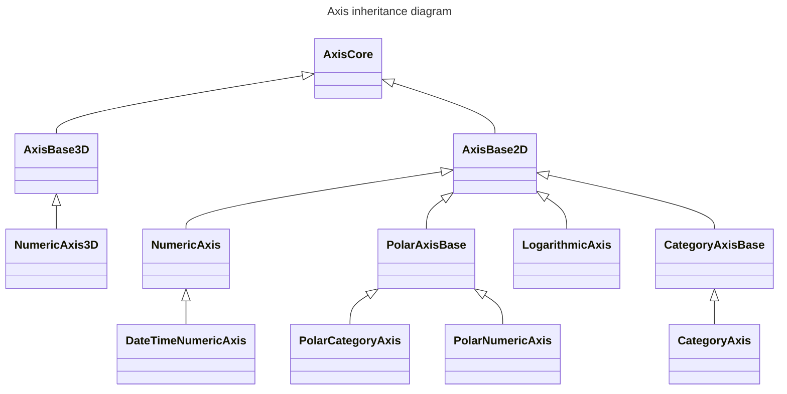

# Common Axis Base Type and Options

Common Axis Base Type and Options

All the axis types in SciChart inherit from [AxisCore:blue_book:](https://www.scichart.com/documentation/js/current/typedoc/classes/axiscore.html) - a common type shared across both 2D and 3D Charts - and all 2D Axis inherit **[AxisBase2D:blue_book:](https://www.scichart.com/documentation/js/current/typedoc/classes/axisbase2d.html)**. 

The inheritance diagram for Axis in SciChart.js looks like this:

Common Properties on an Axis
----------------------------

Common properties on an axis allow you to configure the following things:

*   Showing/hiding and styling of Gridlines 
*   Showing/hiding and styling of labels
*   Alignment of the axis
*   Formatting of labels
*   Getting / setting visibleRange or padding
*   Getting / setting ID - used in multi-axis scenarios
*   Styling border, background
*   Setting axis title

The properties common to the **AxisBase2D** / **AxisCore** classes can be found in the [TypeDoc API documentation:blue_book:](https://www.scichart.com/documentation/js/current/typedoc/classes/axisbase2d.html).

Specific Axis Types
-------------------

The following sections go into further details for specific axis types, as well as giving code samples on how to configure and use each axis.

| Axis Type | Description |
|-----------|-------------|
| **[NumericAxis](/2d-charts/axis-api/axis-types/numeric-axis)** | Value Axis / Numeric Types |
| **[PolarNumericAxis](/2d-charts/axis-api/axis-types/polar-numeric-axis)** | Value Axis / Numeric Types for [Polar Charts](/2d-charts/surface/scichart-polar-surface-type) |
| **[DateTimeNumericAxis](/2d-charts/axis-api/axis-types/date-time-numeric-axis)** | Value Axis with additional features for Dates and Time formatting |
| **[CategoryAxis](/2d-charts/axis-api/axis-types/category-axis)** | Category Axis - measures using index - Numeric Types or Dates |
| **[PolarCategoryAxis](/2d-charts/axis-api/axis-types/polar-category-axis)** | Category Axis for [Polar Charts](/2d-charts/surface/scichart-polar-surface-type) - measures using index - Numeric Types or Dates |
| **[LogarithmicAxis](/2d-charts/axis-api/axis-types/logarithmic-axis)** | Logarithmic Axis supporting Base2, BaseE, Base10 with or without scientific notation |
