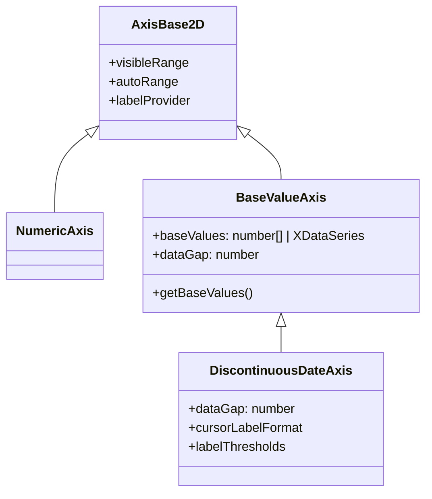

# Discontinuous Date Axis

## Overview

The [DiscontinuousDateAxis:blue_book:](http://stagingdemo.scichart.com/documentation/js/v5/typedoc/classes/discontinuousdateaxis.html) is a specialized axis type in SciChart.js that **inherits from `BaseValueAxis`** and provides intelligent handling of time-series data with gaps. Unlike a standard `NumericAxis` or `DateTimeNumericAxis`, it interpolates data based on a **fixed timescale after each baseValue**, effectively collapsing gaps (such as weekends, holidays, or after-hours periods in financial data) while maintaining proper time-based positioning within each segment.

## Inheritance Hierarchy



## How It Works

The `DiscontinuousDateAxis` uses **baseValues** (inherited from `BaseValueAxis`) to define anchor points in time. Between these anchor points, it interpolates using a fixed `dataGap` interval. This creates a coordinate system where:

1. **BaseValues** define the primary time points (e.g., daily candle timestamps)
2. **DataGap** specifies the fixed interval between consecutive baseValues (e.g., `24 * 60 * 60` for daily data)
3. Data points falling between baseValues are positioned proportionally within that segment
4. Gaps in the data (weekends, holidays) are automatically collapsed

## Key Properties

| Property | Type | Description |
|----------|------|-------------|
| [`dataGap`](Examples/src/components/Examples/Charts2D/ModifyAxisBehavior/DiscontinuousDateAxisComparison/drawExample.ts:138) | `number` | The fixed time interval between baseValues in seconds. Auto-calculated from minimum gap if not specified. |
| `baseValues` | `number[]` or `XDataSeries` | The anchor time points. Defaults to x-values from the first data series. |
| [`cursorLabelFormat`](Examples/src/components/Examples/Charts2D/BasicChartTypes/CandlestickChart/drawExample.ts:56) | `ENumericFormat` | Format for cursor/crosshair labels |
| [`labelThresholds`](Examples/src/components/Examples/Charts2D/BasicChartTypes/CandlestickChart/drawExample.ts:58) | `object` | Thresholds for smart date label formatting |

## Use Cases

### 1. Stock Market / Financial Charts

The primary use case is displaying OHLC (candlestick) data where markets are closed on weekends and holidays. From [`CandlestickChart/drawExample.ts`](Examples/src/components/Examples/Charts2D/BasicChartTypes/CandlestickChart/drawExample.ts:52-59):

```typescript
const xAxis = new DiscontinuousDateAxis(wasmContext, {
    autoRange: EAutoRange.Never,
    cursorLabelFormat: ENumericFormat.Date_HHMM,
    labelThresholds: { [ETradeChartLabelFormat.Minutes]: 60 * 60 * 24 * 10 },
});
```

### 2. Multi-Pane Stock Charts

When creating synchronized multi-pane charts (price, MACD, RSI), all panes can share the same discontinuous time scale.

```typescript
chart1XAxis = new DiscontinuousDateAxis(wasmContext, {
    drawLabels: false,
    drawMajorTickLines: false,
    drawMinorTickLines: false,
});
```

### 3. Comparing Multiple Data Series with Different Point Counts

The **DiscontinuousDateAxisComparison example** demonstrates a key advantage: unlike `CategoryAxis`, the `DiscontinuousDateAxis` supports:

- **Multiple points at the same x-value**
- **Data series with different numbers of points**
- **Points positioned between baseValues**

```typescript
// X values from the first series are used as baseXValues unless specified explicitly
const startDate = new Date(Date.UTC(2024, 0, 6, 0, 0, 0, 0));
const startTime = startDate.getTime() / 1000;

// OHLC series defines the base time points
const ohlcSeries = new OhlcDataSeries(wasmContext, {
    xValues: [1, 2, 3, 4, 5, 8, 9, 10, 11, 12, 15, 16].map((x) => startTime + x * 24 * 60 * 60),
    // ... OHLC values
});

// This series has points at the same x and between baseValues - works with DiscontinuousDateAxis!
const dataSeries1 = new XyDataSeries(wasmContext, {
    xValues: [1, 2, 2, 5, 5.5, 8, 9, 9.5, 9.8, 11, 15, 16].map((x) => startTime + x * 24 * 60 * 60),
    yValues: [2, 5, 4, 6.2, 3, 3, 2.3, 3, 4, 5, 3, 3],
});

// This series has fewer points - also works!
const dataSeries2 = new XyDataSeries(wasmContext, {
    xValues: [1, 3, 5, 8, 11, 16].map((x) => startTime + x * 24 * 60 * 60),
    yValues: [3, 6, 5, 7.21, 4, 4],
});
```

## Comparison: DiscontinuousDateAxis vs CategoryAxis vs NumericAxis

| Feature | NumericAxis | CategoryAxis | DiscontinuousDateAxis |
|---------|-------------|--------------|----------------------|
| Collapses gaps | ❌ | ✅ | ✅ |
| True time positioning | ✅ | ❌ | ✅ (within segments) |
| Multiple series with different point counts | ✅ | ❌ | ✅ |
| Multiple points at same x-value | ✅ | ❌ | ✅ |
| Points between base values | ✅ | ❌ | ✅ |

## Configuration Example

```typescript
const xAxisDiscontinuous = new DiscontinuousDateAxis(wasmContext, {
    growBy: new NumberRange(0.05, 0.05),
    // Fixed gap between baseValues - should be set to avoid auto-calculation
    dataGap: 24 * 60 * 60, // One day in seconds
    cursorLabelFormat: ENumericFormat.Date_DDMMHHMM,
    axisTitle: "Discontinuous Date X Axis - Fixed gap between baseValues",
});

// Optional: Custom label provider and explicit tick deltas
xAxisDiscontinuous.labelProvider = new DayOfWeekLabelProvider({
    cursorLabelFormat: ENumericFormat.Date_DDMMHHMM,
});
xAxisDiscontinuous.autoTicks = false;
xAxisDiscontinuous.majorDelta = 24 * 60 * 60;
xAxisDiscontinuous.minorDelta = 4 * 60 * 60;
```

## Best Practices

1. **Always specify `dataGap`** when possible to avoid auto-calculation overhead
2. **Use `SmartDateLabelProvider`** for intelligent date formatting across zoom levels
3. **Synchronize axes** when using multiple panes with the same time scale
4. **Set `autoRange: EAutoRange.Never`** when manually controlling the visible range

## Related Documentation

- [SciChart.js DiscontinuousDateAxis Documentation](https://www.scichart.com/documentation/js/v4/DiscontinuousDateAxis.html)
