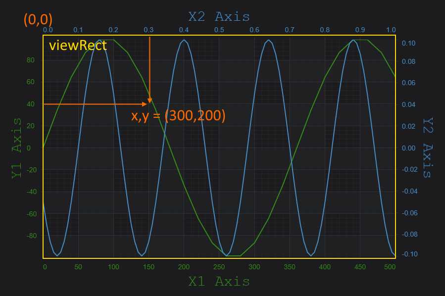
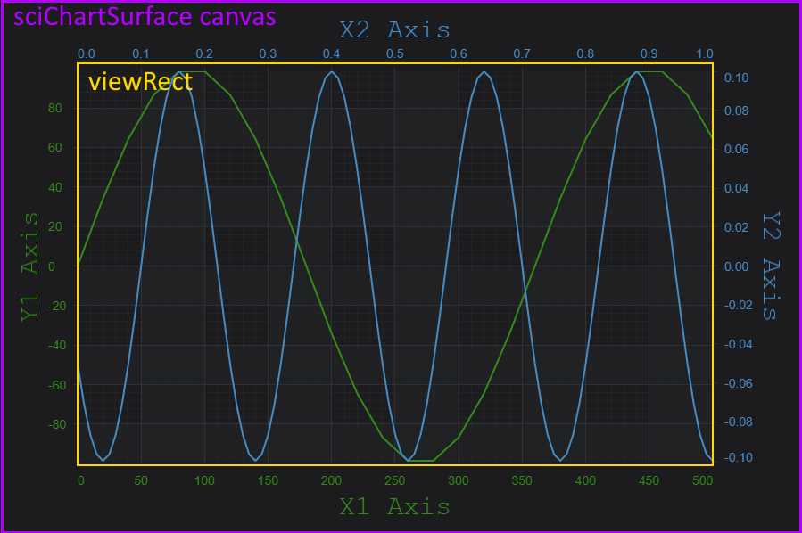

# Axis APIs - Convert Pixel to Data Coordinates

SciChart.js provides a clean and simple API to transform pixels to data-values and vice versa via the CoordinateCalculator API.

Where Pixel Coordinates are measured from
-----------------------------------------

It is important to note when converting Pixels to Data Coordinates and vice versa that pixels are measured from the top-left inside corner of the series area of the chart known as the [viewRect:blue_book:](https://www.scichart.com/documentation/js/current/typedoc/classes/axisbase2d.html#viewrect). So, the pixel coordinate (0,0) corresponds to the data-value at [xAxis.visibleRange.min, yAxis.visibleRange.max] and the pixel coordinate (Width, Height) corresponds to the data-value at [xAxis.visibleRange.max, yAxis.visibleRange.min].

:::tip
Learn about Axis.VisibleRange and how to get/set this property at the page: [Axis Ranging - Setting and Getting VisibleRange](/docs/2d-charts/axis-api/ranging-scaling/set-range-zoom-to-fit)
:::



Converting between Pixels and Data Coordinates
----------------------------------------------

To convert between pixel and data coordinates, you must first get a [CoordinateCalculator:blue_book:](https://www.scichart.com/documentation/js/current/typedoc/classes/coordinatecalculatorbase.html) instance. This is retrieved with the following code.

<CodeSnippetBlock labels={["Getting a CoordinateCalculator"]}>
    ```ts
const xAxis = sciChartSurface.xAxes.get(0); // Type AxisBase2D
const coordCalc = xAxis.getCurrentCoordinateCalculator(); // Type CoordinateCalculatorBase
    ```
</CodeSnippetBlock>


Data-values are converted to pixel coordinates via the [coordinateCalculator.getCoordinate():blue_book:](https://www.scichart.com/documentation/js/current/typedoc/classes/coordinatecalculatorbase.html#getcoordinate) method. Also, Coordinates in pixels are converted back to chart data-values via the [coordinateCalculator.getDataValue():blue_book:](https://www.scichart.com/documentation/js/current/typedoc/classes/coordinatecalculatorbase.html#getdatavalue) method. It expects a coordinate in pixels and returns the closest data value to that coordinate.

All coordinates are relative to the [viewRect:blue_book:](https://www.scichart.com/documentation/js/current/typedoc/classes/axisbase2d.html#viewrect) - the area where series are drawn inside the axis on the [SciChartSurface](/docs/2d-charts/surface/scichart-surface-type-overview).

You can find some examples how to do the conversions below.

### Converting NumericAxis Data to Pixels

The [NumericAxis:blue_book:](https://www.scichart.com/documentation/js/current/typedoc/enums/eaxistype.html#numericaxis) is a Value-Axis which uses data-values for measurement. It can be used to display numbers, or dates (stored as unix time stamps) formatted as date/time using the [LabelProvider](/docs/2d-charts/axis-api/axis-labels/label-provider-api-overview) feature.

To convert between pixel-coordinates relative to viewRect and data-values on a NumericAxis, use the following code.

<CodeSnippetBlock labels={["TS"]}>
    ```ts
const xAxis = sciChartSurface.xAxes.get(0); // Type AxisBase2D
const coordCalc = xAxis.getCurrentCoordinateCalculator(); // Type CoordinateCalculatorBase
// Gets the pixel coordinate relative to viewRect for data-value 1.23 on this axis only
const coord = coordCalc.getCoordinate(1.23);

// Converts a pixel coordinate back to dataValue
const dataValue= coordCalc.getDataValue(coord);

// dataValue should === 1.23
    ```
</CodeSnippetBlock>

### Converting CategoryAxis Data to/from Pixels

[CategoryAxis:blue_book:](https://www.scichart.com/documentation/js/current/typedoc/enums/eaxistype.html#categoryaxis) are treated slightly differently. This axis type can also be used to display numbers, or dates (stored as unix time stamps) but we must perform an extra step to convert between data-value, index and pixel coordinate.

A Category Axis uses the index to data not the data-value itself for measurement. Learn more about Category Axis at the page [Category Axis in SciChart.js](/docs/2d-charts/axis-api/axis-types/category-axis)

<CodeSnippetBlock labels={["Category Coordinate conversion"]}>
    ```ts
import { CategoryCoordinateCalculator, CategoryAxis } from "scichart";

const xAxis = new CategoryAxis(wasmContext);
// Get the CoordinateCalculator
const coordCalc = xAxis.getCurrentCoordinateCalculator();
// OR TypeScript only, cast as CategoryCoordinateCalculator
const coordCalc = xAxis.getCurrentCoordinateCalculator() as CategoryCoordinateCalculator;
// Get the pixel coordinate at index=10
const coord = coordCalc.getCoordinate(10);
// Convert a coordinate back to index
const index = coordCalc.getDataValue(coord);
// Convert an index to data-value
const dataValue = coordCalc.transformIndexToData(index);
    ```
</CodeSnippetBlock>

Transforming Pixels to the ViewRect
-----------------------------------

Functions exist to translate a point from the parent canvas of the chart to the viewRect. This is useful if you want to transform a mouse-coordinate on the parent canvas into a data-value on the chart. For more info about his, se the [Hit-Test API section](/docs/2d-charts/chart-types/hit-test-api/hit-test-api-overview).



_**Above**: The SciChartSurface sits on a canvas in the DOM. The viewRect is the inner area which draws the series._

To transform a point on the parent SciChartSurface to the viewRect, use the following code:

<CodeSnippetBlock labels={["Transforming Points from viewRect"]}>
```ts
import { Point } from "../../Core/Point";
import { Rect } from "../../types/Rect";
import { translateFromCanvasToSeriesViewRect } from "../../utils/translate";

const sciChartSurface; // Assuming a SciChartSurface instance
const point = new Point(100, 200);
const viewRectPoint = translateFromCanvasToSeriesViewRect(point, sciChartSurface.seriesViewRect);
```
</CodeSnippetBlock>
