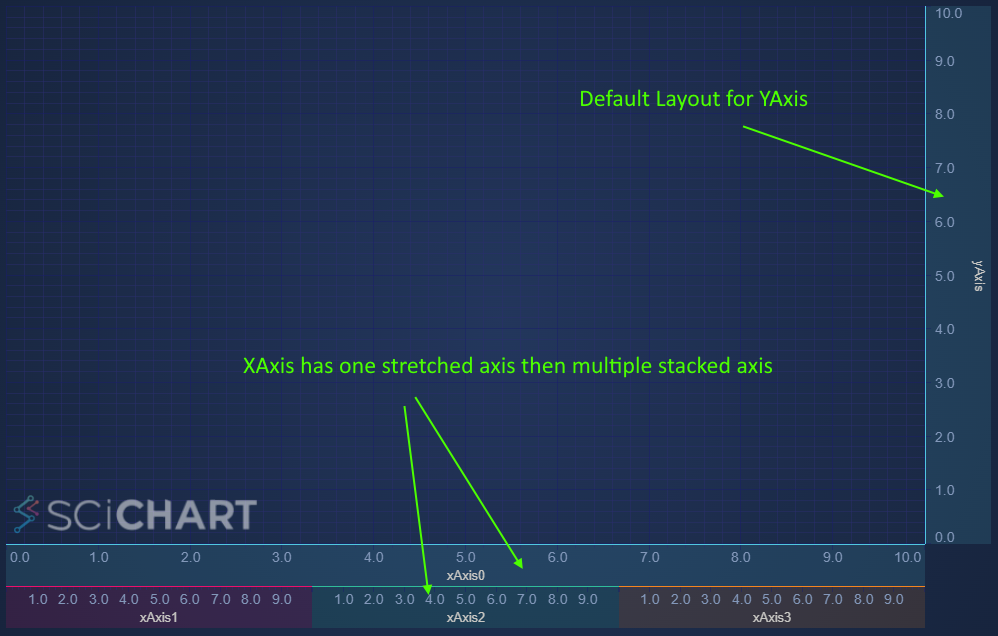

# ✅ Advanced Options - Custom Layout Managers

In SciChart.js, all positioning and layout of axis are done with Layout Strategies. A list of default built-in strategies can be found below.

| Layout Strategy | Use On | Apply To | Behavior |
|----------------|--------|----------|----------|
| [BottomAlignedOuterAxisLayoutStrategy:blue_book:](https://www.scichart.com/documentation/js/current/typedoc/classes/baseaxislayoutstrategy.html) | X Axis | Bottom side | Default behavior |
| [BottomAlignedOuterHorizontallyStackedAxisLayoutStrategy:blue_book:](https://www.scichart.com/documentation/js/current/typedoc/classes/bottomalignedouterhorizontallystackedaxislayoutstrategy.html) | X Axis | Bottom side | Horizontal stacking behavior |
| [LeftAlignedOuterAxisLayoutStrategy:blue_book:](https://www.scichart.com/documentation/js/current/typedoc/classes/leftalignedouteraxislayoutstrategy.html) | Y Axis | Left side | Default behavior |
| [RightAlignedOuterAxisLayoutStrategy:blue_book:](https://www.scichart.com/documentation/js/current/typedoc/classes/rightalignedouteraxislayoutstrategy.html) | Y Axis | Right side | Default behavior |
| [TopAlignedOuterAxisLayoutStrategy:blue_book:](https://www.scichart.com/documentation/js/current/typedoc/classes/topalignedouteraxislayoutstrategy.html) | X Axis | Top side | Default behavior |
| [LeftAlignedOuterVerticallyStackedAxisLayoutStrategy:blue_book:](https://www.scichart.com/documentation/js/current/typedoc/classes/leftalignedouterverticallystackedaxislayoutstrategy.html) | Y Axis | Left side | Vertical stacking behavior |
| [RightAlignedOuterVerticallyStackedAxisLayoutStrategy:blue_book:](https://www.scichart.com/documentation/js/current/typedoc/classes/rightalignedouterverticallystackedaxislayoutstrategy.html) | Y Axis | Right side | Vertical stacking behavior |
| [TopAlignedOuterHorizontallyStackedAxisLayoutStrategy:blue_book:](https://www.scichart.com/documentation/js/current/typedoc/classes/topalignedouterhorizontallystackedaxislayoutstrategy.html) | X Axis | Top side | Horizontal stacking behavior |

By applying these strategies to the SciChartSurface you can achieve various layouts, such as [Central Axis Layout](/docs/2d-charts/axis-api/multi-axis-and-layout/central-axis-layout) or [Vertically Stacked Axis Layout](/docs/2d-charts/axis-api/multi-axis-and-layout/vertically-stacked-axis-layout).

However, you can also create your own layout managers for custom or complex axis layouts.

Here's a worked example:

Example: Custom Stacked and Normal Axis Layout
----------------------------------------------

A user on the [SciChart Forums](https://www.scichart.com/questions/js/is-it-possible-to-create-two-xaxis-where-one-is-normal-and-the-other-one-is-horizontally-stacked-axis-layout) asked us how to combine Horizontally Stacked Axis behaviour with default behaviour, to achieve a layout like this:



This is possible by creating a **custom layout strategy.**

Step 1: create a class which inherits one of our default layout strategies. For this, we chose [BottomAlignedOuterHorizontallyStackedAxisLayoutStrategy:blue_book:](https://www.scichart.com/documentation/js/current/typedoc/classes/bottomalignedouterhorizontallystackedaxislayoutstrategy.html) as the base class.

<CodeSnippetBlock labels={["TS"]}>
    ```ts showLineNumbers file=./Basic/demo.ts start=region_A_start end=region_A_end

    ```
</CodeSnippetBlock>

Breaking this code down:

*   The [BottomAlignedOuterHorizontallyStackedAxisLayoutStrategy:blue_book:](https://www.scichart.com/documentation/js/current/typedoc/classes/bottomalignedouterhorizontallystackedaxislayoutstrategy.html) is designed to layout axis on the bottom of the chart (x-Axis) horizontally stacked.
*   We override [measureAxes:blue_book:](https://www.scichart.com/documentation/js/current/typedoc/classes/baseaxislayoutstrategy.html#measureaxes) and use the default **super.measureAxes()** function to measure the last three axis. We use a [BottomAlignedOuterAxisLayoutStrategy:blue_book:](https://www.scichart.com/documentation/js/current/typedoc/classes/baseaxislayoutstrategy.html) member variable to measure the final axis.
*   We override [layoutAxes:blue_book:](https://www.scichart.com/documentation/js/current/typedoc/classes/baseaxislayoutstrategy.html#layoutaxes) and do the same, combining the result of two strategies.

Applying the strategy like this to a chart:

<CodeSnippetBlock labels={["TS"]}>
    ```ts showLineNumbers file=./Basic/demo.ts start=region_B_start end=region_B_end

    ```
</CodeSnippetBlock>

You can now get the following output.

<LiveDocSnippet maxWidth={"100%"} name="./Basic/demo" />

Reversing the Order of Stacked & Stretched Axis
-----------------------------------------------

What if you wanted to swap the order of the stretched xAxis and the stacked xAxis?

This is really simple, just modify the layoutAxes function like this.

<CodeSnippetBlock labels={["TS"]}>
    ```ts showLineNumbers file=./Reversed/demo.ts start=region_A_start end=region_A_end

    ```
</CodeSnippetBlock>
  
Now the axis order are swapped, resulting in this output.

<LiveDocSnippet maxWidth={"100%"} name="./Reversed/demo" />