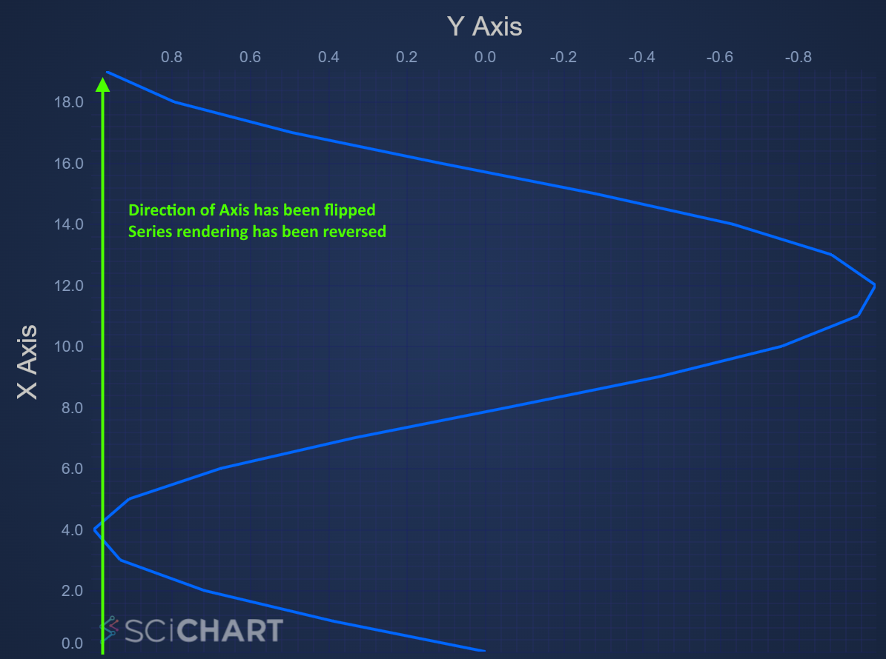

# ✅ Vertical Charts (Rotate, Transpose Axis)

It is possible to create Vertical (Rotated) Charts with SciChart. This transposes the entire chart, swapping X-Axis for Y and renders series top to bottom intead of left to right. Tooltips and markers also are transposed to the final effect is like a vertical chart.

<ChartFromSciChartDemo src="https://demo.scichart.com/iframe/javascript-oil-and-gas-dashboard-showcase" title="JavaScript Oil and Gas Dashboard" description="showing a use-case of transposing the X,Y axis to achieve a vertical chart, visualising well drill depth." />

To achieve this, simply set [axis.axisAlignment:blue_book:](https://www.scichart.com/documentation/js/current/typedoc/classes/axisbase2d.html#axisalignment) to Left or Right for X Axis and Top or Bottom for Y Axis. And that's it - SciChart takes care of the rest:

<CodeSnippetBlock labels={["TS", "Builder API (Config)"]}>
    ```ts showLineNumbers file=./VerticalCharts/demo.ts start=region_A_start end=region_A_end

    ```
    ```ts showLineNumbers file=./VerticalCharts/demo.ts start=region_B_start end=region_B_end

    ```

</CodeSnippetBlock>

This results in the following output, where the XAxis is on the left, the YAxis is on the top. The chart series is rotated automatically and now draws top to bottom, rather than left to right.

<LiveDocSnippet maxWidth={"100%"} name="./VerticalCharts/demo" />

Flipping the Axis when Horizontal or Vertical.
----------------------------------------------

An Axis may be flipped when horizontal or vertical (coordinates drawn in opposite directions) by setting the [AxisCore.flippedCoordinates:blue_book:](https://www.scichart.com/documentation/js/current/typedoc/classes/axiscore.html#flippedcoordinates) property.

For example, taking the code sample above, and setting [xAxis.flippedCoordinates:blue_book:](https://www.scichart.com/documentation/js/current/typedoc/classes/axiscore.html#flippedcoordinates) = true, we get the following result. Notice the XAxis is now drawn in reverse and the series is now drawn from bottom to top..



Considerations when using Vertical Charts
-----------------------------------------

This Flexibility of SciChart allows for some pretty interesting configurations of charts. However, here are some considerations when using a Vertical Chart.

*   Tooltips, [Cursors](/docs/2d-charts/chart-modifier-api/cursor-modifier/cursor-modifier-overview) and the [RolloverModifier](/docs/2d-charts/chart-modifier-api/rollover-modifier) will also be transposed (rotated 90 degrees). When applying a RolloverModifier the cursor line is usually vertical, but in a vertical chart the cursor line will be horizontal.
*   Annotations will behave differently. For example a [HorizontalLineAnnotation](/docs/2d-charts/annotations-api/horizontal-line-annotation) will still draw horizontally but instead of setting the y1 property to place on the YAxis, now you must set x1 property to place on the XAxis.

#### See Also

* [Vertical (Rotated) Chart Example](https://demo.scichart.com/javascript-vertical-charts)
