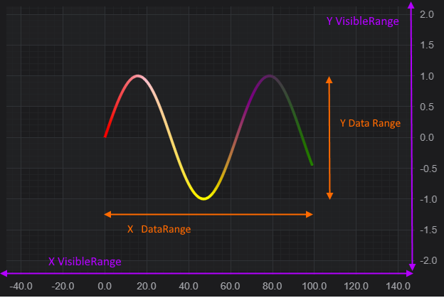

# Axis Ranging - Set Range and Zoom to Fit

What is VisibleRange?
---------------------

**[VisibleRange:blue_book:](https://www.scichart.com/documentation/js/current/typedoc/classes/axiscore.html#visiblerange)** is an actual axis range, measured in chart units. This is a part of a chart that is currently visible in a viewport.

This is a different concept to the Data Range, which is the extents of the data on the chart.

The diagram below explains the concept of the VisibleRange:



Setting Axis.VisibleRange Programmatically
------------------------------------------

To programmatically range an axis, set the [AxisCore.visibleRange:blue_book:](https://www.scichart.com/documentation/js/current/typedoc/classes/axiscore.html#visiblerange) property with a [NumberRange:blue_book:](https://www.scichart.com/documentation/js/current/typedoc/classes/numberrange.html) type.

<CodeSnippetBlock labels={["TS", "Builder API (Config)"]}>
    ```ts showLineNumbers file=./SetGetVisibleRange/demo.ts start=region_A_start end=region_A_end

    ```
    ```ts showLineNumbers file=./SetGetVisibleRange/demo.ts start=region_B_start end=region_B_end

    ```

</CodeSnippetBlock>

This results in the following output: 

<LiveDocSnippet name="./SetGetVisibleRange/demo" htmlPath="./SetGetVisibleRange/demo.html" cssPath="./SetGetVisibleRange/demo.css" />

Click the button above to update yAxis.visibleRange. View the codepen in full to see how this works.

Note the [CategoryAxis](/docs/2d-charts/axis-api/axis-types/category-axis) is treated as a special case. Although it has the same property [CategoryAxis.visibleRange:blue_book:](https://www.scichart.com/documentation/js/current/typedoc/classes/categoryaxis.html#visiblerange) of type [NumberRange:blue_book:](https://www.scichart.com/documentation/js/current/typedoc/classes/numberrange.html), it expects values to be indices, not data-values.

The reason for this is that this axis type works with with **data indexes, not actual data values.** So a **NumberRange** should be applied instead, with lower data index as Min and Upper data index as Max.

To learn more about **how to convert values** from Data-values to Indexes and back in a CategoryAxis, please refer to the [Convert Pixels to Data Coordinates](/docs/2d-charts/axis-api/misc/pixel-and-data-coordinates) article.

Zooming to fit all the Data
---------------------------

Sometimes it is required to make an axis to **show the full extent of the data** associated with it. There are several ways to achieve this in code:

1.  Set the [visibleRange:blue_book:](https://www.scichart.com/documentation/js/current/typedoc/classes/axisbase2d.html#visiblerange) equal to [axis.getMaximumRange():blue_book:](https://www.scichart.com/documentation/js/current/typedoc/classes/axisbase2d.html#getmaximumrange)
2.  Configure the axis to auto adjust correspondingly to data changes. See the article [AxisRanging - AutoRange](/docs/2d-charts/axis-api/ranging-scaling/auto-range).
3.  Call the functions from [SciChartSurface](/docs/2d-charts/surface/scichart-surface-type-overview) such as [ZoomExtents():blue_book:](https://www.scichart.com/documentation/js/current/typedoc/classes/scichartsurface.html#zoomextents), [ZoomExtentsY():blue_book:](https://www.scichart.com/documentation/js/current/typedoc/classes/scichartsurface.html#zoomextentsy) and [ZoomExtentsX():blue_book:](https://www.scichart.com/documentation/js/current/typedoc/classes/scichartsurface.html#zoomextentsx) to force a zoom to fit operation once.

Try this example below:

<CodeSnippetBlock labels={["TS", "Builder API (Config)"]}>
    ```ts showLineNumbers file=./ZoomExtents/demo.ts start=region_A_start end=region_A_end

    ```
    ```ts showLineNumbers file=./ZoomExtents/demo.ts start=region_B_start end=region_B_end

    ```

</CodeSnippetBlock>

This results in the following output:

<LiveDocSnippet name="./ZoomExtents/demo" htmlPath="./ZoomExtents/demo.html" cssPath="./ZoomExtents/demo.css" />

What if you want to allow the user to zoom to fit using the mouse? All the zooming, panning operations via mouse or touch are handled by ChartModifiers in SciChart.js. See the [ZoomPanModifier](/docs/2d-charts/chart-modifier-api/zooming-and-panning/zoom-pan-modifier), [ZoomExtentsModifier](/docs/2d-charts/chart-modifier-api/zooming-and-panning/zoom-extents-modifier) for information.

#### See Also

* [Axis Ranging - AutoRange](/docs/2d-charts/axis-api/ranging-scaling/auto-range)
* [Axis Ranging - How to Listen to VisibleRange Changes](/docs/2d-charts/axis-api/ranging-scaling/listen-to-visible-range-changes)
