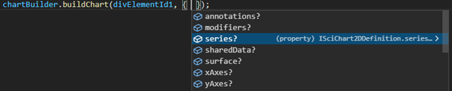
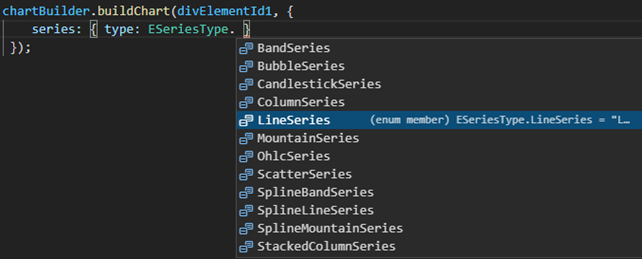
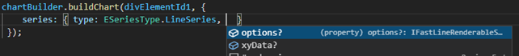

# Intro to the Builder API

The **Builder API** is a new API to SciChart.js v2. In addition to programmatically creating charts with JavaScript or TypeScript code, you can now create charts with a JSON-object API, either with objects in code with discovererable intellisense, or with JSON passed from server to client.

The Builder API is intended to:

*   Provide a more familiar api to javascript developers
*   Provide better discoverability of SciChart features when using typescript
*   Enable charts to be defined using pure data, so that they can be serialized and deserialized

It is not intended to completely replace the existing API. The two can be used in combination, and the original api is more suitable for some tasks, and required for others. Currently it only supports 2D charts.

## Discovering the Builder API

To use the SciChart.js Builder API, you will need this import.

```ts
import { chartBuilder } from "scichart";
```

**chartBuilder** exposes all the builder methods, which can be used to build parts of, or the entire chart from a JSON definition:

The top level method is **buildChart**, which takes the id of the target div, and a definition, which can be a JSON string or an object.

There are also specific function calls to [build2DChart:blue_book:](https://www.scichart.com/documentation/js/current/typedoc/index.html#chartbuilder.build2dchart), [buildPieChart:blue_book:](https://www.scichart.com/documentation/js/current/typedoc/index.html#chartbuilder.buildpiechart), [build2DPolarChart:blue_book:](https://www.scichart.com/documentation/js/current/typedoc/index.html#chartbuilder.build2dpolarchart) and [build3DChart:blue_book:](https://www.scichart.com/documentation/js/current/typedoc/index.html#chartbuilder.build3dchart) which can be used to build on specific chart surfaces:

<CodeSnippetBlock labels={["Build Surface-specific Charts"]}>
    ```ts showLineNumbers
    const { build2DChart, buildPieChart, build2DPolarChart, build3DChart } = chartBuilder;

    // build a 2D chart
    const simple2d = await build2DChart("chartDivId", {
        // ...
    });

    // build a Pie chart
    const pieChart = await buildPieChart("chartDivId", {});

    // build a Polar 2D chart
    const polar2d = await build2DPolarChart("chartDivId", {});

    // build a 3D chart
    const simple3d = await build3DChart("chartDivId", {});
    ```
</CodeSnippetBlock>


Note that all the elements are optional. This lets you define partial definitions that you can reuse and combine.
## Worked Examples of the Builder API

We've created some worked examples of the Builder API on the following pages. Also check out our [Github](https://www.github.com/abtsoftware/scichart.js.examples) and [SciChart demo](https://www.scichart.com/demo) where we have published some examples of the Builder API.

### Builder API Documentation Pages

*   **Documentation**: [Creating a Simple Chart](/2d-charts/builder-api/simple-chart)
*   **Documentation**: [Working with Data](/2d-charts/builder-api/working-with-data)
*   **Documentation**: [Complex Customisation](/2d-charts/builder-api/complex-options)
*   **Documentation**: [Custom Subtypes](/2d-charts/builder-api/custom-subtypes)

### Builder API Examples

*   **Example**: [Simple Chart using Builder API](https://www.scichart.com/demo/javascript-builder-simple)
*   **Example**: [Full Chart using Builder API](https://www.scichart.com/demo/javascript-builder-full)
*   **Example**: [Chart from JSON](https://www.scichart.com/demo/javascript-chart-from-json)
*   **Example**: [Reusable Templates with Shared Data](https://www.scichart.com/demo/javascript-shared-data)
*   **Example**: [Custom Subtypes with Builder API](https://www.scichart.com/demo/javascript-custom-types)

## TypeScript Intellisense

The Builder API is best when used with Typescript, so it can guide you as to what types are available or required.

Intellisense shows which options can be passed to **buildChart**:



Intellisense will show you the series definition must have a type property which is an **ESeriesType**. This shows you all the series types that SciChart provides (more than shown in this screenshot).



Once you have selected a series, the properties and types will become specific to that series type:



#### See Also

* [Creating a Simple Chart](/2d-charts/builder-api/simple-chart)
* [Working with Data](/2d-charts/builder-api/working-with-data)