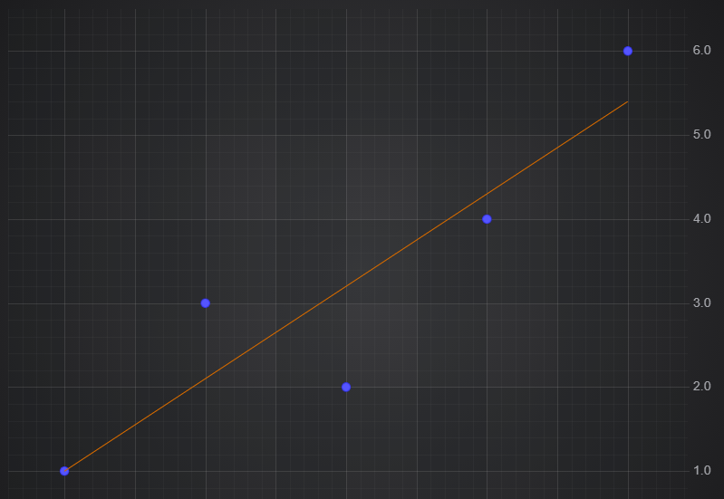
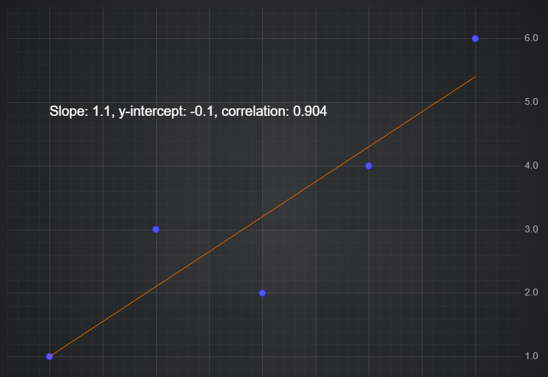
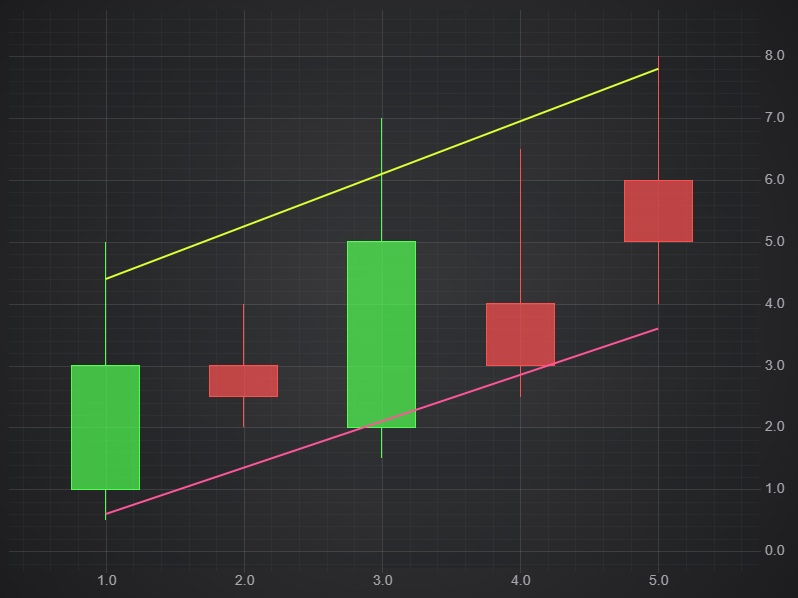

# ✅ Linear Trendline Filter

The Linear Trend filter calculates a straight line best-fit for your DataSeries. This can then be plotted as a line series on the chart.

Applying a Linear Trendline to Chart Data
-----------------------------------------

To calculate a Linear Trendline use the following code.


<CodeSnippetBlock labels={["Linear Trendline"]}>
    ```ts showLineNumbers
    import {
        SciChartSurface,
        NumericAxis,
        XyDataSeries,
        FastLineRenderableSeries,
        XyScatterRenderableSeries,
        NumberRange,
        XyLinearTrendFilter 
    } from "scichart";
    ...
    const { sciChartSurface, wasmContext } = await SciChartSurface.create('scichart-div-id-2');
    sciChartSurface.xAxes.add(new NumericAxis(wasmContext, { growBy: new NumberRange(0.1, 0.1) }));
    sciChartSurface.yAxes.add(new NumericAxis(wasmContext, { growBy: new NumberRange(0.1, 0.1) }));
    // Original Data
    const dataSeries = new XyDataSeries(wasmContext, {
        xValues: [1, 2, 3, 4, 5],
        yValues: [1, 3, 2, 4, 6],
    });
    const originalLine = new XyScatterRenderableSeries(wasmContext, { dataSeries });
    // Create the filter, passing in the original series
    const linearTrendFilter = new XyLinearTrendFilter(dataSeries);
    const filteredLine = new FastLineRenderableSeries(wasmContext, { dataSeries: linearTrendFilter, stroke: "#cc6600" });
    sciChartSurface.renderableSeries.add(originalLine, filteredLine);

    ```

</CodeSnippetBlock>

This results in the following output:



Accessing Trendline Properties
------------------------------

The **XyLinearTrendFilter** has properties for slope, intercept and correlation which you can use to access the parameters of the trend line.

For example you could display them using an annotation like this:

<CodeSnippetBlock labels={["Trendline properties"]}>
    ```ts showLineNumbers
    import { TextAnnotation, EHorizontalAnchorPoint, EVerticalAnchorPoint } from "scichart";

    const textAnnotation = new TextAnnotation({
        x1: 1,
        y1: 5,
        fontSize: 20,
        text: `Slope: ${linearTrendFilter.slope}, y-intercept: ${linearTrendFilter.intercept}, correlation: ${linearTrendFilter.correlation.toFixed(3)}`
    });
    sciChartSurface.annotations.add(textAnnotation);
    ```

</CodeSnippetBlock>



Specifying the Input Field
--------------------------

The XyLinearTrendFilter produces an XyDataSeries, but it can accept any series type as input. The options includes a **field** property of type **EDataSeriesField**, which determines which field on the original series will be the input.

This example takes a OHLC Series as input and plots separate trendlines for the High and Low values:

<CodeSnippetBlock labels={["Trendline properties"]}>
    ```ts showLineNumbers
    import { 
        OhlcDataSeries,
        FastLineRenderableSeries,
        FastCandlestickRenderableSeries,
        XyLinearTrendFilter,
        EDataSeriesField 
    } from "scichart";
    ...
    // Original Data
    const dataSeries = new OhlcDataSeries(wasmContext, {
        xValues: [1, 2, 3, 4, 5],
        openValues: [1, 3, 2, 4, 6],
        highValues: [5, 4, 7, 6.5, 8],
        lowValues: [0.5, 2, 1.5, 2.5, 4],
        closeValues: [3, 2.5, 5, 3, 5],
    });
    const rsCandles = new FastCandlestickRenderableSeries(wasmContext, { dataSeries });
    // Create the filters, passing in the original series and specifying the input field
    const linearTrendHigh = new XyLinearTrendFilter(dataSeries, { field: EDataSeriesField.High });
    const linearTrendLow = new XyLinearTrendFilter(dataSeries, { field: EDataSeriesField.Low });
    const rsHigh = new FastLineRenderableSeries(wasmContext, { dataSeries: linearTrendHigh, stroke: "#ddff33", strokeThickness: 3 });
    const rsLow = new FastLineRenderableSeries(wasmContext, { dataSeries: linearTrendLow, stroke: "#ff5599", strokeThickness: 3 });
    sciChartSurface.renderableSeries.add(rsCandles, rsHigh, rsLow);
    ```

</CodeSnippetBlock>



#### See Also

* [What is the Filters API](/docs/2d-charts/chart-types/data-filters-api/data-filters-api-overview)
* [Scale Offset Filters](/docs/2d-charts/chart-types/data-filters-api/scale-offset-filters)
* [Creating a Custom Filter](/docs/2d-charts/chart-types/data-filters-api/custom-filter)
* [Ratio Filter](/docs/2d-charts/chart-types/data-filters-api/ratio-filter)
* [Moving Average Filter](/docs/2d-charts/chart-types/data-filters-api/moving-average-filter)
