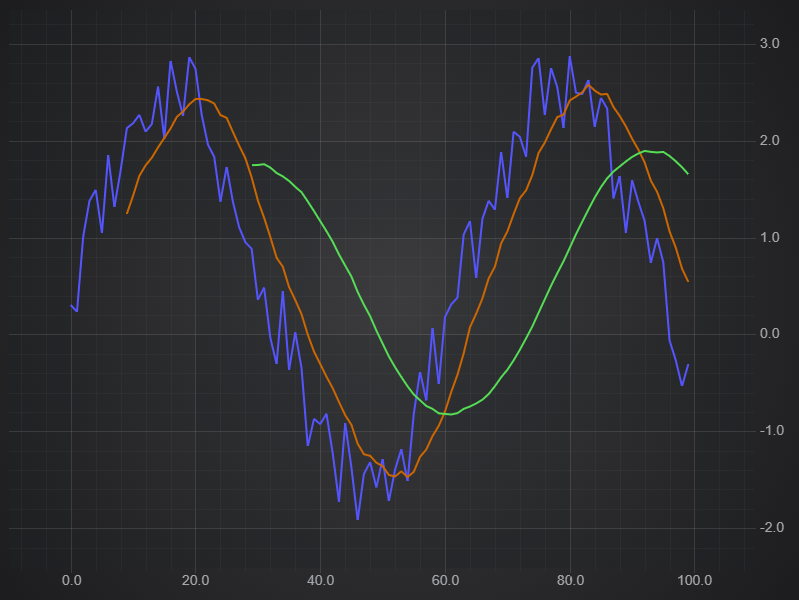
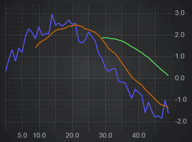

# ✅ Moving Average Filter

The XyMovingAverageFilter performs a simple moving average with a specified period length, resulting in a smoothed waveform derived from your data.

Applying a Moving Average to Chart Data
---------------------------------------

To calculate a moving average and apply to a chart, use the following code.


<CodeSnippetBlock labels={["Moving average"]}>
    ```ts showLineNumbers
    import { SciChartSurface } from 'scichart/Charting/Visuals/SciChartSurface';
    import { NumericAxis } from 'scichart/Charting/Visuals/Axis/NumericAxis';
    import { XyDataSeries } from 'scichart/Charting/Model/XyDataSeries';
    import { FastLineRenderableSeries } from 'scichart/Charting/Visuals/RenderableSeries/FastLineRenderableSeries';
    import { NumberRange } from 'scichart/Core/NumberRange';
    import { XyMovingAverageFilter } from 'scichart/Charting/Model/Filters/XyMovingAverageFilter';
    ...
    const { sciChartSurface, wasmContext } = await SciChartSurface.create('scichart-div-id-4');
    sciChartSurface.xAxes.add(new NumericAxis(wasmContext, { growBy: new NumberRange(0.1, 0.1) }));
    sciChartSurface.yAxes.add(new NumericAxis(wasmContext, { growBy: new NumberRange(0.01, 0.01), autoRange: EAutoRange.Always }));
    // A function to get some data - sinewave plus a randm factor
    const getData = (start, count) => {
        let xValues = [];
        let yValues = [];
        for (let i = start; i < start + count; i++) {
            xValues.push(i);
            yValues.push(2 * Math.sin(i/10) + Math.random());      
        }
        return { xValues, yValues };
    };
    // Original Data
    const dataSeries = new XyDataSeries(wasmContext, getData(0, 100));
    const originalLine = new FastLineRenderableSeries(wasmContext, { dataSeries, stroke: "#5555ff", strokeThickness: 3 });
    // Create the filter, passing in the original series
    const movingAverage = new XyMovingAverageFilter(dataSeries, { length: 10 });
    const filteredLine = new FastLineRenderableSeries(wasmContext, { dataSeries: movingAverage, stroke: "#cc6600", strokeThickness: 3 });
    // Another filter using the same original data, but different length
    const movingAverage30 = new XyMovingAverageFilter(dataSeries, { length: 30});
    const filteredLine30 = new FastLineRenderableSeries(wasmContext, { dataSeries: movingAverage30, stroke: "#55dd55", strokeThickness: 3 });
    sciChartSurface.renderableSeries.add(originalLine, filteredLine, filteredLine30);
    ```

</CodeSnippetBlock>

This results in the following output:



Updating Moving Averages Dynamically
------------------------------------

When the underlying data updates, the filter automatically updates. There is no need to recalculate your filter: SciChart.js does this for you!

Where possible, only the changed points are recalculated. In addition, updating the parameters of the filter, in this case the length, will also recalulate the filter and redraw.

If we add the following to the above example:


<CodeSnippetBlock labels={["Moving average"]}>
    ```ts showLineNumbers
    // Add some additional data every 100ms
    const updateFunc = () => {
        if (dataSeries.count() < 300) {
            const { xValues, yValues } = getData(dataSeries.count(), 10);
            dataSeries.appendRange(xValues, yValues);
            setTimeout(updateFunc, 100);
        }
    };
    // Start the update
    setTimeout(updateFunc, 1000);
    ```

</CodeSnippetBlock>

We get this output.



#### See Also

* [What is the Filters API](/docs/2d-charts/chart-types/data-filters-api/data-filters-api-overview/index.md)
* [Scale Offset Filters](/docs/2d-charts/chart-types/data-filters-api/scale-offset-filters/index.md)
* [Linear Trendline Filter](/docs/2d-charts/chart-types/data-filters-api/linear-trendline-filter/index.md)
* [Ratio Filter](/docs/2d-charts/chart-types/data-filters-api/ratio-filter/index.md)
* [Creating a Custom Filter](/docs/2d-charts/chart-types/data-filters-api/custom-filter/index.md)
