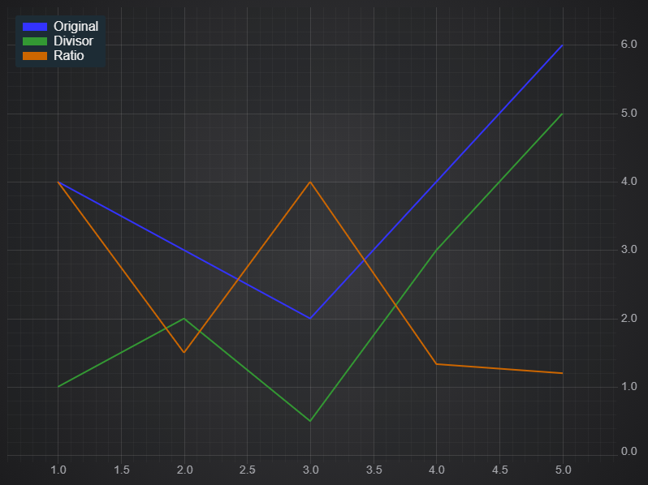

# ✅ Ratio Filter

The XyRatioFilter returns a series where each point is the ratio of the original series and the given divisor DataSeries.

The original series and divisor series can be different types, and there is a **divisorField** option to specify the field to use from the divisorSeries.

Calculating a Ratio of Two Chart Series
---------------------------------------

To create a ratio filter and apply to a chart, use the code below:

<CodeSnippetBlock labels={["Ratio filter example"]}>
    ```ts showLineNumbers
    import { SciChartSurface } from 'scichart/Charting/Visuals/SciChartSurface';
    import { NumericAxis } from 'scichart/Charting/Visuals/Axis/NumericAxis';
    import { XyDataSeries } from 'scichart/Charting/Model/XyDataSeries';
    import { FastLineRenderableSeries } from 'scichart/Charting/Visuals/RenderableSeries/FastLineRenderableSeries';
    import { NumberRange } from 'scichart/Core/NumberRange';
    import { XyMovingAverageFilter } from 'scichart/Charting/Model/Filters/XyMovingAverageFilter';
    ...
    const { sciChartSurface, wasmContext } = await SciChartSurface.create('scichart-div-id-4');
    sciChartSurface.xAxes.add(new NumericAxis(wasmContext, { growBy: new NumberRange(0.1, 0.1) }));
    sciChartSurface.yAxes.add(new NumericAxis(wasmContext, { growBy: new NumberRange(0.01, 0.01), autoRange: EAutoRange.Always }));
    // A function to get some data - sinewave plus a randm factor
    const getData = (start, count) => {
        let xValues = \[\];
        let yValues = \[\];
        for (let i = start; i < start + count; i++) {
            xValues.push(i);
            yValues.push(2 \* Math.sin(i/10) + Math.random());      
        }
        return { xValues, yValues };
    };
    // Original Data
    const dataSeries = new XyDataSeries(wasmContext, getData(0, 100));
    const originalLine = new FastLineRenderableSeries(wasmContext, { dataSeries, stroke: "#5555ff", strokeThickness: 3 });
    // Create the filter, passing in the original series
    const movingAverage = new XyMovingAverageFilter(dataSeries, { length: 10 });
    const filteredLine = new FastLineRenderableSeries(wasmContext, { dataSeries: movingAverage, stroke: "#cc6600", strokeThickness: 3 });
    // Another filter using the same original data, but different length
    const movingAverage30 = new XyMovingAverageFilter(dataSeries, { length: 30});
    const filteredLine30 = new FastLineRenderableSeries(wasmContext, { dataSeries: movingAverage30, stroke: "#55dd55", strokeThickness: 3 });
    sciChartSurface.renderableSeries.add(originalLine, filteredLine, filteredLine30);
    ```

</CodeSnippetBlock>

This produces the following chart. We also added a LegendModifier to make it clear which line is which:



The ratio filter requires that the original series and divisor series have the same number of elements.

When you add or remove data, the filter will not update until both series have been updated. It does not matter which series you update first.

#### See Also

* [What is the Filters API](/docs/2d-charts/chart-types/data-filters-api/data-filters-api-overview/index.md)
* [Scale Offset Filters](/docs/2d-charts/chart-types/data-filters-api/scale-offset-filters/index.md)
* [Linear Trendline Filter](/docs/2d-charts/chart-types/data-filters-api/linear-trendline-filter/index.md)
* [Creating a Custom Filter](/docs/2d-charts/chart-types/data-filters-api/custom-filter/index.md)
* [Moving Average Filter](/docs/2d-charts/chart-types/data-filters-api/moving-average-filter/index.md)
