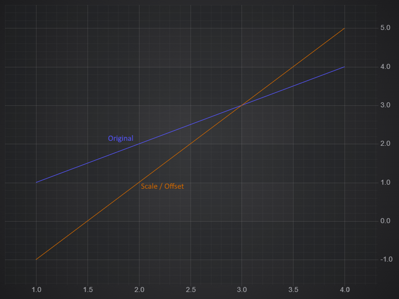

# ✅ Scale Offset Filters

The ScaleOffsetFilter Applies a scale (multiplier) and an offset (addition) to each field value in a Data Series. There is a specific filter for each type of dataseries:

*   **XyScaleOffsetFilter**
*   **XyyScaleOffsetFilter**
*   **XyzScaleOffsetFilter**
*   **OhlcScaleOffsetFilter**

Applying Scale & Offset to Chart Data
-------------------------------------

To create an **XyScaleOffsetFilter** and apply it to your chart, use the following code:

<CodeSnippetBlock labels={["TS"]}>
    ```ts showLineNumbers
    import { SciChartSurface } from 'scichart/Charting/Visuals/SciChartSurface';
    import { NumericAxis } from 'scichart/Charting/Visuals/Axis/NumericAxis';
    import { XyDataSeries } from 'scichart/Charting/Model/XyDataSeries';
    import { FastLineRenderableSeries } from 'scichart/Charting/Visuals/RenderableSeries/FastLineRenderableSeries';
    import { NumberRange } from 'scichart/Core/NumberRange';
    import { XyScaleOffsetFilter } from 'scichart/Charting/Model/Filters/XyScaleOffsetFilter';
    ...
    const { sciChartSurface, wasmContext } = await SciChartSurface.create('scichart-div-id');
    sciChartSurface.xAxes.add(new NumericAxis(wasmContext, { growBy: new NumberRange(0.1, 0.1) }));
    sciChartSurface.yAxes.add(new NumericAxis(wasmContext, { growBy: new NumberRange(0.1, 0.1) }));
    // Original Data
    const dataSeries = new XyDataSeries(wasmContext, {
        xValues: [1, 2, 3, 4],
        yValues: [1, 2, 3, 4],
    });
    const originalLine = new FastLineRenderableSeries(wasmContext, { dataSeries, stroke: "#5555ff" });
    // Create the filter, passing in the original series
    const scaleOffsetFilter = new XyScaleOffsetFilter(dataSeries, { scale: 2, offset: -3 });
    const filteredLine = new FastLineRenderableSeries(wasmContext, { dataSeries: scaleOffsetFilter, stroke: "#cc6600" });
    sciChartSurface.renderableSeries.add(originalLine, filteredLine);
    ```

</CodeSnippetBlock>

This produces the following chart where the orange filtered data is twice as steep, and shifted down by 3.



With the Filters API in SciChart.js, if you update the original data, or any of the parameters of the filter, the chart will automatically redraw.

Note that ScaleOffsetFilter only changes data in the Y direction. If you want to shift data in X, create a [Complex Custom Filter](Creating a Custom Filter.html). The other ScaleOffsetFilters apply the same transformation to every non-x field. If you want to apply different filters to different fields, create a [Complex Custom Filter](/docs/2d-charts/chart-types/data-filters-api/custom-filter/index.md).

Specifying the Input Field
--------------------------

An Xy filter will produce an XyDataSeries, but it can accept any series type as input. The options includes a **field** property of type **EDataSeriesField**, which determines which field on the original series will be the input. For Xyy filters there are yField and y1Field, and for Xyz filters there are yField and zField options.

Percentage Change
-----------------

You can use a ScaleOffset filter to show the percentage change in a series, which is useful for comparing data at different scales. For a running example of this with code see our [Percentage Change demo](http://demo.scichart.com/javascript-percentage-change)

#### See Also

* [What is the Filters API](/docs/2d-charts/chart-types/data-filters-api/data-filters-api-overview/index.md)
* [Linear Trendline Filter](/docs/2d-charts/chart-types/data-filters-api/linear-trendline-filter/index.md)
* [Creating a Custom Filter](/docs/2d-charts/chart-types/data-filters-api/custom-filter/index.md)
* [Ratio Filter](/docs/2d-charts/chart-types/data-filters-api/ratio-filter/index.md)
* [Moving Average Filter](/docs/2d-charts/chart-types/data-filters-api/moving-average-filter/index.md)
