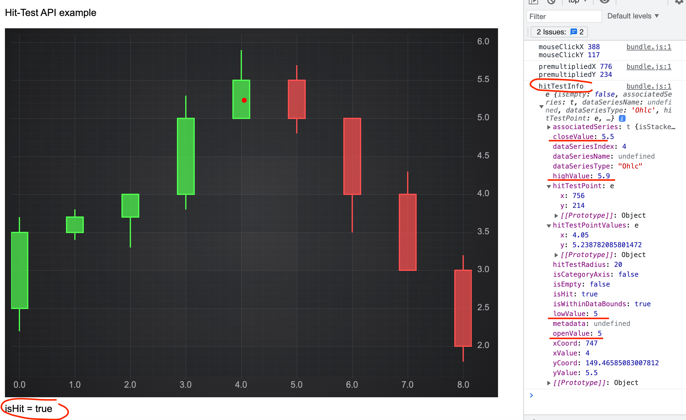

# ✅ Hit-Test API for Candlestick and OHLC Series

The hitTest method on Candlestick or OHLC Series
------------------------------------------------

The **IHitTestProvider.hitTest** method on [FastCandlestickRenderableSeries](/docs/2d-charts/chart-types/fast-candlestick-renderable-series/index.md) or [FastOhlcRenderableSeries](/docs/2d-charts/chart-types/fast-ohlc-renderable-series/index.md) tests if the click was within the **hitTestRadius** from a candle.

The algorithm is as follows:

*   Find the nearest candle in X direction.
*   Test if the click was within the **hitTestRadius** from the candle body or wicks and update **HitTestInfo.isHit** property.

A sample source code is below.

<CodeSnippetBlock labels={["JS","TS"]}>
    ```ts showLineNumbers
    import { SciChartSurface, NumericAxis, NumberRange, DpiHelper, CustomAnnotation, EHorizontalAnchorPoint, EVerticalAnchorPoint, FastCandlestickRenderableSeries, OhlcDataSeries  } from 'scichart';

    export async function hitTestCandlestickTs(divId) {
        const { sciChartSurface, wasmContext } = await SciChartSurface.create(divId);
        const HIT_TEST_RADIUS = 10 * DpiHelper.PIXEL_RATIO;
        sciChartSurface.xAxes.add(new NumericAxis(wasmContext));
        sciChartSurface.yAxes.add(new NumericAxis(wasmContext, { growBy: new NumberRange(0.05, 0.05) }));
        const xOhlcValues = [0, 1, 2, 3, 4, 5, 6, 7, 8];
        const openValues = [2.5, 3.5, 3.7, 4.0, 5.0, 5.5, 5.0, 4.0, 3.0];
        const highValues = [3.7, 3.8, 4.0, 5.3, 5.9, 5.7, 5.0, 4.3, 3.2];
        const lowValues = [2.2, 3.4, 3.3, 3.8, 5.0, 4.8, 3.5, 3.0, 1.8];
        const closeValues = [3.5, 3.7, 4.0, 5.0, 5.5, 5.0, 4.0, 3.0, 2.0];
        const candlestickSeries = new FastCandlestickRenderableSeries(wasmContext, {
            dataPointWidth: 0.3,
            strokeThickness: 2,
            dataSeries: new OhlcDataSeries(wasmContext, {
                xValues: xOhlcValues,
                openValues,
                highValues,
                lowValues,
                closeValues
            })
        });
        sciChartSurface.renderableSeries.add(candlestickSeries);
        // Add an SVG annotation to display the mouse click
        const svgAnnotation = new CustomAnnotation({
            svgString: `<svg width="8" height="8"><circle cx="50%" cy="50%" r="4" fill="#FF0000"/></svg>`,
            isHidden: true,
            horizontalAnchorPoint: EHorizontalAnchorPoint.Center,
            verticalAnchorPoint: EVerticalAnchorPoint.Center
        });
        sciChartSurface.annotations.add(svgAnnotation);
        sciChartSurface.domCanvas2D.addEventListener('mousedown', (mouseEvent) => {
            const mouseClickX = mouseEvent.offsetX;
            const mouseClickY = mouseEvent.offsetY;
            console.log('mouseClickX', mouseClickX, 'mouseClickY', mouseClickY);
            const premultipliedX = mouseEvent.offsetX * DpiHelper.PIXEL_RATIO;
            const premultipliedY = mouseEvent.offsetY * DpiHelper.PIXEL_RATIO;
            console.log('premultipliedX', premultipliedX, 'premultipliedY', premultipliedY);
            // IHitTestProvider.hitTest
            const hitTestInfo = candlestickSeries.hitTestProvider.hitTest(premultipliedX, premultipliedY, HIT_TEST_RADIUS);
            svgAnnotation.x1 = hitTestInfo.hitTestPointValues.x;
            svgAnnotation.y1 = hitTestInfo.hitTestPointValues.y;
            svgAnnotation.isHidden = false;
            const resultDiv = document.getElementById('result');
            resultDiv.innerText = `isHit = ${hitTestInfo.isHit}`;
            console.log('hitTestInfo', hitTestInfo);
        });
    }
    ```
    ```ts showLineNumbers
    import { SciChartSurface, NumericAxis, NumberRange, DpiHelper, CustomAnnotation, EHorizontalAnchorPoint, EVerticalAnchorPoint, FastCandlestickRenderableSeries, OhlcDataSeries  } from 'scichart';

    export async function hitTestCandlestickTs(divId: string) {
        const { sciChartSurface, wasmContext } = await SciChartSurface.create(divId);
        const HIT_TEST_RADIUS = 10 * DpiHelper.PIXEL_RATIO;
        sciChartSurface.xAxes.add(new NumericAxis(wasmContext));
        sciChartSurface.yAxes.add(new NumericAxis(wasmContext, { growBy: new NumberRange(0.05, 0.05) }));
        const xOhlcValues = [0, 1, 2, 3, 4, 5, 6, 7, 8];
        const openValues = [2.5, 3.5, 3.7, 4.0, 5.0, 5.5, 5.0, 4.0, 3.0];
        const highValues = [3.7, 3.8, 4.0, 5.3, 5.9, 5.7, 5.0, 4.3, 3.2];
        const lowValues = [2.2, 3.4, 3.3, 3.8, 5.0, 4.8, 3.5, 3.0, 1.8];
        const closeValues = [3.5, 3.7, 4.0, 5.0, 5.5, 5.0, 4.0, 3.0, 2.0];
        const candlestickSeries = new FastCandlestickRenderableSeries(wasmContext, {
            dataPointWidth: 0.3,
            strokeThickness: 2,
            dataSeries: new OhlcDataSeries(wasmContext, {
                xValues: xOhlcValues,
                openValues,
                highValues,
                lowValues,
                closeValues
            })
        });
        sciChartSurface.renderableSeries.add(candlestickSeries);
        // Add an SVG annotation to display the mouse click
        const svgAnnotation = new CustomAnnotation({
            svgString: `<svg width="8" height="8"><circle cx="50%" cy="50%" r="4" fill="#FF0000"/></svg>`,
            isHidden: true,
            horizontalAnchorPoint: EHorizontalAnchorPoint.Center,
            verticalAnchorPoint: EVerticalAnchorPoint.Center
        });
        sciChartSurface.annotations.add(svgAnnotation);
        sciChartSurface.domCanvas2D.addEventListener('mousedown', (mouseEvent: MouseEvent) => {
            const mouseClickX = mouseEvent.offsetX;
            const mouseClickY = mouseEvent.offsetY;
            console.log('mouseClickX', mouseClickX, 'mouseClickY', mouseClickY);
            const premultipliedX = mouseEvent.offsetX * DpiHelper.PIXEL_RATIO;
            const premultipliedY = mouseEvent.offsetY * DpiHelper.PIXEL_RATIO;
            console.log('premultipliedX', premultipliedX, 'premultipliedY', premultipliedY);
            // IHitTestProvider.hitTest
            const hitTestInfo = candlestickSeries.hitTestProvider.hitTest(premultipliedX, premultipliedY, HIT_TEST_RADIUS);
            svgAnnotation.x1 = hitTestInfo.hitTestPointValues.x;
            svgAnnotation.y1 = hitTestInfo.hitTestPointValues.y;
            svgAnnotation.isHidden = false;
            const resultDiv = document.getElementById('result');
            resultDiv.innerText = `isHit = ${hitTestInfo.isHit}`;
            console.log('hitTestInfo', hitTestInfo);
        });
    }
    ```
</CodeSnippetBlock>

 This gives us the chart below.



 If we click on the candle or wicks within a distance of 10 pixels it will be hit. In the console you will find **hitTestInfo** which contains **openValue**, **highValue**, **lowValue** and **closeValue** in addition to common **HitTestInfo** properties.

 The hitTestDataPoint method on Candlestick or OHLC Series
----------------------------------------------------------

The **IHitTestProvider.hitTestDataPoint** method on [FastCandlestickRenderableSeries](/docs/2d-charts/chart-types/fast-candlestick-renderable-series/index.md) or [FastOhlcRenderableSeries](/docs/2d-charts/chart-types/fast-ohlc-renderable-series/index.md) tests if the click was within the **hitTestRadius** from **Close** value of a data point.

```ts
// hitTestDataPoint method on Candlestick Series
const hitTestInfo = candlestickSeries.hitTestProvider.hitTestDataPoint(premultipliedX, premultipliedY, HIT\_TEST\_RADIUS);
```

 The algorithm is as follows:

1.  Iterate over each of the points to find the nearest one on the XY plane.
2.  Compare the distance to the nearest point with the **hitTestRadius** and update **HitTestInfo.isHit** property.

The hitTestXSlice method on Candlestick or OHLC Series
------------------------------------------------------

The **IHitTestProvider.hitTestXSlice** method is used for [CursorModifier](/docs/2d-charts/chart-modifier-api/cursor-modifier/cursor-modifier-overview/index.md) and [RolloverModifier](/docs/2d-charts/chart-modifier-api/rollover-modifier/index.md) to get information about the nearest point.

```ts
// hitTestXSlice method on Candlestick Series
const hitTestInfo = candlestickSeries.hitTestProvider.hitTestXSlice(premultipliedX, premultipliedY);
```

 The way it works:

1.  Finds the nearest point in X direction.
2.  Sets **HitTestInfo.isHit** property to **True** if the mouse click was within the data bounds.

#### See Also

* [Hit-Test API for Line Series](/docs/2d-charts/chart-types/hit-test-api/fast-line-renderable-series/index.md)
* [Hit-Test API for Band Series](/docs/2d-charts/chart-types/hit-test-api/fast-band-renderable-series/index.md)
* [Hit-Test API for Bubble Series](/docs/2d-charts/chart-types/hit-test-api/fast-bubble-renderable-series/index.md)
* [Hit-Test API for Heatmap Series](/docs/2d-charts/chart-types/hit-test-api/uniform-heatmap-renderable-series/index.md)
* [Hit-Test API for Rectangle Series](/docs/2d-charts/chart-types/hit-test-api/fast-rectangle-renderable-series/index.md)
* [Hit-Test API for Polar Line Series](/docs/2d-charts/chart-types/hit-test-api/polar-line-renderable-series/README.md)
