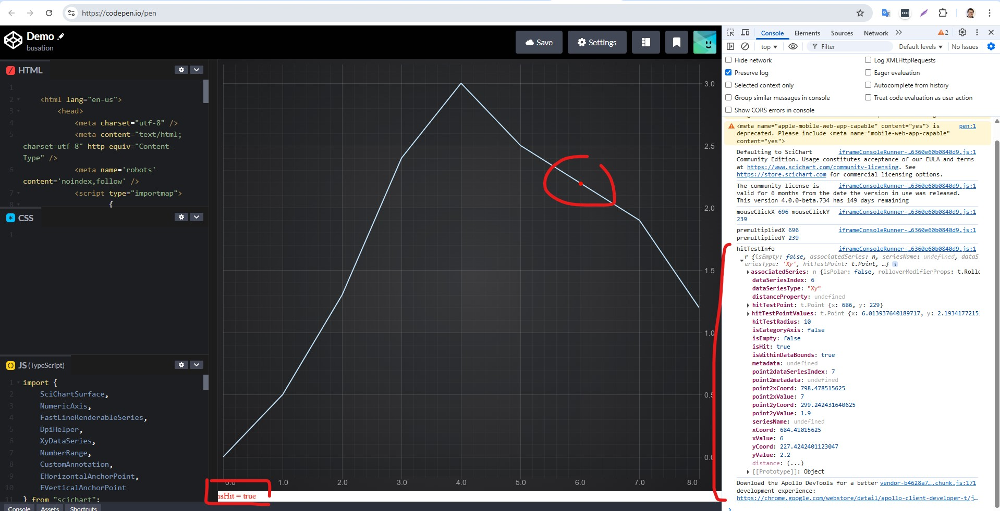

# ✅ Hit-Test API overview

In SciChart.js we have **Hit-Test API** which allows access to information about the point being clicked on the canvas, such as the nearest data point index, X and Y data values, coordinate values and metadata.

The Hit-Test API is a set of functions defined on the [BaseRenderableSeries class](https://www.scichart.com/documentation/js/current/typedoc/classes/baserenderableseries.html), and overridden by some of the series types. This API is used internally by tooltips (see [RolloverModifier](/docs/2d-charts/chart-modifier-api/rollover-modifier/index.md) and [CursorModifier](/docs/2d-charts/chart-modifier-api/cursor-modifier/cursor-modifier-overview/index.md)) to transform mouse clicks on screen into data-points, and determine if a mouse event occurs over a point or over a series. You can use the same API to determine if a click or touch event was over a series, and take appropriate action.

There are three main Hit-Test methods:

*   **hitTest** which tests against the series body.
*   **hitTestDataPoint** which tests against data points.
*   **hitTestXSlice** which tests for the vertical slice where only X value is taken into account; used for **CursorModifier** and **RolloverModifier.**

In addition, there are other Hit-Test methods specific for chart modifiers. For example, **hitTestForDataPointSelectionModifier** is designed for **DataPointSelectionModifier**.

To call the **hitTest** method, use the following code:

**hitTest call example**

```ts
const hitTestInfo = lineSeries.hitTestProvider.hitTest(premultipliedX, premultipliedY, HIT_TEST_RADIUS);
```

 This is a complete example.

<CodeSnippetBlock labels={["TS"]}>
    ```ts showLineNumbers file=./demo.ts start=region_A_start end=region_A_end

    ```

</CodeSnippetBlock>


In this example we create a simple line chart using **FastLineRenderableSeries** with an annotation which is used to display the point being clicked. Also, we add an event listener for mousedown events. When the mouse button is clicked **lineSeries.hitTestProvider.hitTest** method is called to get **HitTestInfo**.

To support High DPI and Retina displays the canvas is scaled by **DpiHelper.PIXEL\_RATIO**. Which is why X and Y mouse values must be multiplied by **DpiHelper.PIXEL\_RATIO** before passing into Hit-Test methods.

This code produces the line chart.

<LiveDocSnippet maxWidth={"100%"} name="demo" htmlType="WithResult" />

Let's click on the canvas near the line.



 On the canvas we will see the red dot where the click was performed. If the click was within 10 pixels from the line, under the chart we will see **isHit = true.** In the browser console the **HitTestInfo** object itself will be output.

IHitTestProvider.hitTest method
-------------------------------

The **IHitTestProvider.hitTest** method tests for the series body. If the series body is clicked within a given radius **HitTestInfo.isHit** value will be true. The method tests

*   Line body for line series
*   Scatter point for scatter series
*   Mountain area for mountain series and stacked mountain series
*   Candlestick body for candle series
*   Column body for column series and stacked column series
*   Band series body for band series
*   Bubble for bubble series
*   The entire heatmap for heatmap series

**IHitTestProvider.hitTest**

```ts
    /**
     * @description Performs a hit-test for series body at the specific mouse point (X,Y coordinate on the parent SciChartSurface),
     * returning a HitTestInfo type with the results
     * @remarks For Retina displays and Browser zoom, ensure that X,Y points are scaled by {@link DpiHelper.PIXEL_RATIO}
     * @param x The mouse point X coordinate on the parent SciChartSurface.
     * NOTE: For Retina displays and Browser zoom, ensure that X,Y points are scaled by {@link DpiHelper.PIXEL_RATIO}
     * @param y The mouse point Y coordinate on the parent SciChartSurface.
     * NOTE: For Retina displays and Browser zoom, ensure that X,Y points are scaled by {@link DpiHelper.PIXEL_RATIO}
     * @param hitTestRadius The radius in pixels to determine whether a mouse is over a data-point
     */
    hitTest(x: number, y: number, hitTestRadius?: number): HitTestInfo;
```

IHitTestProvider.hitTestDataPoint method
----------------------------------------

 The **IHitTestProvider.hitTestDataPoint** method tests if the click was near a data point.

*   XY data point for line series, scatter, bubble, mountain and column data series.
*   XY or XY1 point for band series.
*   Close values for OHLC or candlestick series.
*   Method is not supported for heatmap and stacked series.

**IHitTestProvider.hitTestDataPoint**

```ts
    /**
     * @description Performs a hit-test for the data point at the specific mouse point (X,Y coordinate on the parent SciChartSurface),
     * returning a HitTestInfo type with the results
     * @remarks For Retina displays and Browser zoom, ensure that X,Y points are scaled by {@link DpiHelper.PIXEL_RATIO}
     * @param x The mouse point X coordinate on the parent SciChartSurface.
     * NOTE: For Retina displays and Browser zoom, ensure that X,Y points are scaled by {@link DpiHelper.PIXEL_RATIO}
     * @param y The mouse point Y coordinate on the parent SciChartSurface.
     * NOTE: For Retina displays and Browser zoom, ensure that X,Y points are scaled by {@link DpiHelper.PIXEL_RATIO}
     * @param hitTestRadius The radius in pixels to determine whether a mouse is over a data-point
     */
    hitTestDataPoint(x: number, y: number, hitTestRadius?: number): HitTestInfo;
```

IHitTestProvider.hitTestXSlice method
-------------------------------------

The **IHitTestProvider.hitTestXSlice** method tests for the series body. But unlike the hitTest method it finds the nearest point in X direction only, the Y value of the hit-test point is ignored. Moreover, **isHit** is always **True** if the click was within the data bounds.

**IHitTestProvider.hitTestXSlice**

```ts
    /**
     * @description Performs a hit-test for the vertical slice at the specific mouse point (X,Y coordinate on the parent SciChartSurface),
     * only X value is taken into account, it is used for {@link CursorModifier} and {@link RolloverModifier},
     * returns a HitTestInfo type with the results,
     * Only for sorted values
     * @remarks For Retina displays and Browser zoom, ensure that X,Y points are scaled by {@link DpiHelper.PIXEL_RATIO}
     * @param x The mouse point X coordinate on the parent SciChartSurface.
     * NOTE: For Retina displays and Browser zoom, ensure that X,Y points are scaled by {@link DpiHelper.PIXEL_RATIO}
     * @param y The mouse point Y coordinate on the parent SciChartSurface.
     * NOTE: For Retina displays and Browser zoom, ensure that X,Y points are scaled by {@link DpiHelper.PIXEL_RATIO}
     * @param hitTestRadius The radius in pixels to determine whether a mouse is over a data-point
     */
    hitTestXSlice(x: number, y: number, hitTestRadius?: number): HitTestInfo;
```

The Hit-Test Results
--------------------

Hit-Test methods return **HitTestInfo** objects which contain the following information.

*   associatedSeries: The **IRenderableSeries** against which the hitTest operation was performed
*   dataSeriesName: The dataSeriesName value from the associated data series
*   dataSeriesType: The type of the associated data series
*   hitTestPoint: The X and Y screen coordinates of the point being clicked relative to the **seriesViewRect** and premultiplied by **DpiHelper.PIXEL_RATIO**
*   hitTestPointValues: The X and Y data coordinates of the point being clicked
*   hitTestRadius: The radius in pixels that was used for the hit-test operation
*   dataSeriesIndex: The index of the nearest point
*   metadata: The point metadata from the associated data series, which is useful for displaying tooltips with additional information specific for the data point
*   xCoord: The X-coordinate result of the hit-test operation
*   yCoord: The Y-coordinate result of the hit-test operation
*   xValue: The X-value result of the hit-test operation
*   yValue: The Y-value result of the hit-test operation
*   y1Value: The Y1-value result of the hit-test operation, only for **XyyDataSeries**
*   zValue: The Z-value result of the hit-test operation, only for **XyzDataSeries**
*   openValue: The Open-value result of the hit-test operation, only for **OhlcDataSeries**
*   highValue: The High-value result of the hit-test operation, only for **OhlcDataSeries**
*   lowValue: The Low-value result of the hit-test operation, only for **OhlcDataSeries**
*   closeValue: The Close-value result of the hit-test operation, only for **OhlcDataSeries**
*   isCategoryAxis: When true, the associated xAxis is a Category Axis
*   isEmpty: When true, the HitTestInfo is empty
*   isHit: When true, the hit-test operation was a success. For the hitTest method it means that a series body was hit. For the hitTestDataPoint method it means that a data point was hit. For the hitTestXSlice method is means that the click was within data bounds.
*   isWithinDataBounds: When true the hit-test operation was within the first and the last DataSeries X-values.
*   point2dataSeriesIndex: The index of the second data-series point when hit-test is performed for the series body

More information can be found at the [TypeDoc website](https://www.scichart.com/documentation/js/v4/typedoc/index.html).

Calling Hit-Test methods on Spline Series
-----------------------------------------

SciChart.js has three different spline series:

*   **SplineLineRenderableSeries**
*   **SplineBandRenderableSeries**
*   **SplineMountainRenderableSeries**

In addition **PolarLineRenderableSeries** has [PolarLineRenderableSeries.interpolateLine](https://www.scichart.com/documentation/js/v4/typedoc/classes/polarlinerenderableseries.html#interpolateline) property which draws line as interpolated arcs.
    

Hit-Test methods always use the original values which is why all methods such as **hitTest**, **hitTestDataPoint**, **hitTestXSlice** work the same way as for **FastLineRenderableSeries**, **FastBandRenderableSeries**, **SplineMountainRenderableSeries** and for **PolarLineRenderableSeries** with interpolation.

#### See Also

* [Hit-Test API for Line Series](/docs/2d-charts/chart-types/hit-test-api/fast-line-renderable-series/index.md)
* [Hit-Test API for Band Series](/docs/2d-charts/chart-types/hit-test-api/fast-band-renderable-series/index.md)
* [Hit-Test API for Bubble Series](/docs/2d-charts/chart-types/hit-test-api/fast-bubble-renderable-series/index.md)
* [Hit-Test API for Column Series](/docs/2d-charts/chart-types/hit-test-api/fast-column-renderable-series/index.md)
* [Hit-Test API for Heatmap Series](/docs/2d-charts/chart-types/hit-test-api/uniform-heatmap-renderable-series/index.md)
* [Hit-Test API for Rectangle Series](/docs/2d-charts/chart-types/hit-test-api/fast-rectangle-renderable-series/index.md)
* [Hit-Test API for Polar Line Series](/docs/2d-charts/chart-types/hit-test-api/polar-line-renderable-series/README.md)

