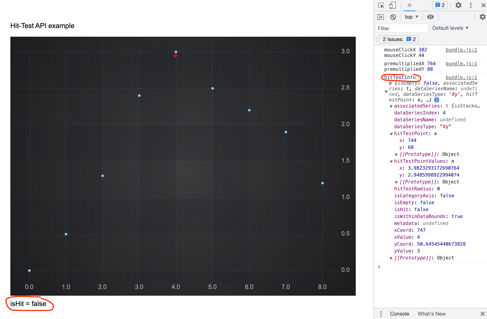

# ✅ Hit-Test API for Scatter Series

The hitTest method on Scatter Series
------------------------------------

The **IHitTestProvider.hitTest** method on [XyScatterRenderableSeries](/docs/2d-charts/chart-types/polar-xy-scatter-renderable-series/index.md) tests if the click was within the hitTestRadius from the rectangle bounding a point marker.

```ts
// hitTest method on Scatter Series
const hitTestInfo = scatterSeries.hitTestProvider.hitTest(premultipliedX, premultipliedY, HIT_TEST_RADIUS);
```

The algorithm is as follows:

1.  Iterate over each of the points to find the nearest one on the XY plane.
2.  Test if the mouse click was within the **hitTestRadius** from the rectangle bounding the point marker and update **HitTestInfo.isHit** property in the result returned.

This is the full example of the **hitTest** method on Scatter Series.

<CodeSnippetBlock labels={["JS","TS"]}>
```ts showLineNumbers
import { SciChartSurface, NumericAxis, NumberRange, DpiHelper, CustomAnnotation, EHorizontalAnchorPoint, EVerticalAnchorPoint, EllipsePointMarker, XyScatterRenderableSeries, XyDataSeries} from 'scichart';

export async function hitTestScatterTs(divId) {
    const { sciChartSurface, wasmContext } = await SciChartSurface.create(divId);
    const HIT_TEST_RADIUS = 0;
    sciChartSurface.xAxes.add(new NumericAxis(wasmContext, { growBy: new NumberRange(0.05, 0.05) }));
    sciChartSurface.yAxes.add(new NumericAxis(wasmContext, { growBy: new NumberRange(0.05, 0.05) }));
    const xLineValues = [0, 1, 2, 3, 4, 5, 6, 7, 8];
    const yLineValues = [0, 0.5, 1.3, 2.4, 3, 2.5, 2.2, 1.9, 1.2];
    const scatterSeries = new XyScatterRenderableSeries(wasmContext, {
        pointMarker: new EllipsePointMarker(wasmContext, {
            width: 7,
            height: 7,
            fill: 'white',
            strokeThickness: 2,
            stroke: '#368BC1'
        }),
        dataSeries: new XyDataSeries(wasmContext, { xValues: xLineValues, yValues: yLineValues })
    });
    sciChartSurface.renderableSeries.add(scatterSeries);
    // Add an SVG annotation to display the mouse click
    const svgAnnotation = new CustomAnnotation({
        svgString: `<svg width="8" height="8"><circle cx="50%" cy="50%" r="4" fill="#FF0000"/></svg>`,
        isHidden: true,
        horizontalAnchorPoint: EHorizontalAnchorPoint.Center,
        verticalAnchorPoint: EVerticalAnchorPoint.Center
    });
    sciChartSurface.annotations.add(svgAnnotation);
    sciChartSurface.domCanvas2D.addEventListener('mousedown', (mouseEvent) => {
        const mouseClickX = mouseEvent.offsetX;
        const mouseClickY = mouseEvent.offsetY;
        console.log('mouseClickX', mouseClickX, 'mouseClickY', mouseClickY);
        const premultipliedX = mouseEvent.offsetX * DpiHelper.PIXEL_RATIO;
        const premultipliedY = mouseEvent.offsetY * DpiHelper.PIXEL_RATIO;
        console.log('premultipliedX', premultipliedX, 'premultipliedY', premultipliedY);
        // IHitTestProvider.hitTest
        const hitTestInfo = scatterSeries.hitTestProvider.hitTest(premultipliedX, premultipliedY, HIT_TEST_RADIUS);
        svgAnnotation.x1 = hitTestInfo.hitTestPointValues.x;
        svgAnnotation.y1 = hitTestInfo.hitTestPointValues.y;
        svgAnnotation.isHidden = false;
        const resultDiv = document.getElementById('result');
        resultDiv.innerText = `isHit = ${hitTestInfo.isHit}`;
        console.log('hitTestInfo', hitTestInfo);
    });
}
```
```ts showLineNumbers
import { SciChartSurface, NumericAxis, NumberRange, DpiHelper, CustomAnnotation, EHorizontalAnchorPoint, EVerticalAnchorPoint, EllipsePointMarker, XyScatterRenderableSeries, XyDataSeries} from 'scichart';

export async function hitTestScatterTs(divId: string) {
    const { sciChartSurface, wasmContext } = await SciChartSurface.create(divId);
    const HIT_TEST_RADIUS = 0;
    sciChartSurface.xAxes.add(new NumericAxis(wasmContext, { growBy: new NumberRange(0.05, 0.05) }));
    sciChartSurface.yAxes.add(new NumericAxis(wasmContext, { growBy: new NumberRange(0.05, 0.05) }));
    const xLineValues = [0, 1, 2, 3, 4, 5, 6, 7, 8];
    const yLineValues = [0, 0.5, 1.3, 2.4, 3, 2.5, 2.2, 1.9, 1.2];
    const scatterSeries = new XyScatterRenderableSeries(wasmContext, {
        pointMarker: new EllipsePointMarker(wasmContext, {
            width: 7,
            height: 7,
            fill: 'white',
            strokeThickness: 2,
            stroke: '#368BC1'
        }),
        dataSeries: new XyDataSeries(wasmContext, { xValues: xLineValues, yValues: yLineValues })
    });
    sciChartSurface.renderableSeries.add(scatterSeries);
    // Add an SVG annotation to display the mouse click
    const svgAnnotation = new CustomAnnotation({
        svgString: `<svg width="8" height="8"><circle cx="50%" cy="50%" r="4" fill="#FF0000"/></svg>`,
        isHidden: true,
        horizontalAnchorPoint: EHorizontalAnchorPoint.Center,
        verticalAnchorPoint: EVerticalAnchorPoint.Center
    });
    sciChartSurface.annotations.add(svgAnnotation);
    sciChartSurface.domCanvas2D.addEventListener('mousedown', (mouseEvent: MouseEvent) => {
        const mouseClickX = mouseEvent.offsetX;
        const mouseClickY = mouseEvent.offsetY;
        console.log('mouseClickX', mouseClickX, 'mouseClickY', mouseClickY);
        const premultipliedX = mouseEvent.offsetX * DpiHelper.PIXEL_RATIO;
        const premultipliedY = mouseEvent.offsetY * DpiHelper.PIXEL_RATIO;
        console.log('premultipliedX', premultipliedX, 'premultipliedY', premultipliedY);
        // IHitTestProvider.hitTest
        const hitTestInfo = scatterSeries.hitTestProvider.hitTest(premultipliedX, premultipliedY, HIT_TEST_RADIUS);
        svgAnnotation.x1 = hitTestInfo.hitTestPointValues.x;
        svgAnnotation.y1 = hitTestInfo.hitTestPointValues.y;
        svgAnnotation.isHidden = false;
        const resultDiv = document.getElementById('result');
        resultDiv.innerText = `isHit = ${hitTestInfo.isHit}`;
        console.log('hitTestInfo', hitTestInfo);
    });
}
```
</CodeSnippetBlock>

 This gives us this chart.



 If to click inside the point marker it will be hit. In the browser console you will find output for the **HitTestInfo** object.

The hitTestDataPoint method on Scatter Series
---------------------------------------------

The **IHitTestProvider.hitTestDataPoint** method on [XyScatterRenderableSeries](/docs/2d-charts/chart-types/polar-xy-scatter-renderable-series/index.md) tests if the click was within the **hitTestRadius** from a data point.

```ts
// hitTestDataPoint method on Scatter Series
const hitTestInfo = scatterSeries.hitTestProvider.hitTestDataPoint(premultipliedX, premultipliedY, HIT_TEST_RADIUS);
```

 The algorithm is as follows:

1.  Iterate over each of the points to find the nearest one on the XY plane.
2.  Compare distance to the point with the **hitTestRadius** and update **HitTestInfo.isHit** property.

The hitTestXSlice method on Scatter Series
------------------------------------------

The **IHitTestProvider.hitTestXSlice** method is used for [CursorModifier](/docs/2d-charts/chart-modifier-api/cursor-modifier/cursor-modifier-overview/index.md) and [RolloverModifier](/docs/2d-charts/chart-modifier-api/rollover-modifier/index.md) to get information about the nearest point.

```ts
// hitTestXSlice method on Scatter Series
const hitTestInfo = scatterSeries.hitTestProvider.hitTestXSlice(premultipliedX, premultipliedY);
```

 The way it works:

1.  Finds the nearest point in X direction.
2.  Sets **HitTestInfo.isHit** property to **True** if the mouse click was within the data bounds.

#### See Also

* [Hit-Test API for Line Series](/docs/2d-charts/chart-types/hit-test-api/fast-line-renderable-series/index.md)
* [Hit-Test API for Band Series](/docs/2d-charts/chart-types/hit-test-api/fast-band-renderable-series/index.md)
* [Hit-Test API for Bubble Series](/docs/2d-charts/chart-types/hit-test-api/fast-bubble-renderable-series/index.md)
* [Hit-Test API for Heatmap Series](/docs/2d-charts/chart-types/hit-test-api/uniform-heatmap-renderable-series/index.md)
* [Hit-Test API for Rectangle Series](/docs/2d-charts/chart-types/hit-test-api/fast-rectangle-renderable-series/index.md)
* [Hit-Test API for Polar Line Series](/docs/2d-charts/chart-types/hit-test-api/polar-line-renderable-series/README.md)
