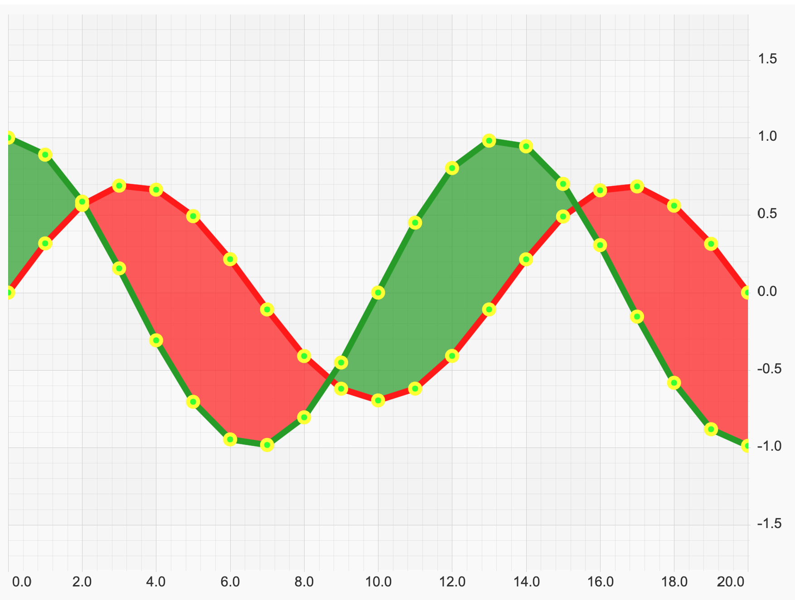
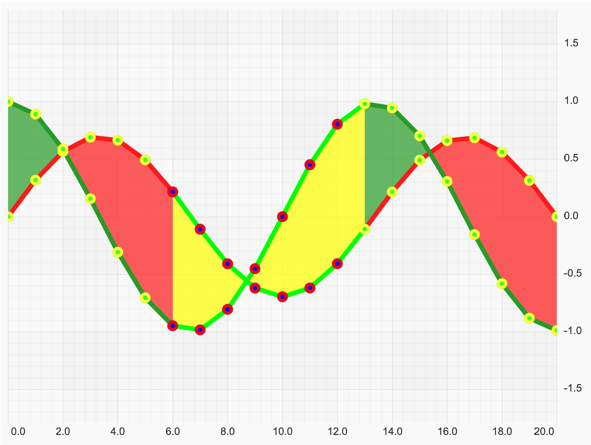

# ✅ Per-Point Colouring of Band Segments

## Colour Band Series Segments with PaletteProvider

Let's create a [FastBandRenderableSeries](/docs/2d-charts/chart-types/fast-band-renderable-series/index.md).

<CodeSnippetBlock labels={["TS"]}>

```ts
const { wasmContext, sciChartSurface } = await SciChartSurface.create(divElementId, {
     theme: new SciChartJSLightTheme()
 });

 sciChartSurface.xAxes.add(new NumericAxis(wasmContext));
 sciChartSurface.yAxes.add(new NumericAxis(wasmContext, { growBy: new NumberRange(0.4, 0.4) }));
 const dataSeries = new XyyDataSeries(wasmContext);
 const POINTS = 20;
 const STEP = (3 \* Math.PI) / POINTS;

 for (let i = 0; i <= POINTS; i++) {
     const k = 1 - i / 2000;
     const y = Math.sin(i \* STEP) \* k \* 0.7;
     const y1 = Math.cos(i \* STEP) \* k;
     dataSeries.append(i, y, y1);
 }

 const rendSeries = new FastBandRenderableSeries(wasmContext, {
     dataSeries,
     strokeThickness: 7,
     fill: 'rgba(39,155,39,0.7)',
     fillY1: 'rgba(255,25,25,0.7)',
     stroke: '#FF1919',
     strokeY1: '#279B27',
     opacity: 1,
     pointMarker: new EllipsePointMarker(wasmContext, {
         width: 14,
         height: 14,
         strokeThickness: 4,
         stroke: '#FFFF33',
         fill: '#33FF33',
         opacity: 1
     }),
 });

 sciChartSurface.renderableSeries.add(rendSeries);
 sciChartSurface.zoomExtents();
```

</CodeSnippetBlock>



Next we create a BandPaletteProvider by implementing [IStrokePaletteProvider:blue_book:](https://www.scichart.com/documentation/js/current/typedoc/interfaces/istrokepaletteprovider.html), [IFillPaletteProvider:blue_book:](https://www.scichart.com/documentation/js/current/typedoc/interfaces/ifillpaletteprovider.html) and [IPointMarkerPaletteProvider:blue_book:](https://www.scichart.com/documentation/js/current/typedoc/interfaces/ipointmarkerpaletteprovider.html) interfaces in typescript, or extending [DefaultPaletteProvider:blue_book:](https://www.scichart.com/documentation/js/current/typedoc/classes/defaultpaletteprovider.html) in JavaScript.

<CodeSnippetBlock labels={["JS", "TS"]}>

```ts
// PaletteProvider implementation which colours stroke, fill and pointmarker
class BandPaletteProvider extends DefaultPaletteProvider {
    constructor() {
        super();
        this.strokePaletteMode = EStrokePaletteMode.SOLID;
        this.fillPaletteMode = EFillPaletteMode.SOLID;
        this.limeStroke = parseColorToUIntArgb("lime");
        this.yellowFill = parseColorToUIntArgb("rgba(255,255,0,0.7)");
        this.markerRedStroke = parseColorToUIntArgb("red");
        this.markerBlueFill = parseColorToUIntArgb("blue");
    }
    overrideFillArgb(xValue, yValue, index, opacity, metadata) {
        if (xValue >= 6 && xValue <= 12) {
            return opacity !== undefined ? uintArgbColorMultiplyOpacity(this.yellowFill, opacity) : this.yellowFill;
        }
        return undefined;
    }
    overrideStrokeArgb(xValue, yValue, index, opacity, metadata) {
        if (xValue >= 6 && xValue <= 12) {
            return opacity !== undefined ? uintArgbColorMultiplyOpacity(this.limeStroke, opacity) : this.limeStroke;
        }
        return undefined;
    }
    overridePointMarkerArgb(xValue, yValue, index, opacity, metadata) {
        if (xValue >= 6 && xValue <= 12) return { stroke: this.markerRedStroke, fill: this.markerBlueFill };
        return undefined;
    }
}
```

```ts
// PaletteProvider implementation which colours stroke, fill and pointmarker
class BandPaletteProvider implements IStrokePaletteProvider, IFillPaletteProvider, IPointMarkerPaletteProvider {
    public readonly strokePaletteMode = EStrokePaletteMode.SOLID;
    public readonly fillPaletteMode = EFillPaletteMode.SOLID;
    private readonly limeStroke = parseColorToUIntArgb("lime");
    private readonly yellowFill = parseColorToUIntArgb("rgba(255,255,0,0.7)");
    private readonly markerRedStroke = parseColorToUIntArgb("red");
    private readonly markerBlueFill = parseColorToUIntArgb("blue");
    public onAttached(parentSeries: IRenderableSeries): void {}
    public onDetached(): void {}
    public overrideFillArgb(
        xValue: number,
        yValue: number,
        index: number,
        opacity?: number,
        metadata?: IPointMetadata
    ): number {
        if (xValue >= 6 && xValue <= 12) {
            return opacity !== undefined ? uintArgbColorMultiplyOpacity(this.yellowFill, opacity) : this.yellowFill;
        }
        return undefined;
    }
    public overrideStrokeArgb(
        xValue: number,
        yValue: number,
        index: number,
        opacity?: number,
        metadata?: IPointMetadata
    ): number {
        if (xValue >= 6 && xValue <= 12) {
            return opacity !== undefined ? uintArgbColorMultiplyOpacity(this.limeStroke, opacity) : this.limeStroke;
        }
        return undefined;
    }
    public overridePointMarkerArgb(
        xValue: number,
        yValue: number,
        index: number,
        opacity?: number,
        metadata?: IPointMetadata
    ): TPointMarkerArgb {
        if (xValue >= 6 && xValue <= 12) return { stroke: this.markerRedStroke, fill: this.markerBlueFill };
        return undefined;
    }
}
```

</CodeSnippetBlock>

To use it, apply to the Paletteprovider property on a RenderableSeries:

```ts
// Usage
const bandSeries = new FastBandRenderableSeries(wasmContext);
bandSeries.paletteProvider = new BandPaletteProvider();
```

Now we have a paletted band renderable series with fill, stroke and point markers overridden for X in range from 6 to 12.


