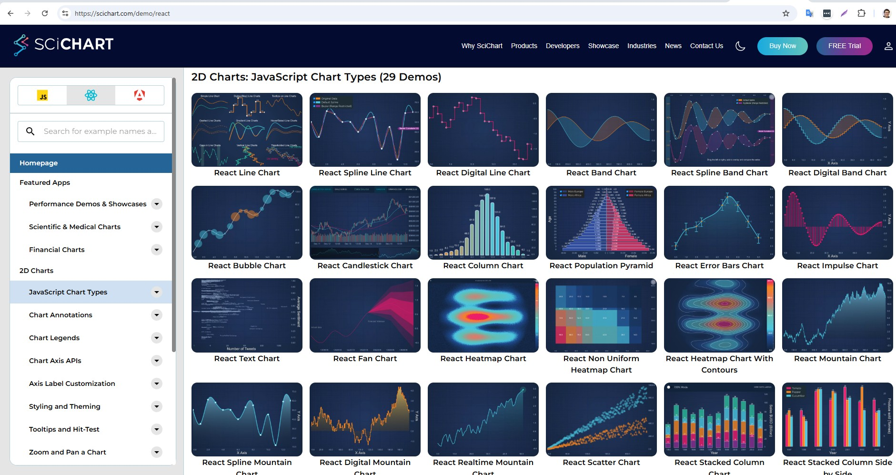

# RenderableSeries Overview

The RenderableSeries in SciChart are visual representations of **X,Y Numeric** or **Date** data. Other libraries call them 'Chart Types'.

Some RenderableSeries render simple X,Y values (2D points in space), while some render additional information (such as X,Y0,Y1 values, or X,Y,Z values).

Chart Types in SciChart.js
------------------------------

SciChart.js supports a number of 2D & 3D Chart types. These include:



|  |  |
|---|---|
| [Line Series](/2d-charts/chart-types/fast-line-renderable-series) | [Uniform Heatmap Series](/2d-charts/chart-types/uniform-heatmap-renderable-series/uniform-heatmap-chart-type) |
| [Digital (Step) Line Series](/2d-charts/chart-types/fast-line-digital-renderable-series) | [Non-Uniform Heatmap Series](/2d-charts/chart-types/non-uniform-heatmap-renderable-series) |
| [Spline Line Series](/2d-charts/chart-types/spline-line-renderable-series) | [Heatmap Contours Series](/2d-charts/chart-types/uniform-contours-renderable-series) |
| [Mountain (Area) Series](/2d-charts/chart-types/fast-mountain-area-renderable-series) | [Candlestick Series](/2d-charts/chart-types/fast-candlestick-renderable-series) |
| [Digital (Step) Mountain Series](/2d-charts/chart-types/fast-mountain-area-digital-renderable-series) | [OHLC Series](/2d-charts/chart-types/fast-ohlc-renderable-series) |
| [Spline Mountain Series](/2d-charts/chart-types/spline-mountain-renderable-series) | [Lollipop (Impulse or Stem) Series](/2d-charts/chart-types/fast-impulse-renderable-series) |
| [Column Series](/2d-charts/chart-types/fast-column-renderable-series/column-series-type) | [Error Bars Series](/2d-charts/chart-types/fast-error-bars-renderable-series) |
| [Stacked (Grouped) Column Series](/2d-charts/chart-types/stacked-column-renderable-series) | [Fan Charts](/2d-charts/chart-types/fan-charts-type) |
| [100% Stacked Column Series](/2d-charts/chart-types/stacked-column-renderable-series)  | [Pie Charts](/2d-charts/chart-types/pie-chart-type) |
| [Stacked Mountain Series](/2d-charts/chart-types/stacked-mountain-renderable-series) | [Donut Charts](/2d-charts/chart-types/donut-chart-type) |
| [100% Stacked Mountain Series](/2d-charts/chart-types/stacked-mountain-renderable-series) | [Band (High-Low Fill) Series](/2d-charts/chart-types/fast-band-renderable-series) |
| [Smooth Stacked Mountain Series](/2d-charts/chart-types/smooth-stacked-mountain-renderable-series) | [Digital (Step) Band (High-Low Fill) Series](/2d-charts/chart-types/fast-band-digital-renderable-series) |
| [Scatter Series](/2d-charts/chart-types/xy-scatter-renderable-series) | [Text Series](/2d-charts/chart-types/fast-text-renderable-series) |
| [Bubble Series](/2d-charts/chart-types/fast-bubble-renderable-series) | [Triangle series](/2d-charts/chart-types/fast-triangle-renderable-series/index.md) |
| [Rectangle series](/2d-charts/chart-types/fast-rectangle-renderable-series) | [Treemap chart](/2d-charts/chart-types/tree-map-type) |
| [Box plot series](/2d-charts/chart-types/fast-box-plot-renderable-series) | [Line Segment Series](/2d-charts/chart-types/fast-line-segment-renderable-series/index.md) |
| [Polar Partial Chart](/2d-charts/chart-types/polar-partial-chart-type) | [Polar Line Series](/2d-charts/chart-types/polar-line-renderable-series) |
| [Polar Band Series](/2d-charts/chart-types/polar-band-renderable-series) | [Polar Column (Area) Series](/2d-charts/chart-types/polar-column-renderable-series) |
| [Polar Heatmap Series](/2d-charts/chart-types/polar-uniform-heatmap-renderable-series) | [Polar Mountain Series](/2d-charts/chart-types/polar-mountain-renderable-series) |
| [Polar Pie Chart](/2d-charts/chart-types/polar-pie-chart) | [Polar Scatter Series](/2d-charts/chart-types/polar-xy-scatter-renderable-series) |
| [Polar Stacked Column Series](/2d-charts/chart-types/polar-stacked-column-renderable-series) | [Polar Stacked Mountain Series](/2d-charts/chart-types/polar-stacked-mountain-renderable-series) |
| [Polar Gauge Chart](/2d-charts/chart-types/polar-gauge-chart) | |

:::tip
Click on the links above to see documentation and live embedded code snippets for each of the chart types in SciChart.js
:::

Common 2D Chart Features
----------------------------

As well as just render 2D Data, a number of chart types support additional properties and features.

For example, most 2D Chart types in SciChart.js support:

| SciChart.js Feature | Description |
|---------------------|-------------|
| **Dynamic Data Updates** | All SciChart.js chart types support dynamic updates to data out of the box. Insert, append, update, delete - modify data and the chart updates FAST. See the [DataSeries API documentation](/2d-charts/chart-types/data-series-api/data-series-api-overview) for more details. |
| **Per-point coloring** | SciChart.js chart types support per-point coloring based on a rule. Xy values over/under a threshold, values with a property can be colored individually. See the [PaletteProvider API](/2d-charts/chart-types/palette-provider-api/palette-provider-api-overview) for more details. |
| **Data-point markers** | SciChart.js chart types support adding a pointmarker (circle, square, triangle, cross marker) at data-points. See the [PointMarkers documentation](/2d-charts/chart-types/common-series-apis/drawing-point-markers) for more details. |
| **Data-point Text Labels** | SciChart.js supports fast, WebGL based text labels at datapoints, which can be customised. See the [DataLabels API](/2d-charts/chart-types/data-point-labels/data-labels-api-overview) for more details. |
| **Render Data Transforms** | Allows transforming data right before rendering. Used, for example, to add or remove data points just before rendering. See the [RenderDataTransforms API](/2d-charts/chart-types/render-data-transforms-api) |
| **Showing / hiding series** | You can show/hide series in SciChart.js as well as be notified when a series is hidden. See the [isVisibleChanged documentation](/2d-charts/chart-types/common-series-apis/is-visible) for more details. |
| **Select series** | Using a ChartModifier (an attached behaviour) you can add Series Selection, Hover callbacks and styling into SciChart.js. See the [SeriesSelectionModifier documentation](/2d-charts/chart-modifier-api/selection/series-selection) for more details. |
| **Select data-points** | Using a ChartModifier (attached behaviour), you can add data-point selection detection, callbacks and styling into SciChart.js. See the [DataPointSelectionModifier](/2d-charts/chart-modifier-api/selection/data-point-selection) docs for more details. |
| **Tooltips and Cursors** | Of course, SciChart.js supports customisable tooltips and cursors using ChartModifiers (attached behaviour). See the [CursorModifier](/2d-charts/chart-modifier-api/cursor-modifier/cursor-modifier-overview) or [RolloverModifier](/2d-charts/chart-modifier-api/rollover-modifier) docs for more details. |
| **Nulls (Gaps) in Data** | For line charts, mountain charts and 2D cartesian chart types you can draw nulls (gaps) in data, or even change style in the line using a technique we have. See the [Drawing Gaps in Series](/2d-charts/chart-types/common-series-apis/drawing-gaps) documentation for more details. |

:::tip
We are continually improving and adding features to SciChart.js. Some of the things on the roadmap are: more chart types, more interactions & even allowing custom drawing.
:::

The RenderableSeries Class
------------------------------

All 2D Chart types in SciChart.js are derived from the [BaseRenderableSeries:blue_book:](https://www.scichart.com/documentation/js/current/typedoc/classes/baserenderableseries.html) type. This is a JavaScript class which is added to the [sciChartSurface.renderableSeries:blue_book:](https://www.scichart.com/documentation/js/current/typedoc/classes/scichartsurface.html#renderableseries) collection and is rendered using our own proprietary WebAssembly / WebGL based rendering engine.

Each RenderableSeries is rendered to the screen, displaying the data from an associated [DataSeries](/2d-charts/chart-types/data-series-api/data-series-api-overview).

### Renderable Series Properties

The properties common to the [BaseRenderableSeries class:blue_book:](https://www.scichart.com/documentation/js/current/typedoc/classes/baserenderableseries.html) are listed below.

**BaseRenderableSeries** **property**

Here's the converted content in a two-column Markdown table with headers:

| Property | Description |
|----------|-------------|
| **[dataLabelProvider:blue_book:](https://www.scichart.com/documentation/js/current/typedoc/classes/baserenderableseries.html#datalabelprovider)** | (New to v3.0) The dataLabelprovider allows creation of per **data-point text labels**. Please see the [Data Labels API](/2d-charts/chart-types/data-point-labels/data-labels-api-overview) section for a complete walk-through of text labels on chart series. |
| **[dataSeries:blue_book:](https://www.scichart.com/documentation/js/current/typedoc/classes/baserenderableseries.html#dataseries)** | The DataSeries is the data-source for the RenderableSeries. Please see [DataSeries API](/2d-charts/chart-types/data-series-api/data-series-api-overview) section for a complete walk-through of the DataSeries API |
| **[drawNanAs:blue_book:](https://www.scichart.com/documentation/js/current/typedoc/classes/baserenderableseries.html#drawnanas)** | How to treat NAN (Not a number) values in the input dataSeries. See [ELineDrawMode:blue_book:](https://www.scichart.com/documentation/js/current/typedoc/enums/elinedrawmode.html) for a list of values. |
| **[renderDataTransform:blue_book:](https://www.scichart.com/documentation/js/v4/typedoc/classes/baserenderableseries.html#renderdatatransform)** | (New to v3.4) A [RenderDataTransform](/2d-charts/chart-types/render-data-transforms-api) may be optionally applied to a RenderableSeries to transform data immediately before drawing. Can be used to change the visual output e.g. create interpolated series, insert points into series and change styles in a series without changing the data. |
| **[pointMarker:blue_book:](https://www.scichart.com/documentation/js/current/typedoc/classes/baserenderableseries.html#pointmarker)** | A [PointMarker:blue_book:](https://www.scichart.com/documentation/js/current/typedoc/classes/basepointmarker.html) is used to draw an **optional point-marker at each data-point**. Applicable to some series types only. |
| **[stroke:blue_book:](https://www.scichart.com/documentation/js/current/typedoc/classes/baserenderableseries.html#stroke)** | A Stroke for lines, outlines and edges of this RenderableSeries. Acceptable values include RGB format e.g. "#FF0000", RGBA format e.g. "#FF000077" and RGBA format e.g. "rgba(255,0,0,0.5)" |
| **[strokeThickness:blue_book:](https://www.scichart.com/documentation/js/current/typedoc/classes/baserenderableseries.html#strokethickness)** | The Stroke Thickness for lines, outlines and edges of this RenderableSeries |
| **[strokeDashArray:blue_book:](https://www.scichart.com/documentation/js/current/typedoc/classes/fastlinerenderableseries.html#strokedasharray)** | Some chart types which support lines (e.g. Line series, Spline Line series, Mountain Series) support dashed lines. This property accepts an array which defines [dot, dash] length in pixels |
| **[opacity:blue_book:](https://www.scichart.com/documentation/js/current/typedoc/classes/baserenderableseries.html#opacity)** | An Opacity factor of the Series that controls its semi-transparency level, where value 1 means the Series is opaque; 0 means transparent. |
| **[xAxisId:blue_book:](https://www.scichart.com/documentation/js/current/typedoc/classes/baserenderableseries.html#xaxisid)** | The XAxisId of the series allows you to attach a series to a specific axis. If you only have single X and Y Axis you can leave this default. |
| **[xAxis:blue_book:](https://www.scichart.com/documentation/js/v4/typedoc/classes/baserenderableseries.html#xaxis)** | Link to the associated X Axis |
| **[yAxisId:blue_book:](https://www.scichart.com/documentation/js/current/typedoc/classes/baserenderableseries.html#yaxisid)** | The YAxisId of the series allows you to attach a series to a specific axis. If you only have single X and Y Axis you can leave this default. |
| **[yAxis:blue_book:](https://www.scichart.com/documentation/js/v4/typedoc/classes/baserenderableseries.html#yaxis)** | Link to the associated Y Axis |
| **[isvisible:blue_book:](https://www.scichart.com/documentation/js/current/typedoc/classes/baserenderableseries.html#isvisible)** | When true, the series is visible. To hide a series, set IsVisible = false. |
| **[isVisibleChanged:blue_book:](https://www.scichart.com/documentation/js/current/typedoc/classes/baserenderableseries.html#isvisiblechanged)** | An [EventHandler:blue_book:](https://www.scichart.com/documentation/js/current/typedoc/classes/eventhandler.html) allowing you to subscribe to isVisible changed callbacks |
| **[effect:blue_book:](https://www.scichart.com/documentation/js/current/typedoc/classes/baserenderableseries.html#effect)** | An optional [ShaderEffect](/2d-charts/miscellaneous-apis/glow-and-dro-shadow-shader-effects) for modifying the render output of a RenderableSeries. |
| **[paletteProvider:blue_book:](https://www.scichart.com/documentation/js/current/typedoc/classes/baserenderableseries.html#paletteprovider)** | The PaletteProvider API **allows changing the color of a series on a per-point basis**. For more details about the PaletteProvider API see the individual examples for [Line Series](/2d-charts/chart-types/palette-provider-api/fast-line-renderable-series), [Column Series](/2d-charts/chart-types/palette-provider-api/fast-column-renderable-series) etc... |
| **[hitTestProvider:blue_book:](https://www.scichart.com/documentation/js/current/typedoc/classes/baserenderableseries.html#hittestprovider)** | The [HitTestProvider:blue_book:](https://www.scichart.com/documentation/js/current/typedoc/interfaces/ihittestprovider.html) exposes the [Hit-Test API](/2d-charts/chart-types/hit-test-api/hit-test-api-overview), used to **determine whether a series has been clicked on, hovered** or find the nearest Xy datapoint to a mouse coordinate. |

### Constructor options on RenderableSeries

Every RenderableSeries has a set of constructor options allowing for fast initialization and setup by passing in a javascript object. Each property reflected on the series has an optional constructor option parameter.

For example this code:

**Setting properties of series**

```ts
const lineSeries = new FastLineRenderableSeries(wasmContext);
lineSeries.stroke = "Red";
lineSeries.strokeThickness = 3;
lineSeries.dataSeries = new XyDataSeries(wasmContext, {xValues, yValues});
lineSeries.isVisible = true;
lineSeries.opacity = 0.7;
```

is equivalent to this:

**Constructor parameters of series**

```ts
const lineSeries = new FastLineRenderableSeries(wasmContext, {
    stroke: "Red",
    strokeThickness: 3,
    dataSeries: new XyDataSeries(wasmContext, {xValues, yValues}),
    isVisible: true,
    opacity: 0.7
});
```

Where Next?
---------------

To learn about a specific chart type, and to find out how to configure them, visit the following pages:

*   [The Line Series Type](/2d-charts/chart-types/fast-line-renderable-series)
*   [The Scatter Series Type](/2d-charts/chart-types/xy-scatter-renderable-series)
*   [The Mountain Series Type](/2d-charts/chart-types/fast-mountain-area-renderable-series)
* [The Column Series Type](/2d-charts/chart-types/fast-column-renderable-series/column-series-type)
* [The Candlestick Series type](/2d-charts/chart-types/fast-candlestick-renderable-series)
* [The OHLC Series Type](/2d-charts/chart-types/fast-ohlc-renderable-series)
* [The Uniform Heatmap Chart Type](/2d-charts/chart-types/uniform-heatmap-renderable-series/uniform-heatmap-chart-type)
* [The Polar Column Chart Type](/2d-charts/chart-types/polar-column-renderable-series)
