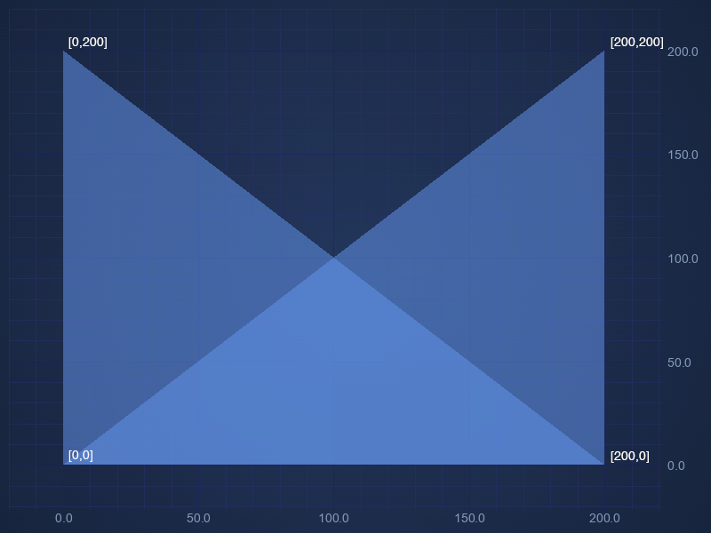
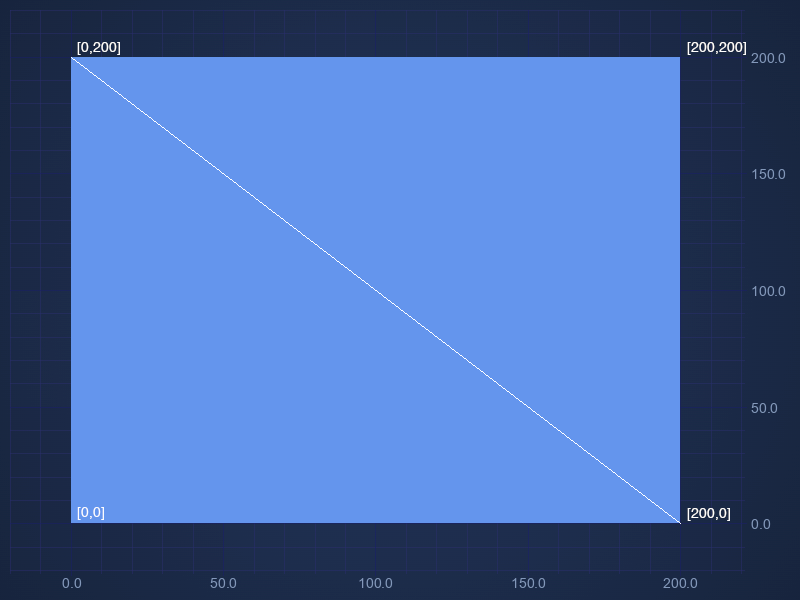

# 🔄 The Triangle Series Type

The TriangleRenderableSeries is designed to plot data points as triangles, often used for custom scatter plots, mesh visualizations, or highlighting specific data points with a triangle marker. It supports full customization, including stroke, fill, and point marker options.

Triangle Series can be created using the [TriangleRenderableSeries:blue_book:](https://www.scichart.com/documentation/js/v4/typedoc/classes/trianglerenderableseries.html) type.

The TriangleRenderableSeries class in SciChart.js is a specialized renderable series used for visualizing data as a series of triangles on a 2D chart. It extends the base BaseRenderableSeries class and provides additional properties and methods tailored for rendering triangle shapes.

Here is a simple Triangle Series example made using [XyDataSeries:blue_book:](https://www.scichart.com/documentation/js/v4/typedoc/classes/xydataseries.html):

```ts {4} showLineNumbers file=./triangle-series-list/demo.ts start=region_A_start end=region_A_end
```

## Properties

- **drawMode** Determines how the triangles are rendered on the chart. Options that are available are List, Polygon and Strip.

    - **ETriangleSeriesDrawMode.List** - In this mode, each group of three consecutive points in the list defines an independent triangle. The triangles are not connected, every set of three points forms a separate triangle.

    - **ETriangleSeriesDrawMode.Polygon** - In this mode, each group of two consecutive points and the first one in the list defines a triangle. The triangles are connected in a way that they share the same point defined by the first point on the list.

    - **ETriangleSeriesDrawMode.Strip** - In this mode, each group of three consecutive points in the list defines a triangle. The triangles are connected, every point is connected to the last two points.

- **fill** The fill color of the triangle.
- **dataSeries** The data series containing the X, and Y values to plot.
- **isVisible** Determines whether the series is visible on the chart.
- **polygonVertices** Sets the number of points per polygon. Applies only for drawMode ETriangleSeriesDrawMode.Polygon

## Polygon and Strip mode explained by using the same set of data

Polygon and Strip modes are explained by using the same set of four coordinates.

```ts
const coordinates = [
    [0, 0],
    [0, 200],
    [200, 0],
    [200, 200]
];
```

Here is the result using Polygon mode. Each group of two consecutive points and the first one in the list defines a triangle.
Out of these four points from this data set we have two triangles [[0, 0],[0, 200],[200, 0]] and [[0, 0],[200, 0], [200, 200]]



Here is the result using Strip mode mode. Each group of three consecutive points in the list defines a triangle.
Out of these four points from this data set we also have two triangles [[0, 0],[0, 200],[200, 0]] and [[0, 200],[200, 0], [200, 200]]



## Examples

### Triangle Series List Mode Example

In this mode, each group of three consecutive points in the list defines an independent triangle. The triangles are not connected, every set of three points forms a separate triangle.

<LiveDocSnippet name="./triangle-series-list/demo" />

```ts {11} showLineNumbers file=./triangle-series-list/demo.ts start=region_A_start end=region_A_end
```

### Triangle Series Polygon Mode Example

In this mode, each group of two consecutive points and the first one in the list defines a triangle. The triangles are connected in a way that they share the same point defined by the first point on the list.

<LiveDocSnippet name="./triangle-series-polygon/demo" />

```ts {22} showLineNumbers file=./triangle-series-polygon/demo.ts start=region_A_start end=region_A_end
```

### Triangle Series Strip Mode Example

In this mode, each group of three consecutive points in the list defines a triangle. The triangles are connected, every point is connected to the last two points.

<LiveDocSnippet name="./triangle-series-strip/demo" />

```ts {20} showLineNumbers file=./triangle-series-strip/demo.ts start=region_A_start end=region_A_end
```

### Triangle Series Custom Gradient Example

In this example we have used [XyxyDataSeries:blue_book:](https://www.scichart.com/documentation/js/v4/typedoc/classes/xyxydataseries.html) and fillLinearGradient to display custom gradient.

<LiveDocSnippet name="./triangle-series-custom-gradient/demo" />

```ts {30-33} showLineNumbers file=./triangle-series-custom-gradient/demo.ts start=region_A_start end=region_A_end
```

### Triangle Series Texture Example

In Triangle Series Texture example we are using [XyxyDataSeries:blue_book:](https://www.scichart.com/documentation/js/v4/typedoc/classes/xyxydataseries.html), ETriangleSeriesDrawMode.Polygon and customTextureOptions to display rectangles with custom texture that are comprised of four triangles.

<LiveDocSnippet name="./triangle-series-texture/demo" />

```ts showLineNumbers file=./triangle-series-texture/demo.ts start=region_A_start end=region_A_end
```

### Australia Map Example

In this example we have used Sweep-line algorithm for constrained Delaunay triangulation to convert outline of Australia into series of triangles that can be displayed using ETriangleSeriesDrawMode.List mode.

<LiveDocSnippet name="./australia-map/demo" />

