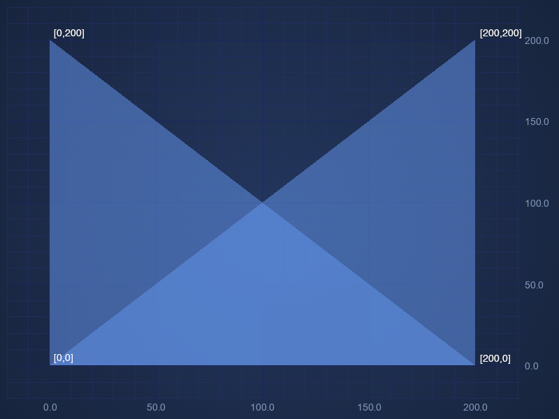
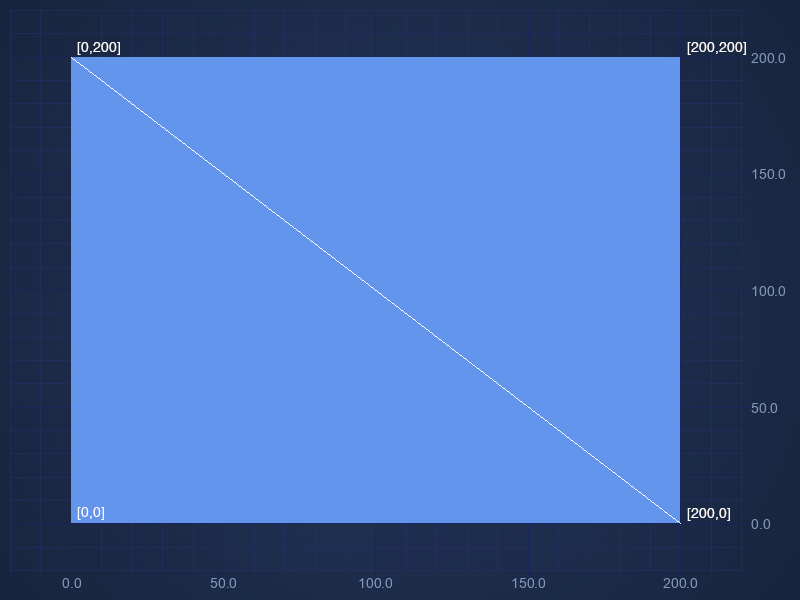

import ChartPreviewWrapper from "@site/src/components/ChartPreviewWrapper";
import triangleSeriesList from "!!raw-loader!./triangle-series-list/demo";
import triangleSeriesPolygon from "!!raw-loader!./triangle-series-polygon/demo";
import triangleSeriesStrip from "!!raw-loader!./triangle-series-strip/demo";
import australiaMap from "!!raw-loader!./australia-map/demo";
import triangleSeriesCustomGradient from "!!raw-loader!./triangle-series-custom-gradient/demo";

# 🔄 The Triangle Series Type

Triangle Series can be created using the [TriangleRenderableSeries](https://www.scichart.com/documentation/js/v4/typedoc/classes/trianglerenderableseries.html) type.

The TriangleRenderableSeries class in SciChart.js is a specialized renderable series used for visualizing data as a series of triangles on a 2D chart. It extends the base BaseRenderableSeries class and provides additional properties and methods tailored for rendering triangle shapes.

Here is a simple Triangle Series example made using [XyDataSeries](https://www.scichart.com/documentation/js/v4/typedoc/classes/xydataseries.html):

```ts {12} showLineNumbers file=./triangle-series-list/demo.ts start=region_A_start end=region_A_end

```

## Overview

The TriangleRenderableSeries is designed to plot data points as triangles, often used for custom scatter plots, mesh visualizations, or highlighting specific data points with a triangle marker. It supports full customization, including stroke, fill, and point marker options.

## Properties

- **drawMode** Determines how the triangles are rendered on the chart. Options that are available are List, Polygon and Strip.

    - **ETriangleSeriesDrawMode.List** - In this mode, each group of three consecutive points in the list defines an independent triangle. The triangles are not connected, every set of three points forms a separate triangle.

    - **ETriangleSeriesDrawMode.Polygon** - In this mode, each group of two consecutive points and the first one in the list defines a triangle. The triangles are connected in a way that they share the same point defined by the first point on the list.

    - **ETriangleSeriesDrawMode.Strip** - In this mode, each group of three consecutive points in the list defines a triangle. The triangles are connected, every point is connected to the last two points.

- **fill** The fill color of the triangle.
- **dataSeries** The data series containing the X, and Y values to plot.
- **isVisible** Determines whether the series is visible on the chart.
- **polygonVertices** Sets the number of points per polygon. Applies only for drawMode ETriangleSeriesDrawMode.Polygon

## Examples

### List mode example

In this mode, each group of three consecutive points in the list defines an independent triangle. The triangles are not connected, every set of three points forms a separate triangle.

<ChartPreviewWrapper maxWidth={600} jsContent={triangleSeriesList} />

```ts {12} showLineNumbers file=./triangle-series-list/demo.ts start=region_A_start end=region_A_end

```

### Polygon mode example

In this mode, each group of two consecutive points and the first one in the list defines a triangle. The triangles are connected in a way that they share the same point defined by the first point on the list.

<ChartPreviewWrapper maxWidth={600} jsContent={triangleSeriesPolygon} />

### Strip mode example

In this mode, each group of three consecutive points in the list defines a triangle. The triangles are connected, every point is connected to the last two points.

<ChartPreviewWrapper maxWidth={600} jsContent={triangleSeriesStrip} />

### Australia Map

<ChartPreviewWrapper maxWidth={600} jsContent={australiaMap} />

### Triangle Series Custom Gradient

<ChartPreviewWrapper maxWidth={600} jsContent={triangleSeriesCustomGradient} />

## Polygon and Strip mode explained by using the same set of data

Polygon and Strip modes are explained by using the same set of four coordinates.

```
const coordinates = [
 [0, 0],
 [0, 200],
 [200, 0],
 [200, 200]
];
```

Here is the result using Polygon mode. Each group of two consecutive points and the first one in the list defines a triangle.
Out of these four points from this data set we have two triangles [[0, 0],[0, 200],[200, 0]] and [[0, 0],[200, 0], [200, 200]]



Here is the result using Strip mode mode. Each group of three consecutive points in the list defines a triangle.
Out of these four points from this data set we also have two triangles [[0, 0],[0, 200],[200, 0]] and [[0, 200],[200, 0], [200, 200]]


