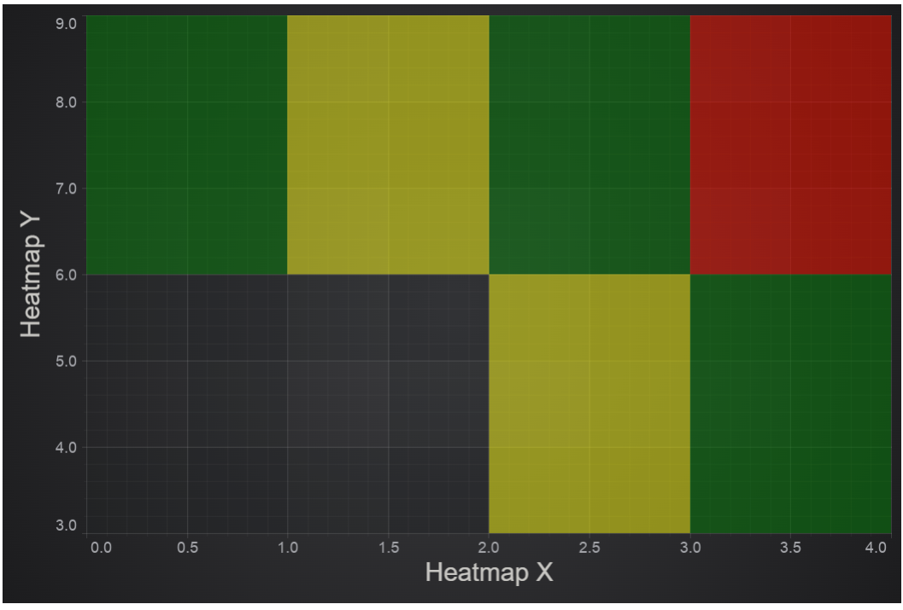

# The Uniform Heatmap Chart Type

Uniform Heatmaps can be created using the [UniformHeatmapRenderableSeries:blue_book:](https://www.scichart.com/documentation/js/current/typedoc/classes/uniformheatmaprenderableseries.html) type.

:::tip
The [JavaScript Heatmap Chart Example](https://www.scichart.com/demo/javascript/heatmap-chart) can be found in the [SciChart.Js Examples Suite > Heatmap Chart](https://github.com/ABTSoftware/SciChart.JS.Examples/tree/master/Examples/src/components/Examples/Charts2D/BasicChartTypes/HeatmapChart) on Github, or our live demo at [scichart.com/demo](https://www.scichart.com/demo/javascript/heatmap-chart).
:::

<ChartFromSciChartDemo
    src="https://www.scichart.com/demo/iframe/heatmap-chart"
    title="Uniform Heatmap Series Chart"
/>

## Create a Uniform Heatmap

Uniform heatmaps are extremely fast, lightweight series types for rendering two dimensional data as a heatmap or spectrogram. The [UniformHeatmapRenderableSeries:blue_book:](https://www.scichart.com/documentation/js/current/typedoc/classes/uniformheatmaprenderableseries.html) type should be used in conjunction with a [UniformHeatmapDataSeries:blue_book:](https://www.scichart.com/documentation/js/current/typedoc/classes/uniformheatmapdataseries.html) when you simply want to specify a Step in the X,Y direction (each cell is the same size).

To create a [Javascript Heatmap Chart](https://www.scichart.com/demo/javascript-heatmap-chart) with SciChart.js, use the following code:

### Creating the Imports

First, let's setup the imports that we need for the heatmap type.

<CodeSnippetBlock labels={["TS"]}>
```ts {5-7} showLineNumbers file=./demo.ts start=#region_A_start end=#region_A_end
```
</CodeSnippetBlock>

### Creating Heatmap ZValues\[ \]\[ \] Array

Next, we want to create a 2-dimensional array of data. Heatmap data is a 2D number array (type `number[][]` in Typescript) which contains the heat values. These are later mapped to colours in the heatmap.

The dimensions of the zValues 2D array are \[height\]\[width\]  

<CodeSnippetBlock labels={["TS"]}>
```ts {18} showLineNumbers file=./demo.ts start=#region_B_start end=#region_B_end
```
</CodeSnippetBlock>

### Creating the Heatmap Instance

Finally, we create the UniformHeatmapRenderableSeries type, which has both a UniformHeatmapDataSeries for the data and a HeatmapColorMap to map zValues to colors.

Here's a full example below:

<CodeSnippetBlock labels={["TS", "Builder API (JSON Config)"]}>
```ts {3-11,15-27} showLineNumbers file=./demo.ts start=#region_C_start end=#region_C_end
```
```ts {8,10-18,24-34} showLineNumbers file=./demo.ts start=#region_D_start end=#region_D_end
```
</CodeSnippetBlock>

This results in the following output:

<LiveDocSnippet name="./demo" />

:::tip
Click **'Edit on CodePen'** in the example above to see the full example in your browser!
:::

## Adding Data Labels (Text Labels) to Heatmap Cells

:::tip
In SciChart.js v3 and above, you can now add data labels (text labels) to heatmap cells. To do this, you specify the HeatmapRenderableSeries.dataLabels property.
Data Labels will automatically hide if the cell size is too small. If you can't see a data label, zoom in to ensure that it shows.
:::

```ts showLineNumbers {5-11}
// ...
const heatmapSeries = new UniformHeatmapRenderableSeries(wasmContext, {
    dataSeries: heatmapDataSeries,
    colorMap: heatmapColorMap,
    dataLabels: {
        style: {
            fontFamily: "Arial",
            fontSize: 16,
        },
        color: appTheme.ForegroundColor
    }
});
```

## Max Heatmap Size and Tiling Heatmaps

In SciChart.js the maximum heatmap size (NxM size of the 2-dimensional array) is determined by [WebGL gl.MAX\_TEXTURE\_SIZE](https://stackoverflow.com/a/46109824). This will be a different value depending on the GPU hardware, the browser and operating system. On a Windows PC Running in Chrome `gl.MAX_TEXTURE_SIZE is 16,384 x 16,384` but could be as low as `2048 x 2048` on other devices.

For viewing massive heatmaps, SciChart.js allows tiling of heatmaps by placing multiple UniformHeatmapRenderableSeries onto the same SciChartSurface. Each heatmap can be positioned using `xStart`, `xStep`, `yStart`, `yStep` constructor parameters. This allows you to render very large datasets in browser and is how one of our users achieved this output: medical imaging using SciChart's heatmap feature.

## How to insert gaps (transparent cells) in heatmap using NaN

This section describes how to insert transparent cells (gaps, not a number, NaNs, null cells, empty cells) into [UniformHeatmapRenderableSeries:blue_book:](https://www.scichart.com/documentation/js/v4/typedoc/classes/uniformheatmaprenderableseries.html). In order to insert gaps we need to add `NaN` values into `zValues` array and to set flag `dataSeries.hasNaNs = true`. 

For [UniformHeatmapDataSeries:blue_book:](https://www.scichart.com/documentation/js/v4/typedoc/classes/uniformheatmapdataseries.html) this can be done by passing [zValue options:blue_book:](https://www.scichart.com/documentation/js/v4/typedoc/interfaces/iuniformheatmapseriesoptions.html#zvalues) in the constructor.

:::info
A similar approach works for [Non-Uniform Heatmap Chart Type](/2d-charts/chart-types/non-uniform-heatmap-renderable-series/index.md).
:::

```typescript {25-28,35,37} showLineNumbers
    const { sciChartSurface, wasmContext } = await SciChartSurface.create(divElementId2);
    sciChartSurface.xAxes.add(
        new NumericAxis(wasmContext, {
            axisTitle: "Heatmap X"
        })
    );
    sciChartSurface.yAxes.add(
        new NumericAxis(wasmContext, {
            axisTitle: "Heatmap Y",
            axisAlignment: EAxisAlignment.Left
        })
    );

    const gradientStops = [
        { offset: 0, color: "yellow" },
        { offset: 0.5, color: "green" },
        { offset: 1, color: "red" }
    ];
    const colorMap = new HeatmapColorMap({
        minimum: 1,
        maximum: 3,
        gradientStops
    });

    const zValues = [
        [NaN, NaN, 1, 2],
        [2, 1, 2, 3]
    ];

    const dataSeries = new UniformHeatmapDataSeries(wasmContext, {
        xStart: 0,
        xStep: 1,
        yStart: 3,
        yStep: 3,
        zValues
    });
    dataSeries.hasNaNs = true;

    const heatmapSeries = new UniformHeatmapRenderableSeries(wasmContext, {
        opacity: 0.5,
        dataSeries,
        colorMap
    });

    sciChartSurface.renderableSeries.add(heatmapSeries);
    return { sciChartSurface, wasmContext };
```

This is the result



#### See Also

* [Updating (Realtime) Heatmaps](/2d-charts/chart-types/uniform-heatmap-renderable-series/updating-realtime)
* [Color Maps and Legends of Heatmap](/2d-charts/chart-types/uniform-heatmap-renderable-series/color-maps-and-legends)
* [Start Here - RenderableSeries Overview](/2d-charts/chart-types/renderable-series-api-overview)