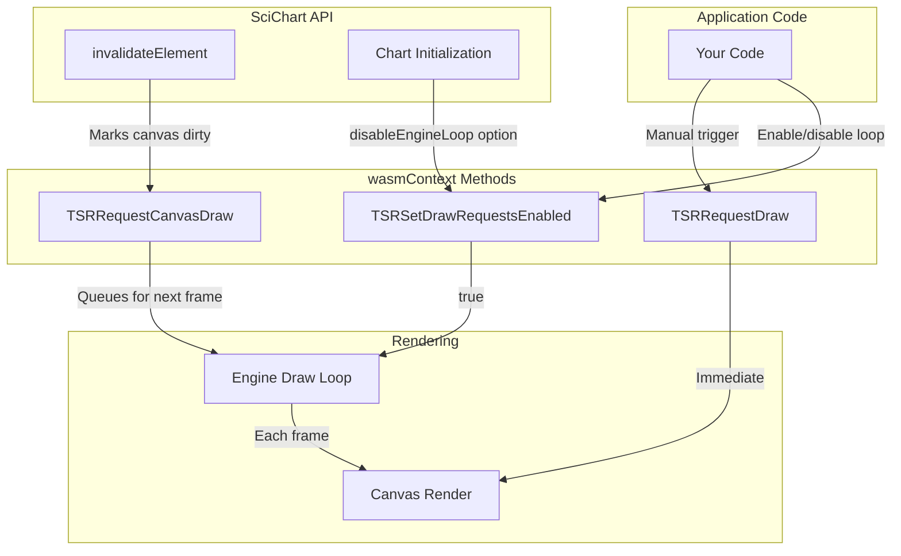
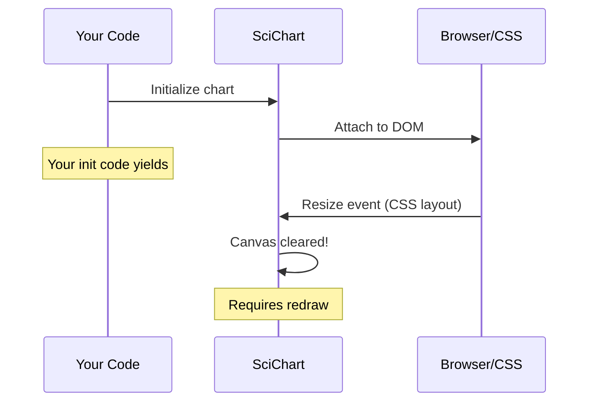

# Manual Render Control 

## Overview 

SciChart.JS provides fine-grained control over the rendering loop through the `wasmContext` object. This is useful for performance optimization, synchronizing multiple charts, or integrating with external animation systems.

## API Reference

### `wasmContext.TSRRequestDraw()`
Triggers an **immediate draw** of all charts associated with this `wasmContext`. Use this when you need to force a render right away, bypassing the normal frame scheduling.

### `wasmContext.TSRSetDrawRequestsEnabled(enabled: boolean)`
Controls the **automatic engine draw loop**:
- `true` - Enables the engine's automatic rendering loop (default behavior)
- `false` - Disables automatic rendering; you must manually call `TSRRequestDraw()` to update charts

This is called internally during chart creation with the **opposite** of the `disableEngineLoop` option. For example, if you create a chart with `disableEngineLoop: true`, the engine calls `TSRSetDrawRequestsEnabled(false)`.

### `wasmContext.TSRRequestCanvasDraw(canvasId: string)`
Marks a specific canvas for redraw on the **next frame**. This is called internally by [`invalidateElement()`](https://www.scichart.com/documentation/js/current/typedoc/classes/scichartsurface.html). The actual draw occurs:
- On the next call to `TSRRequestDraw()`, or
- On the next animation frame if the engine loop is enabled

## Scope of Effect

All three methods affect **all charts** sharing the same `wasmContext`. When you have multiple charts using a shared WebAssembly context, these calls control rendering for the entire group.

## Architecture Diagram



## Important Considerations

### Canvas Resize Behavior
The canvas is **cleared and requires a full redraw** whenever it is resized. This has important implications:



**Key Point**: If your CSS does not specify an **absolute size** for the chart container div, the browser will likely trigger a resize event immediately after your initialization code yields control. This means:

1. Any manual draw you perform during initialization may be immediately invalidated
2. The chart will appear blank until the next render cycle

### Recommended Patterns

**For immediate rendering after init:**
```typescript
// Option 1: Use absolute sizing in CSS
// .chart-container { width: 800px; height: 600px; }

// Option 2: Wait for resize to settle
const { sciChartSurface, wasmContext } = await SciChartSurface.create(divId);
// Use requestAnimationFrame to ensure layout is complete
requestAnimationFrame(() => {
    wasmContext.TSRRequestDraw();
});
```

**For manual render control:**
```typescript
const { sciChartSurface, wasmContext } = await SciChartSurface.create(divId, {
    disableEngineLoop: true  // Calls TSRSetDrawRequestsEnabled(false)
});

// ... modify chart data/properties ...

// Manually trigger render when ready
wasmContext.TSRRequestDraw();
```

**For batched updates:**
```typescript
// Disable automatic rendering temporarily
wasmContext.TSRSetDrawRequestsEnabled(false);

// Perform multiple updates without intermediate renders
series1.appendRange(xValues1, yValues1);
series2.appendRange(xValues2, yValues2);
axis.visibleRange = new NumberRange(0, 100);

// Single render after all updates
wasmContext.TSRRequestDraw();

// Re-enable automatic rendering
wasmContext.TSRSetDrawRequestsEnabled(true);
```
