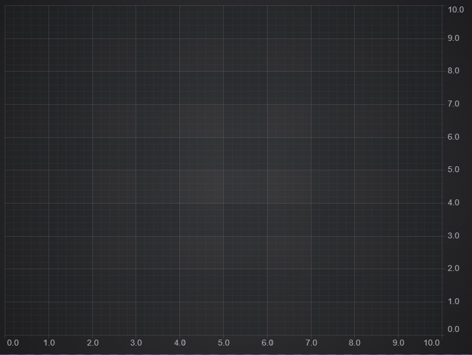
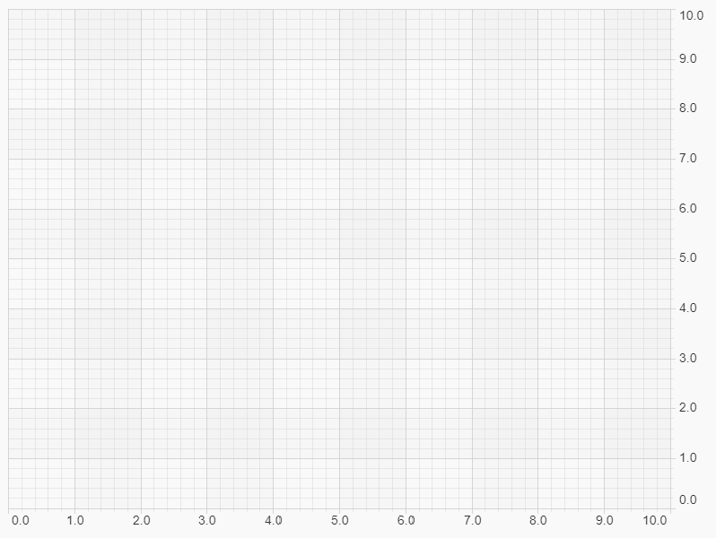
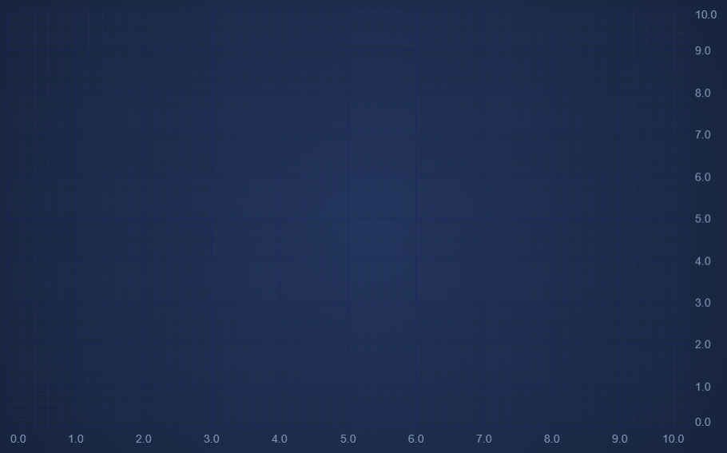

# Chart Styling - ThemeManager API

SciChart ships with a light and dark theme out of the box, which you can select and apply to the charts in your application. Most of the components of SciChart are also stylable, and you can [create your own themes](/docs/2d-charts/styling-and-theming/creating-custom-theme), so you can truly customize the chart to fit your application.

You can view our themes live at the [ThemeManager example, over at the SciChart.js Examples Suite](https://demo.scichart.com/javascript-chart-themes).

SciChart Dark Theme
-------------------

SciChart had a dark theme before dark-mode was cool :) Here's our default theme, SciChart Dark, in all it's glory below.

<CodeSnippetBlock labels={["Applying dark theme"]}>
    ```ts
import { SciChartSurface, SciChartJSDarkv2Theme } from "scichart";

// For best results & applying to the loader animation, apply theme before chart creation
const { wasmContext, sciChartSurface } = await SciChartSurface.create("div-element-id", { theme: new SciChartJSDarkv2Theme() });

// Changing theme after creation
sciChartSurface.applyTheme(new SciChartJSDarkv2Theme());
    ```
</CodeSnippetBlock>



SciChart Light Theme
--------------------

For applications with a white or lighter background color, we also ship a light theme. This is how it looks:

<CodeSnippetBlock labels={["Applying light Theme"]}>
    ```ts
import { SciChartSurface, SciChartJSLightTheme } from "scichart";

// For best results & applying to the loader animation, apply theme before chart creation
const { wasmContext, sciChartSurface } = await SciChartSurface.create("div-element-id", { theme: new SciChartJSLightTheme() });
// Changing theme after creation
 sciChartSurface.applyTheme(new SciChartJSLightTheme());
    ```
</CodeSnippetBlock>



SciChart Navy Theme
-------------------

In SciChart.js v3, we've added a new Navy theme. This looks great on both a light & dark background. This can be enabled as follows:

<CodeSnippetBlock labels={["Applying Navy Theme"]}>
    ```ts
import { SciChartSurface, SciChartJsNavyTheme } from "scichart";

// For best results & applying to the loader animation, apply theme before chart creation
const { wasmContext, sciChartSurface } = await SciChartSurface.create("div-element-id", { theme: new SciChartJsNavyTheme() });
// Changing theme after creation
 sciChartSurface.applyTheme(new SciChartJsNavyTheme());
    ```
</CodeSnippetBlock>



#### See Also

* [Chart Styling - Creating a Custom Theme](/docs/2d-charts/styling-and-theming/creating-custom-theme)
* [Chart Styling - Style Chart Parts in Code](/docs/2d-charts/styling-and-theming/style-chart-parts-in-code)
