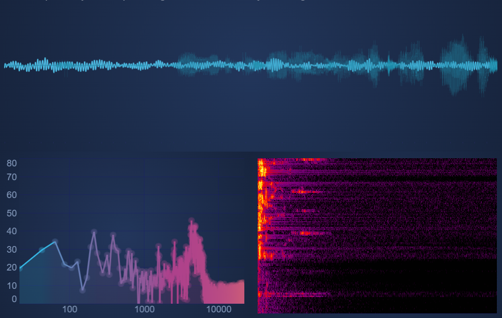

# Worked Example: Re-usable Chart Groups with SubCharts

SubCharts give a way to create re-usable multi-chart components that are managed by a single [SciChartSurface:blue_book:](https://www.scichart.com/documentation/js/current/typedoc/classes/scichartsurface.html) instance.

For example, if in your application you are repeatedly creating groups of charts that share a single common X-Axis, and must zoom and pan together, one way you could do this is by creating three separate [SciChartSurface:blue_book:](https://www.scichart.com/documentation/js/current/typedoc/classes/scichartsurface.html) instances (see the tutorial on [Linking Multiple Charts](/2d-charts/chart-synchronization-api/synchronizing-multiple-charts).

Alternatively, you could create your multi-chart control using SubCharts and manage that with a single SciChartSurface. This will provide cleaner, neater code, plus also give you a performance boost, as SubCharts are faster than standard charts in multi-chart scenarios.

Creating Re-usable Chart Groups with SubCharts
----------------------------------------------

Take the example from the [SciChart Demo - Realtime Audio Analyzer](https://demo.scichart.com/react/audio-analyzer-fft-example). This has three charts arranged in two rows, where the bottom row has two columns. The chart types are Line, Mountain and Heatmap.



If this was a control you needed to instantiate more than once in your application you might consider creating a re-usable Chart Group using SubCharts.

Let's begin.

### Creating the Layout

The layout is pretty simple. We want the top chart to occupy 100% of the width of the chart panel, and the bottom charts to occupy 50% of the width each. The top and bottom charts should both by 50% of the height.

To do this we will use [SciChartSubSurface.createSubSurface():blue_book:](https://www.scichart.com/documentation/js/v4/typedoc/classes/scichartsubsurface.html) and pass the position property as a rectangle with relative coordinates (see the [SubCharts API](/2d-charts/subcharts-api/subcharts-api-overview) and [SubChart positioning](/2d-charts/subcharts-api/sub-charts-positioning) pages for more details).

Here's the code to do this.

<CodeSnippetBlock labels={["TS", "Builder API (Config)"]}>
```ts showLineNumbers file=./Panel1x2/demo.ts start=region_A_start end=region_A_end
```
```ts showLineNumbers file=./Panel1x2/demo.ts start=region_B_start end=region_B_end
```
</CodeSnippetBlock>

This results in the following output:

<LiveDocSnippet maxWidth={"100%"} name="./Panel1x2/demo" />

Code Explanation
----------------

In the above example:

This function, `createThreePanelChart`, demonstrates how to create a **reusable 1x2 panel layout** of charts using SciChart's **SubCharts API**. It initializes a parent chart that contains three sub-charts, each positioned within a **grid layout**. This setup is useful for visualizing related datasets in **audio, frequency, and spectrogram analysis**.

<CodeSnippetBlock labels={["imports"]}>
```ts
const { SciChartSurface, NumericAxis, SciChartJsNavyTheme, Rect, ZoomPanModifier } = SciChart;
// or, if using NPM
import { SciChartSurface, NumericAxis, SciChartJsNavyTheme, Rect, ZoomPanModifier } from "scichart";
```
</CodeSnippetBlock>

### 1. Importing Required Components

These are key SciChart.js components:

*   `SciChartSurface` → The main chart container.
*   `NumericAxis` → Adds numeric axes for the sub-charts.
*   `SciChartJsNavyTheme` → A predefined theme for styling.
*   `Rect` → Defines sub-chart layout positions.
*   `ZoomPanModifier` → Enables zoom and pan interactions.

### 2. Creating the Parent SciChartSurface

<CodeSnippetBlock labels={["Create parent chart"]}>
```ts
    const { wasmContext, sciChartSurface } = await SciChartSurface.create(divElementId, {
        theme: new SciChartJsNavyTheme()
    });
```
</CodeSnippetBlock>

*   Initializes the main `SciChartSurface` inside the `divElementId` container.
*   Applies the `SciChartJsNavyTheme` to maintain a consistent look.
*   `wasmContext` provides access to WebAssembly-powered rendering.

### 3. Adding Sub-Charts

The function creates **three sub-charts** within the parent `SciChartSurface`, defining their position using `Rect(x, y, width, height)`.

**Top Chart (100% width, 50% height)**

<CodeSnippetBlock labels={["Adding SubChart top"]}>
```ts
    const subChartTop = SciChartSubSurface.createSubSurface(sciChartSurface, {
        position: new Rect(0, 0, 1, 0.5),
        theme: new SciChartJsNavyTheme(),
        title: "Audio Chart",
        titleStyle: { fontSize: 14 }
    });
```
</CodeSnippetBlock>

*   Full-width, occupies the **top half** of the container.
*   Labeled **"Audio Chart"**.

**Bottom Left Chart (50% Width, 50% Height)**

<CodeSnippetBlock labels={["Adding SubChart BottomLeft"]}>
```ts
    const subChartBottomLeft = SciChartSubSurface.createSubSurface(sciChartSurface, {
        position: new Rect(0, 0.5, 0.5, 0.5),
        theme: new SciChartJsNavyTheme(),
        title: "Frequency Chart",
        titleStyle: { fontSize: 14 }
    });
```
</CodeSnippetBlock>

*   Takes up **half the width** and sits in the **bottom left**.

**Bottom Right Chart (50% Width, 50% Height)**

<CodeSnippetBlock labels={["Adding SubChart BottomRight"]}>
```ts
    const subChartBottomRight = SciChartSubSurface.createSubSurface(sciChartSurface, {
        position: new Rect(0.5, 0.5, 0.5, 0.5),
        theme: new SciChartJsNavyTheme(),
        title: "Spectrogram Chart",
        titleStyle: { fontSize: 14 }
    });
```
</CodeSnippetBlock>

Placed beside the bottom left chart.

### 4. Adding Axes, Interaction Controls and test data

<CodeSnippetBlock labels={["Adding Axis, Interaction"]}>
```ts
   [subChartTop, subChartBottomLeft, subChartBottomRight].forEach(scs => {
        scs.xAxes.add(
            new NumericAxis(wasmContext, {
                axisTitle: "XAxis",
                axisTitleStyle: { fontSize: 12 }
            })
        );
        scs.yAxes.add(
            new NumericAxis(wasmContext, {
                axisTitle: "YAxis",
                axisTitleStyle: { fontSize: 12 }
            })
        );
        scs.chartModifiers.add(new ZoomPanModifier());

        // Add random data series
        const dataSeries = new XyDataSeries(wasmContext);
        const randomData = generateRandomData();
        dataSeries.appendRange(
            randomData.map(pt => pt.x),
            randomData.map(pt => pt.y)
        );

        scs.renderableSeries.add(
            new FastLineRenderableSeries(wasmContext, {
                stroke: getRandomColor(),
                strokeThickness: 2,
                dataSeries
            })
        );
    });
```
</CodeSnippetBlock>

Loops through all sub-charts to:

* Add **numeric X and Y axes** with labels.
* Attach a `ZoomPanModifier` for **interactive zooming and panning**.
* Add random data using FastLineRenderableSeries

### 5. Returning the Created Chart

<CodeSnippetBlock labels={["Returning Charts"]}>
```ts
    return {
        sciChartSurface,
        subChartTop,
        subChartBottomLeft,
        subChartBottomRight
    };
```
</CodeSnippetBlock>

Finally, we return all the instances to allow further customization if needed.