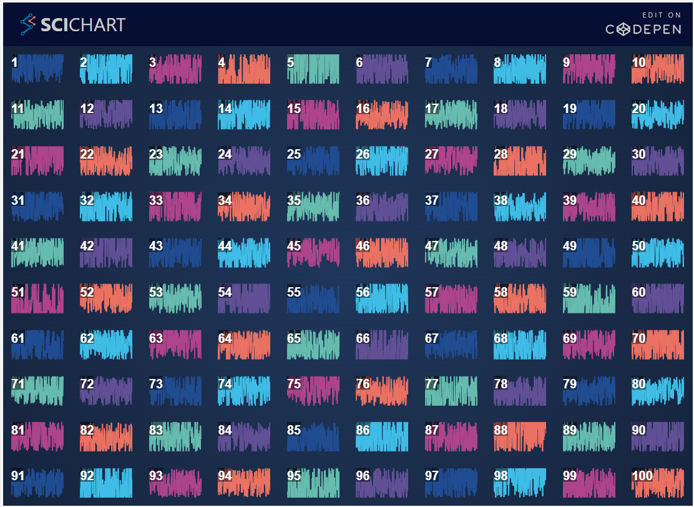

# Worked Example: Using SubCharts to create a Large Dashboard

SubCharts API gives an ability to create multiple charts while providing a great rendering performance. All the charts on a SubChart use a single, shared WebGL context. This means 100s of charts can be placed on screen and update very fast.

:::info
SciChart supports unlimited charts on a page at different locations in the HTML DOM via our innovative, Shared WebGL context technology. See the section on [SciChartSurface.create() vs. createSingle()](/2d-charts/surface/new-scichart-surface) for more background information about WebGL context limits.
:::

The following SubCharts method provides a higher-performance way of creating large grids of charts in similar locations.  

In this section we will show how to generate a 10x10 grid of sub-charts to demonstrate the abilities of the SubCharts API.

<!-- Commented out because it is very slow -->
<!-- <LiveDocSnippet maxWidth={"100%"} name="./Dashboard10x10/demo" /> -->


<CodeSnippetBlock labels={["TS", "Builder API (JSON Config)"]}>
```ts {11,36} showLineNumbers file=./Dashboard10x10/demo.ts start=region_ExampleA_start end=region_ExampleA_end
```
```ts {6,28,29} showLineNumbers file=./Dashboard10x10/demo.ts start=region_ExampleC_start end=region_ExampleC_end
```
</CodeSnippetBlock>

Where `getSubChartPositionIndexes()`, `getRandomColor()` and `generateRandomData()` are helper functions.

*   `getSubChartPositionIndexes()` is used to calculate where a sub-chart should be placed on the grid
*   `getRandomColor()` - returns random color.
*   `getRandomData()` - to generate X and Y values.

For example, in this case:

<CodeSnippetBlock labels={["helper functions"]}>
```ts {6,13,21} showLineNumbers file=./Dashboard10x10/demo.ts start=region_helperFunctions_start end=region_helperFunctions_end
```
</CodeSnippetBlock>