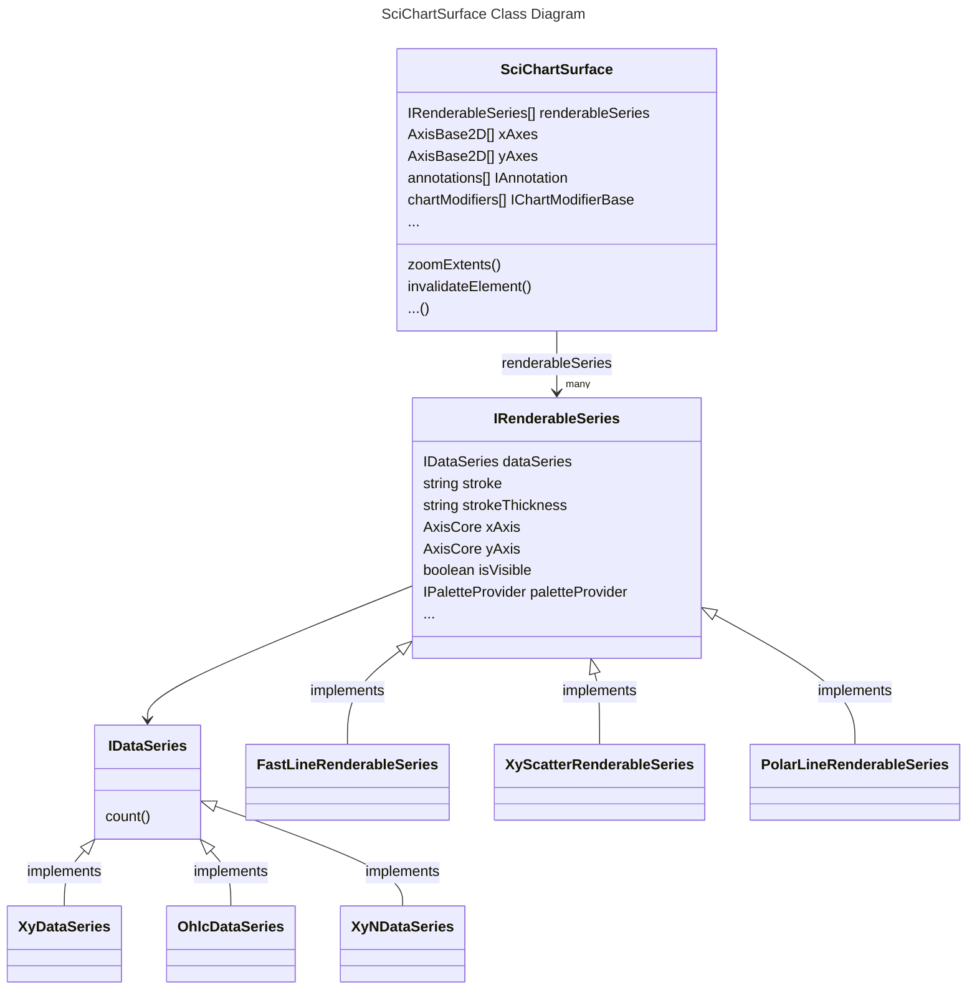
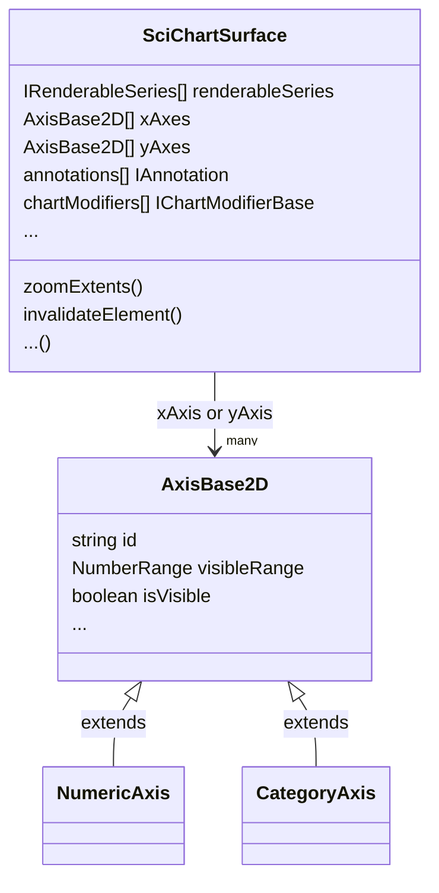
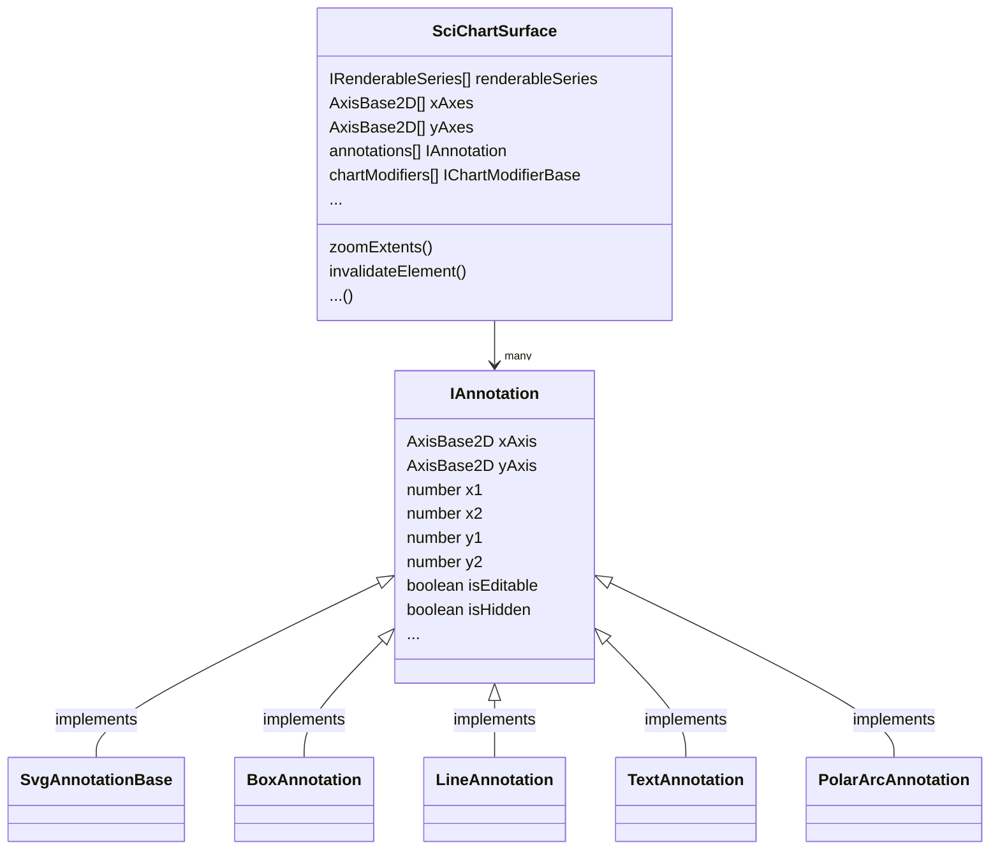
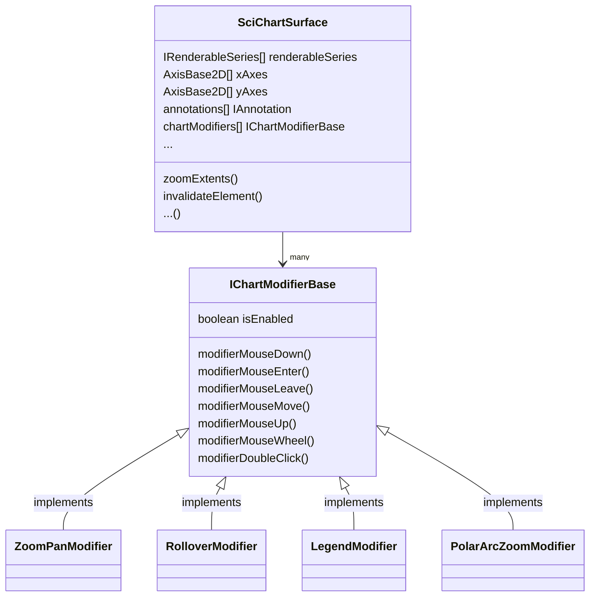

# ✅ The SciChartSurface Type

:::tip
Are you new to SciChart? Check out our most popular pages to get started below:
* [SciChart.js Vanilla JavaScript Tutorials](/docs/get-started/tutorials-js/setting-up-npm-project-with-scichart-js/index.md)   
* [Series or Chart Types](/docs/2d-charts/chart-types/renderable-series-api-overview/README.md)
* [Axis Types and Configuration](/docs/2d-charts/axis-api/axis-api-overview/README.md)
* [Zooming & Panning](/docs/2d-charts/chart-modifier-api/zooming-and-panning/overview/README.md)
* [Tooltips](/docs/2d-charts/chart-modifier-api/rollover-modifier/README.md)
* [Annotations and Markers](/docs/2d-charts/annotations-api/annotations-api-overview/README.md)
* [Styling and Themeing](/docs/2d-charts/styling-and-theming/theme-manager-api/README.md)
* [Chart Synchronization APIs](/docs/2d-charts/chart-synchronization-api/synchronizing-multiple-charts/README.md)
* [3D charts Basics](/docs/3d-charts/scichart-3d-basics/scichart-3d-basics-overview/README.md) 
:::

## The basics of the SciChartSurface Type

The root 2D chart view is called the [SciChartSurface:blue_book:](https://www.scichart.com/documentation/js/v4/typedoc/classes/scichartsurface.html). This is the JavaScript chart control you will be adding to your applications wherever you need a chart. You can add more than one SciChartSurface to an HTML page, you can configure them independently, and you can link them together.

The [SciChartSurface:blue_book:](https://www.scichart.com/documentation/js/v4/typedoc/classes/scichartsurface.html) has a number of properties and functions which allow you to configure and control the chart.

:::tip
Info about the properties and functions available can be found at the [TypeDoc API Documentation for SciChart:blue_book:](https://www.scichart.com/documentation/js/v4/typedoc/index.html).
:::

## Series or Chart Types

A [SciChartSurface:blue_book:](https://www.scichart.com/documentation/js/v4/typedoc/classes/scichartsurface.html) has collections of RenderableSeries (see [sciChartSurface.renderableSeries:blue_book:](https://www.scichart.com/documentation/js/v4/typedoc/classes/scichartsurface.html#renderableseries)), which form the series or chart types on the chart. Each RenderableSeries must have a DataSeries (see [DataSeries types](/docs/2d-charts/chart-types/data-series-api/data-series-api-overview/README.md)) which defines the data for that chart type.

Several RenderableSeries types are available in SciChart, including

* [Line Charts](/docs/2d-charts/chart-types/fast-line-renderable-series/README.md)
* [Scatter Charts](/docs/2d-charts/chart-types/xy-scatter-renderable-series/README.md)
* [Column Charts](/docs/2d-charts/chart-types/fast-column-renderable-series/column-series-type/README.md)
* [Mountain Charts](/docs/2d-charts/chart-types/fast-mountain-area-renderable-series/README.md)
* [Band Charts](/docs/2d-charts/chart-types/fast-band-renderable-series/README.md)
* [Candlestick Charts](/docs/2d-charts/chart-types/fast-candlestick-renderable-series/README.md)
* [Ohlc Charts](/docs/2d-charts/chart-types/fast-ohlc-renderable-series/README.md)
* [Polar Line Charts](/docs/2d-charts/chart-types/polar-line-renderable-series/index.mdx)
* [Polar Column Charts](/docs/2d-charts/chart-types/polar-column-renderable-series/index.mdx) and more.

> For more information about chart types in SciChart, head over to the [RenderableSeries API documentation](/docs/2d-charts/chart-types/renderable-series-api-overview/README.md) or see our [Examples](https://scichart.com/demo/react).

## Axis and Axis Types

A [SciChartSurface:blue_book:](https://www.scichart.com/documentation/js/v4/typedoc/classes/scichartsurface.html) has a collection of X-Axis and Y-Axis (see [sciChartSurface.xAxes:blue_book:](https://www.scichart.com/documentation/js/v4/typedoc/classes/scichartsurface.html#xaxes) collection). Each SciChartSurface can have unlimited, multiple X and Y Axis. SciChart is unique in that you can place axis on the left, right, top, bottom, but [you can also rotate the chart](/docs/2d-charts/axis-api/multi-axis-and-layout/vertical-charts-rotate-transpose-axis/README.md) to have an XAxis on the left and YAxis on the top. It is this configurability which gives SciChart it's edge over other charting libraries.

A few axis types are available in SciChart, such as [Value Axis and Category Axis](/docs/2d-charts/axis-api/axis-types/category-axis/README.md). Axis may be configured by setting [gridline interval](/docs/2d-charts/axis-api/axis-tick-label-interval/gridline-and-label-spacing-interval/README.md), gridline styling, titles, labels and more. 

> For more information about Axis types and configuration in SciChart, head over to the [Axis API documentation](/docs/2d-charts/axis-api/axis-api-overview/README.md) or see our [Examples](https://scichart.com/demo/react).

## Annotations and Markers

A [SciChartSurface:blue_book:](https://www.scichart.com/documentation/js/v4/typedoc/classes/scichartsurface.html) has a collection of Annotations (see [sciChartSurface.annotations:blue_book:](https://www.scichart.com/documentation/js/v4/typedoc/classes/scichartsurfacebase.html#annotations) collection). Annotations are markers (text, labels, lines, custom shapes) which can be placed arbitrarily over the chart ([see types of annotation here](/docs/2d-charts/annotations-api/annotations-api-overview/README.md)), independent of chart types (series) or data. As the chart zooms and pans, the annotations move with the chart, however there is also an [xCoordinateMode:blue_book:](https://www.scichart.com/documentation/js/v4/typedoc/classes/annotationbase.html#xcoordinatemode) and [yCoordinateMode:blue_book:](https://www.scichart.com/documentation/js/v4/typedoc/classes/annotationbase.html#ycoordinatemode) property on Annotations which allows you to place watermarks, or dock annotations to the left, right, top, bottom or centre of a chart.

> For more information about Annotations types in SciChart, head over to the [Annotations API documentation](/docs/2d-charts/annotations-api/annotations-api-overview/README.md) or see our [Examples](https://scichart.com/demo/react).

## Interaction - Zooming, Panning and Tooltips

Zooming, Panning, interaction such as Tooltips and Legends are provided by [ChartModifiers](/docs/2d-charts/chart-modifier-api/chart-modifier-api-overview/README.md). Several modifiers exist out of the box such as the [ZoomPanModifier](/docs/2d-charts/chart-modifier-api/zooming-and-panning/zoom-pan-modifier/README.md), [RubberBandXyZoomModifier](/docs/2d-charts/chart-modifier-api/zooming-and-panning/rubber-band-xy-zoom-modifier/README.md) and [MouseWheelZoomModifier](/docs/2d-charts/chart-modifier-api/zooming-and-panning/mouse-wheel-zoom-modifier/README.md). Tooltips and Legends are also provided by modifiers - see the [RolloverModifier](/docs/2d-charts/chart-modifier-api/rollover-modifier/README.md) and [LegendModifier](/docs/2d-charts/chart-modifier-api/miscellaneous-modifiers/legend-modifier/README.md). You can also create your own modifiers and handle mouse interactions and provide custom behaviours to the chart using this powerful and flexible API.

> For more information about Chart Modifier types in SciChart, head over to the [ChartModifier API documentation](/docs/2d-charts/chart-modifier-api/chart-modifier-api-overview/README.md) or see our [Examples](https://scichart.com/demo/react).

## Declaring a SciChartSurface Instance

In [Tutorial #1 - Setting up a Project with SciChart.js](/docs/get-started/tutorials-js/setting-up-npm-project-with-scichart-js/index.md), we walk you through how to setup a new project with npm, webpack and install SciChart. In particular we show you how to copy the wasm files to the build output, a step that is necessary for our WebAssembly WebGL powered charts.

If you haven't already, go and watch that tutorial quickly so that you can understand the basics of setting up a project with SciChart. The tutorial series is a great way to learn SciChart.

We also have a comprehensive [Examples Suite](https://scichart.com/demo/react) with many examples of how to use our Fast, JavaScript Charts.