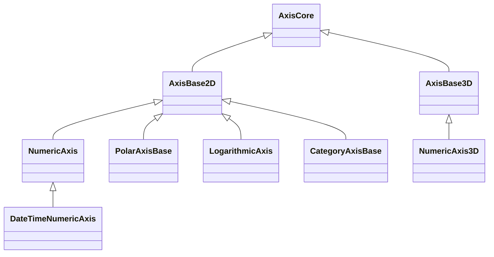

# Axis3D APIs Overview

SciChart.js 3D shares the same [AxisCore:blue_book:](https://www.scichart.com/documentation/js/current/typedoc/classes/axiscore.html) as SciChart.js 2D. Many features such as **Text Formatting**, **Autorange** (zooming to fit) and **Styling** **are** **shared**. For your convenience, some of the documentation has been duplicated here, with some referring to other sections of the user manual.

The Axis Types in SciChart all inherit from [AxisCore:blue_book:](https://www.scichart.com/documentation/js/current/typedoc/classes/axiscore.html) and 3D axis inherit [AxisBase3D:blue_book:](https://www.scichart.com/documentation/js/current/typedoc/classes/axisbase3d.html). Below you can find an inheritance diagram. In the next section we're going to go over the main properties, types and what you can do with SciChart.js 3D Axis.

### The AxisCore Type

[AxisCore:blue_book:](https://www.scichart.com/documentation/js/current/typedoc/classes/axiscore.html) properties and methods can be seen at the [TypeDoc documentation:blue_book:](https://www.scichart.com/documentation/js/current/typedoc/classes/axiscore.html). 

Some important properties to note: [autoRange:blue_book:](https://www.scichart.com/documentation/js/current/typedoc/classes/axiscore.html#autorange), [textFormatting:blue_book:](https://www.scichart.com/documentation/js/current/typedoc/classes/axiscore.html#textformatting), [majorGridLineStyle:blue_book:](https://www.scichart.com/documentation/js/current/typedoc/classes/axiscore.html#majorgridlinestyle) and properties like [drawLabels:blue_book:](https://www.scichart.com/documentation/js/current/typedoc/classes/axiscore.html#drawlabels), [drawMajorGridLines:blue_book:](https://www.scichart.com/documentation/js/current/typedoc/classes/axiscore.html#drawmajorgridlines) etc...  We're going to explain more on how to use these later.

### The AxisBase3D Type

[AxisBase3D:blue_book:](https://www.scichart.com/documentation/js/current/typedoc/classes/axisbase3d.html) inherits AxisCore and has some additional properties specific to 3D charts. These include:

*   [axisPlaneBackgroundFill:blue_book:](https://www.scichart.com/documentation/js/current/typedoc/classes/axisbase3d.html#axisplanebackgroundfill)
*   [backgroundColor:blue_book:](https://www.scichart.com/documentation/js/current/typedoc/classes/axisbase3d.html#backgroundcolor)
*   [labelDepthTestEnabled:blue_book:](https://www.scichart.com/documentation/js/current/typedoc/classes/axisbase3d.html#labeldepthtestenabled)
*   [negativeSideClipping:blue_book:](https://www.scichart.com/documentation/js/current/typedoc/classes/axisbase3d.html#negativesideclipping)
*   [planeBorderColor:blue_book:](https://www.scichart.com/documentation/js/current/typedoc/classes/axisbase3d.html#planebordercolor)
*   [planeBorderThickness:blue_book:](https://www.scichart.com/documentation/js/current/typedoc/classes/axisbase3d.html#planeborderthickness)
*   [positiveSideClipping:blue_book:](https://www.scichart.com/documentation/js/current/typedoc/classes/axisbase3d.html#positivesideclipping)
*   [tickLabelAlignment:blue_book:](https://www.scichart.com/documentation/js/current/typedoc/classes/axisbase3d.html#ticklabelalignment)
*   [tickLabelsOffset:blue_book:](https://www.scichart.com/documentation/js/current/typedoc/classes/axisbase3d.html#ticklabelsoffset)
*   [titleOffset:blue_book:](https://www.scichart.com/documentation/js/current/typedoc/classes/axisbase3d.html#titleoffset)

Basic Examples of how to declare an Axis
----------------------------------------

For a super-simple primer with code sample on how to declare an axis in SciChart.js 3D, see the article [Numeric and Date Axis in SciChart3D](/3d-charts/axis-3d-api/numeric-and-date-axis-in-scichart-3d/index.md).

Axis 3D APIs
------------

Below are the key things you can do with the axis in SciChart.js 3D and where to find more information.

### Axis 3D Text (Label) Formatting

All Axis in SciChart use the labelProviders to format text for the axis labels and cursor (tooltip) labels.

Background information can be found found at the [Axis LabelProvider API Overview](/2d-charts/axis-api/axis-labels/label-provider-api-overview/index.md).

Specific example code for formatting 3D Axis text labels can be found in the article [Axis3D Text (Label) Formatting)](/3d-charts/axis-3d-api/axis-3d-text-label-formatting/index.md).

### Axis 3D AutoRanging & Setting VisibleRange

[AxisBase3D:blue_book:](https://www.scichart.com/documentation/js/current/typedoc/classes/axisbase3d.html) derived Types also have auto-ranging behaviour as per the 2D axis types. The [axis.autoRange:blue_book:](https://www.scichart.com/documentation/js/current/typedoc/classes/axisbase3d.html#autorange) property defines how the axis will autorange when data is changed.

The [axis.visibleRange:blue_book:](https://www.scichart.com/documentation/js/current/typedoc/classes/axisbase3d.html#visiblerange) property allows you to set or get the min, max on the axis.

[axis.growBy:blue_book:](https://www.scichart.com/documentation/js/current/typedoc/classes/axisbase3d.html#growby) allows you to set padding on the visibleRange.

[axis.visibleRangeChanged:blue_book:](https://www.scichart.com/documentation/js/current/typedoc/classes/axisbase3d.html#visiblerangechanged) is an event or callback which fires when the range is updated.

For more info see:

*   [Axis Ranging - AutoRanging](/2d-charts/axis-api/ranging-scaling/auto-range/index.md)
*   [Axis Ranging - Setting and Getting VisibleRange](/2d-charts/axis-api/ranging-scaling/set-range-zoom-to-fit/index.md)
*   [Axis Ranging - Listen to VisibleRange Changes](/2d-charts/axis-api/ranging-scaling/listen-to-visible-range-changes/index.md)

:::info
**NOTE**: In a 3D Axis, AutoRanging means ‘given a fixed size of Axis in 3D world coordinates, change the VisibleRange Max/Min to fit the data’.

Dynamically positioning the camera to view all of the 3D Chart would require updating the camera position, target. See the [article on Camera 3D](/3d-charts/scichart-3d-basics/scichart-surface-camera/index.md) for more information.
:::

### Axis 3D Tick / Label Frequency

In SciChart.js, the ticks are small marks around the chart on an axis. They Also define the spacing of Gridlines, Axis Labels and Axis Bands.

AxisBase3D tick intervals can be changed using the same APIs as SciChart 2D. For further information see [Axis 3D Gridline and Label Spacing](/3d-charts/axis-3d-api/axis-3d-gridline-and-label-spacing-interval/index.md).

### Axis 3D Element Styling

For styling gridlines, labels and titles, the rules in SciChart.js 3D are the same as 2D charts.

There are some addditional elements on the 3D chart which can be styled, such as the axis walls. For more info see the article on [Styling Gridlines, Labels and Elements](/2d-charts/styling-and-theming/style-chart-parts-in-code/index.md).

#### See Also

* [Numeric and Date Axis in SciChart3D](/3d-charts/axis-3d-api/numeric-and-date-axis-in-scichart-3d/index.md)