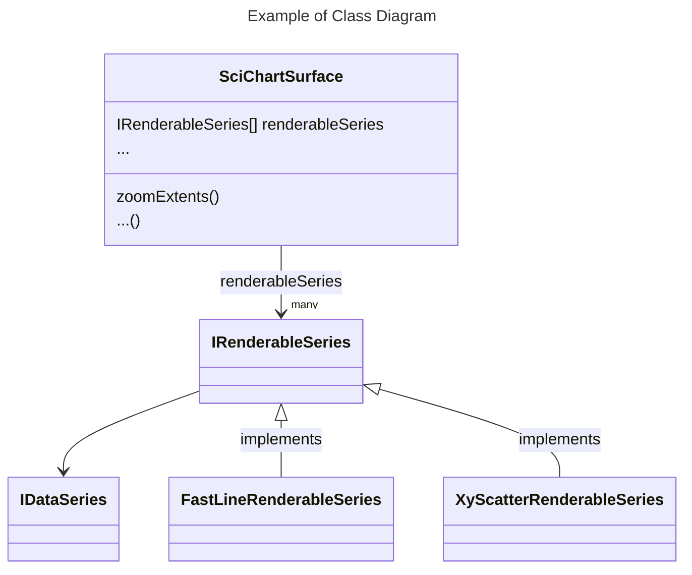

# SciChart.js Docs Contributing Guide

## Mark document status

Use this symbols to mark the status of menu items. This will help us to track the progress.

⭕ - new documentation to write

⚠️ - existing doc to update

🔄 - in progress

✅ - done

## Use TypeScript

Use TypeScript where it is possible.

Create a `demo.ts` file and run snippets compiler in watch mode ` npm run compileSnippets:watch` it will watch for changes and generate `demo.js` file.

In the documentation always reference the ts file, for example:

```text
ts showLineNumbers file=./PaletteProvider/demo.ts start=region_A_start end=region_A_end
```

If after changing `demo.ts` file the code snippet does not update, delete and insert it again.

## Create Search friendly titles

Create titles friendly for the site Search. The title h1, h2, h3 can be created using one, two or three hash symbols (#, ##, ###). The docusaurus uses these title for the search autocomplete. Therefore, give titles wisely to have a useful search. For example, in order to see PolarBandRenderableSeries in the search, I've created a h2 title with 
```
## Create PolarBandRenderableSeries
```

## Decorate TypeDoc links and reference v4

This is v4 TypeDoc - https://www.scichart.com/documentation/js/v4/typedoc/

In order to make all TypeDoc links distinct decorate the link with book icon `:blue_book:`, this is an example of SciChartSurface class typedoc link

[SciChartSurface:blue_book:](https://www.scichart.com/documentation/js/v4/typedoc/classes/scichartsurface.html)

## Reference scichart.com/demo

Use this link to reference scichart demo app - https://scichart.com/demo/react

## Do not reference DocumentX documents

Reference pages within the docusaurus and make sure the links are not broken. The broken links show up in the build console. Do not reference old DocumentX documents.

## Use kebab-case notation for docs

1. It is recommended to **create a separate folder for each document** and to put `index.md` or `index.mdx` file inside. Having a separate folder is preferable because often documentation contains doc-snippets and it is nice to have them in the same folder.
2. In order to have nice URLs it is recommended to create folder names in a **kebab-case notation** like `my-folder-name`.

## Use limited formatting styles

Stick to the limited set of formatting styles.

TODO: add more formatting example


**Tip Example**

:::tip
Info about the properties and functions available can be found at the [TypeDoc API Documentation for SciChart:blue_book:](https://www.scichart.com/documentation/js/v4/typedoc/index.html).
:::

**Info Example**

:::info
The default layers are defined in [EDefaultRenderLayer:blue_book:](https://www.scichart.com/documentation/js/current/typedoc/enums/edefaultrenderlayer.html).  
:::

**Note Example**

:::note
The order may differ depending on some configuration specifics.
:::

**Warning**

:::warning
**Error**: Could not load SciChart WebAssembly module. Check your build process and ensure that your scichart2d.wasm, scichart2d.data and scichart2d.js files are from the same version
:::

**Quotation Example**

> For more information about Chart Modifier types in SciChart, head over to the [ChartModifier API documentation](/docs/2d-charts/chart-modifier-api/chart-modifier-api-overview/index.md) or see our [Examples](https://scichart.com/demo/react).


**Mermaid class diagram example**


