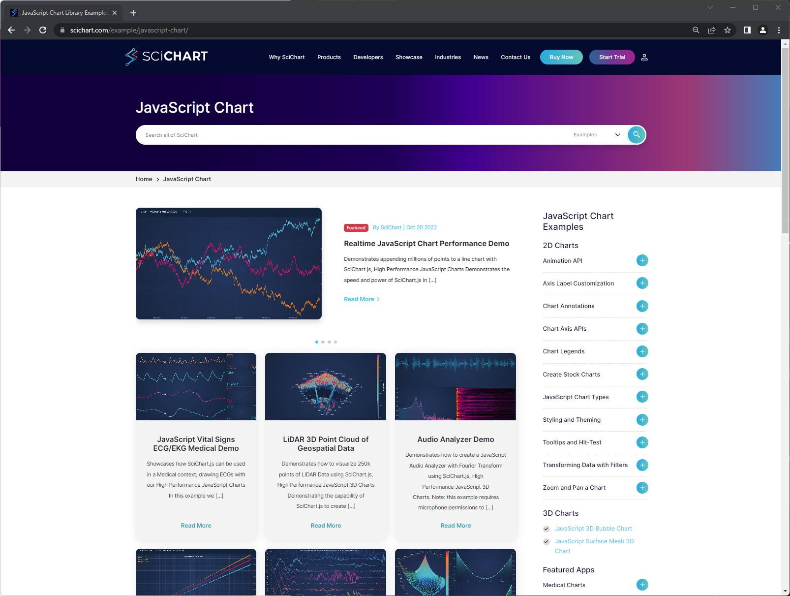
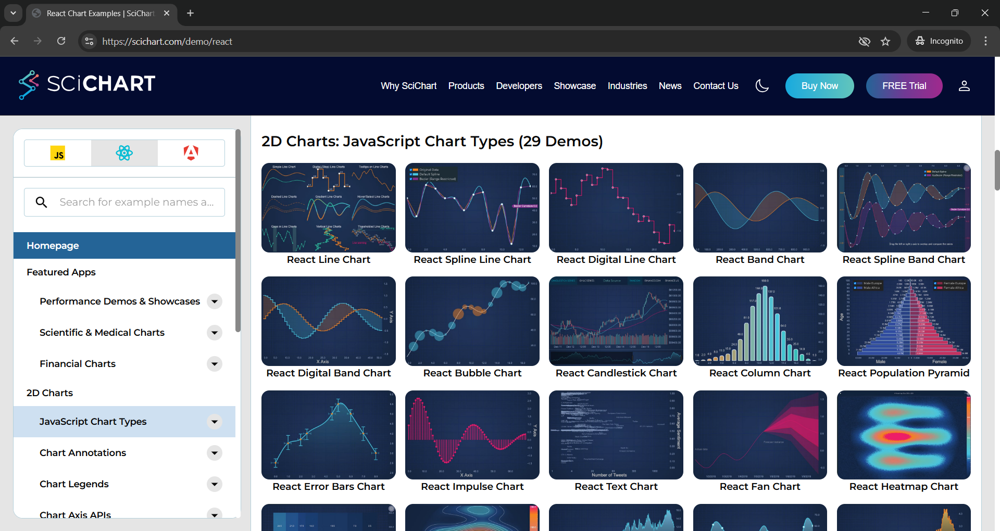
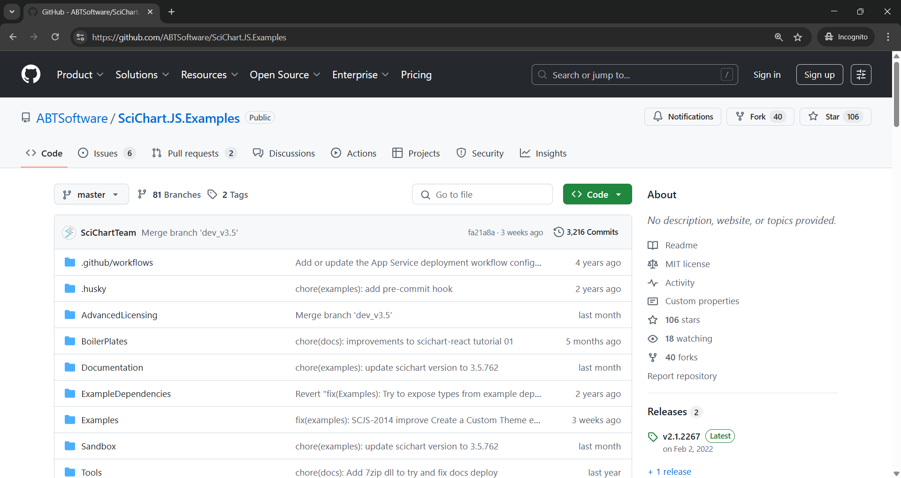

# The SciChart.js Examples Suite

Are you new to SciChart? Check out our most popular pages to get started below:

*   [SciChart.js Vanilla JavaScript Tutorials](/get-started/tutorials-js-npm-webpack/tutorial-01-setting-up-npm-project-with-scichart-js) 
*   [The SciChartSurface Type](/2d-charts/surface/scichart-surface-type-overview)
*   [Series or Chart Types](/2d-charts/chart-types/renderable-series-api-overview)
*   [Axis Types and Configuration](/2d-charts/axis-api/axis-api-overview)
*   [Zooming & Panning](/2d-charts/chart-modifier-api/zooming-and-panning/zoom-pan-modifier)
*   [Tooltips](/2d-charts/chart-modifier-api/rollover-modifier)
*   [Annotations and Markers](/2d-charts/annotations-api/annotations-api-overview)
*   [Styling and Themeing](/2d-charts/styling-and-theming/theme-manager-api)
*   [Chart Synchronization APIs](/2d-charts/chart-synchronization-api/synchronizing-multiple-charts)
*   [3D charts Basics](/3d-charts/scichart-3d-basics/scichart-3d-basics-overview) 

To make it easier to start using SciChart.js in your project, we prepared a bunch of examples demonstrating different features and their usage. These are called “SciChart.js Examples Suite” or SciChart demo.

We have two places you can view the SciChart Demo online.

**Option 1:** Browse all our examples at [scichart.com/examples/javascript-chart](https://www.scichart.com/examples/javascript-chart/), where demos are embedded into our website.

**Option 2:** At [scichart.com/demo](https://scichart.com/demo), where the React app is hosted. The React App demo has a counterpart Github repo here: [SciChart.JS.Examples](https://github.com/ABTSoftware/SciChart.JS.Examples/tree/dev_v4.0/Examples) 

:::tip
_**Note**: The SciChart website wraps & displays the React App demos inside a webpage with supplementary information. Both are good tools for exploring the feature-set of SciChart.js._

_For developers, we would recommend cloning and running the React App locally, and changing code to learn how to use SciChart.js._

_Find the full source code for the scichart demo here: [SciChart.JS.Examples](https://github.com/ABTSoftware/SciChart.JS.Examples/tree/dev_v4.0/Examples)_
:::

Clone the SciChart.js Demo Source
---------------------------------

The SciChart.js Demo React App is hosted on Github and is open source under MIT license.

Clone the repository at [SciChart.JS.Examples](https://github.com/ABTSoftware/SciChart.JS.Examples/tree/dev_v4.0/Examples) and run from the `Examples` folder.

Follow instructions in the readme.md to compile and run the app locally.

