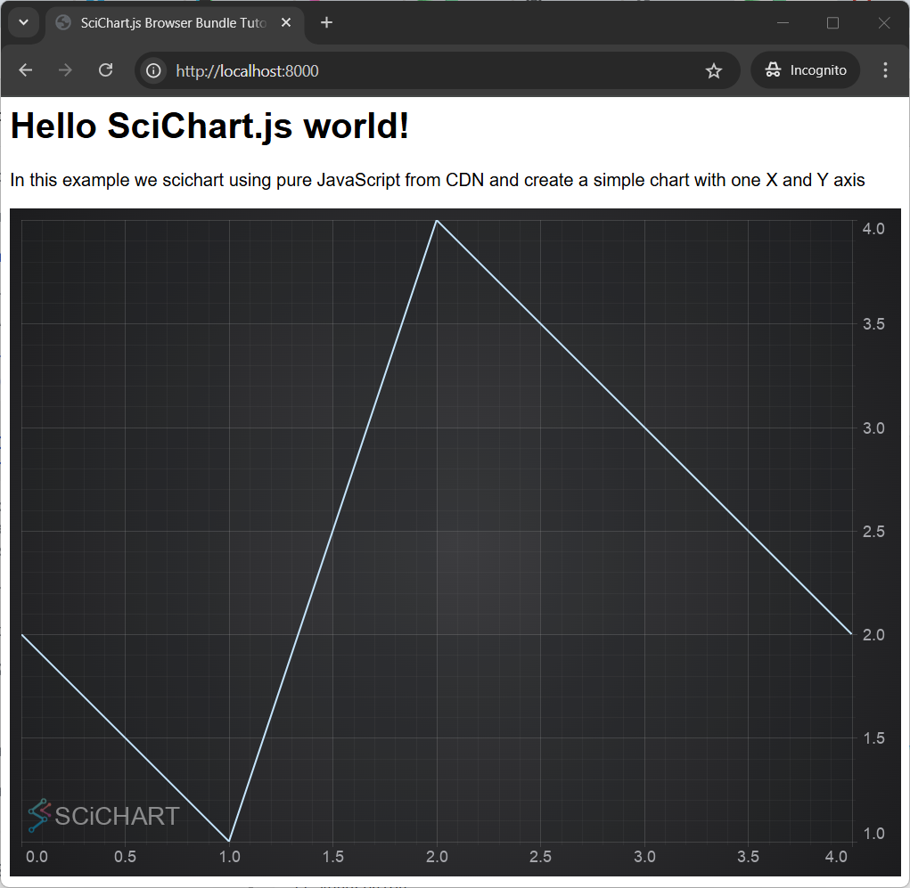

# ✅ Tutorial 01 - Including SciChart.js in an HTML Page using CDN

This set of tutorials will be limited to how to use SciChart.js by including index.min.js in a vanilla JS application (without npm and webpack).

We recommend going through the following tutorials which explain the API first.                        

*   [Adding Series and Data](/docs/get-started/tutorials-js-npm-webpack/tutorial-02-adding-series-and-data)
*   [Adding Zooming and Panning behaviour](/docs/get-started/tutorials-js-npm-webpack/tutorial-03-adding-zooming-panning-behavior)
*   [Adding Realtime Updates](/docs/get-started/tutorials-js-npm-webpack/tutorial-04-adding-realtime-updates)

:::tip
Source code for this tutorial can be found at [SciChart.Js.Examples Github Repository](https://github.com/ABTSoftware/SciChart.JS.Examples/tree/dev_v4.0/Tutorials/2D_Browser_CDN_Tutorials_JavaScript/Tutorial_1_Setting_up_html_page_with_SciChart_CDN)
:::

Including SciChart.js in an HTML Page using CDN
-----------------------------------------------

The following tutorial shows you how to include SciChart.js in an HTML page via a CDN, without the need for setup of npm and a module bundler such as webpack.

This methods is suitable for users who have JavaScript applications but still want to use SciChart.js to show charts & graphs in their applications.

This method is also useful as a fallback in application frameworks like Blazor, which don't have Npm support but do need to interop with JavaScript charts in a webpage.

How to add SciChart index.min.js to your project
------------------------------------------------

SciChart.js is hosted as a javascript file over at [jsdelivr.com/package/npm/scichart](https://www.jsdelivr.com/package/npm/scichart). This can be included in a webpage either by linking direct to the script on CDN or downloading it.

1.  Choose what version of SciChart you want to use. To find out which versions are available, head over to [npmjs.com/package/scichart](https://www.npmjs.com/package/scichart) and click on versions.
2.  Add script pointing to SciChart.js version into the head section of your html file. 
    
    a. For instance to use version `4.0.0-beta.734` add this script:

    <CodeSnippetBlock labels={["Include specific version index.html"]}>
    ```html {6-9} showLineNumbers
    <html lang="en-us">
    <head>
        <meta charset="utf-8" />
        <meta content="text/html; charset=utf-8" http-equiv="Content-Type" />
        <title>SciChart.js Browser Bundle Tutorial 1</title>
        <script
        src="https://cdn.jsdelivr.net/npm/scichart@4.0.0-beta.734/index.min.js"
        crossorigin="anonymous"
        ></script>
        <script async type="text/javascript" src="index.js"></script>
        <style>
        body {
            font-family: "Arial";
        }
        </style>
    </head>
    <body>
        <h1>Hello SciChart.js world!</h1>
        <p>
        In this example we scichart using pure JavaScript from CDN and create a
        simple chart with one X and Y axis
        </p>

        <!-- the Div where the SciChartSurface will reside -->
        <div id="scichart-root" style="width: 800px; height: 600px"></div>
    </body>
    </html>
    ```
    </CodeSnippetBlock>
    
    b. You can if you wish, include latest minor version by using this syntax

    <CodeSnippetBlock labels={["Include latest minor version"]}>
    ```html
        <script
            src="https://cdn.jsdelivr.net/npm/scichart@4.0/index.min.js"
            crossorigin="anonymous"
        ></script>
    ```
    </CodeSnippetBlock>
    
    c. Or, latest major/minor version (unrecommended for production) by using this syntax
    
    <CodeSnippetBlock labels={["Include latest version"]}>
    ```html
        <script
          src="https://cdn.jsdelivr.net/npm/scichart/index.min.js"
          crossorigin="anonymous"
        ></script>
    ```
    </CodeSnippetBlock>

3.  Next, add some series, axis and behaviours to the SciChartSurface (more on that below)

Worked Example using index.min.js
---------------------------------

:::tip
In order to run the example you will need a server. The simplest option would be to open directory with index.js and index.html files in cmd or terminal and to start python server `python3 -m http.server`. The app will be running here `http://localhost:8000/`.
:::

We have a worked example over at [Github](https://github.com/ABTSoftware/SciChart.JS.Examples/tree/dev_v4.0/Tutorials/2D_Browser_CDN_Tutorials_JavaScript/Tutorial_1_Setting_up_html_page_with_SciChart_CDN) of how to use this, but for the sake of ease let's include the code below.


<CodeSnippetBlock labels={["index.js", "index.html"]}>
```js showLineNumbers
// Equivalent of imports when using index.min.js is to declare global variables like this
const { SciChartSurface, NumericAxis, FastLineRenderableSeries, XyDataSeries } =
  SciChart;

async function initSciChart() {
  // Create the SciChartSurface in the div 'scichart-root'
  const { sciChartSurface, wasmContext } = await SciChartSurface.create(
    "scichart-root"
  );

  // Create an X,Y Axis and add to the chart
  const xAxis = new NumericAxis(wasmContext);
  const yAxis = new NumericAxis(wasmContext);

  sciChartSurface.xAxes.add(xAxis);
  sciChartSurface.yAxes.add(yAxis);

  // Add a series
  sciChartSurface.renderableSeries.add(
    new FastLineRenderableSeries(wasmContext, {
      dataSeries: new XyDataSeries(wasmContext, {
        xValues: [0, 1, 2, 3, 4],
        yValues: [2, 1, 4, 3, 2],
      }),
    })
  );
}
initSciChart();
```
```html showLineNumbers
<html lang="en-us">
  <head>
    <meta charset="utf-8" />
    <meta content="text/html; charset=utf-8" http-equiv="Content-Type" />
    <title>SciChart.js Browser Bundle Tutorial 1</title>
    <script
      src="https://cdn.jsdelivr.net/npm/scichart@4.0.0-beta.734/index.min.js"
      crossorigin="anonymous"
    ></script>
    <script async type="text/javascript" src="index.js"></script>
    <style>
      body {
        font-family: "Arial";
      }
    </style>
  </head>
  <body>
    <h1>Hello SciChart.js world!</h1>
    <p>
      In this example we scichart using pure JavaScript from CDN and create a
      simple chart with one X and Y axis
    </p>

    <!-- the Div where the SciChartSurface will reside -->
    <div id="scichart-root" style="width: 800px; height: 600px"></div>
  </body>
</html>
```
</CodeSnippetBlock>

This results in the following output:



Breaking the Code Down
----------------------

1.  We included the `<script>` tag to load `index.min.js` with a specific version  
2.  We have an async function to setup SciChart. This is necessary because SciChart itself uses async functions to load, and we don't want to block the browser loading.  
3.  Inside this async function, we call [SciChartSurface.create():blue_book:](https://www.scichart.com/documentation/js/current/typedoc/classes/scichartsurface.html#create) to instantiate a chart surface. This function must be awaited.  
4.  Lastly, we can use the SciChart API to add a X and Y Axis and series with some data.

:::tip
When using npm we have
```js
import { SciChartSurface, NumericAxis ..} from "scichart";
``` 
  
When using index.min.js all types are global variables and we use 
```js
const { SciChartSurface, NumericAxis ..} = SciChart;
```
:::

How the Wasm Files get Initialized
----------------------------------

If you've watched our [Tutorial 01 - Setting up an npm project with WebPack](/docs/get-started/tutorials-js-npm-webpack/tutorial-01-setting-up-npm-project-with-scichart-js), you will have read about wasm (WebAssembly) files which must be served to load the chart.

SciChart.js when served from CDN automatically defaults to load the wasm from CDN as well. 

When we load SciChart.js via index.min.js implicitly this line of code is called

```js
SciChartSurface.useWasmFromCDN();
```

which is equivalent to calling SciChartSurface.configure() with the URL from the CDN for wasm file

```js
const libraryVersion = "4.0.0";
SciChartSurface.configure({
  wasmUrl: `https://cdn.jsdelivr.net/npm/scichart@${libraryVersion}/_wasm/scichart2d.wasm`,
});
```

This code doesn't actually need to be called when using `index.min.js`, however its good to be aware that it is happening in the background.

It's important to note when initializing SciChart.js from CDN that the wasm files will also be loaded from CDN. **So your application will require an internet connection to work**.

:::tip
If you want to host the index.min.js and wasm files locally, then they must be downloaded and included in your app. Read [Tutorial 02 - Including index.min.js and WebAssembly Files offline](/docs/get-started/tutorials-cdn/tutorial-02-offline) to find out how.

Further details on [Wasm file deployment can also be found here](/docs/2d-charts/surface/deploying-wasm).
:::

Further Notes
-------------

All of the SciChart APIs can be used in the index.min.js method where you include a script directly in HTML.

There is no intellisense or type discovery when using index.min.js. For professional or enterprise grade apps we recommend using npm, a bundler like WebPack and TypeScript which provides a far superior development experience.

:::warning
**A Note on Licensing SciChart.**  
  
The SciChart.js control comes with a community license which is watermarked. This can be used for commercial trial use for a reasonable time period.

  
For commercial licenses, a license key can be applied following the instructions at [www.scichart.com/licensing-scichart-js](https://www.scichart.com/licensing-scichart-js).
:::
