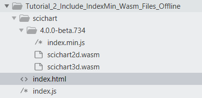
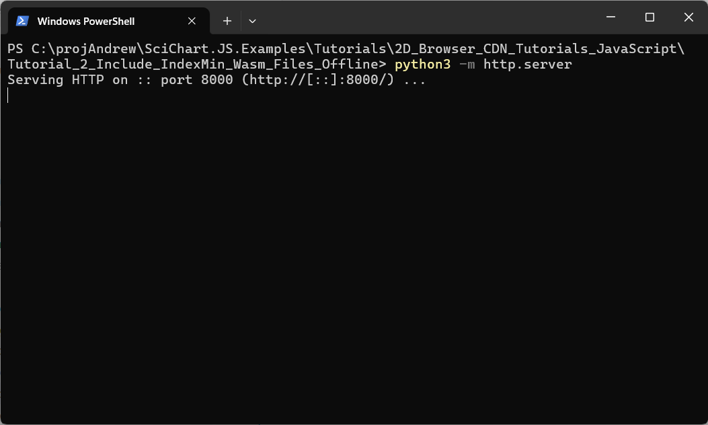

# Tutorial 02 - Including index.min.js and WebAssembly Files offline

This set of tutorials will be limited to how to use SciChart.js by including index.min.js in a vanilla JS application (without npm and webpack).

We recommend going through the following tutorials which explain the API first.                        

*   [Adding Series and Data](/get-started/tutorials-js-npm-webpack/tutorial-02-adding-series-and-data)
*   [Adding Zooing and Panning behaviour](/get-started/tutorials-js-npm-webpack/tutorial-03-adding-zooming-panning-behavior)

How to add SciChart.Browser.js to your project
----------------------------------------------

If you haven't seen our tutorial on how to add SciChart.js to a plain HTML page, then please first read [Tutorial 01 - Including SciChart.js in an HTML page](/get-started/tutorials-cdn/tutorial-01-using-cdn).

This shows you how to reference the browser bundle script, initialize WebAssembly files and create your first basic chart.

Adding Series and Data to a SciChart.js Chart
---------------------------------------------

:::tip
Source code for this tutorial can be found at [SciChart.Js.Examples Github Repository](https://github.com/ABTSoftware/SciChart.JS.Examples/tree/dev_v4.0/Tutorials/2D_Browser_CDN_Tutorials_JavaScript/Tutorial_2_Include_IndexMin_Wasm_Files_Offline)
:::

In this tutorial, we are going to add some Line series onto the chart and to use downloaded js and wasm files to load SciChart.js offline (without internet access).

First, we will add a [FastLineRenderableSeries](/2d-charts/chart-types/fast-line-renderable-series) and add this to the [SciChartSurface.renderableSeries:blue_book:](https://www.scichart.com/documentation/js/current/typedoc/classes/scichartsurface.html#renderableseries) collection.

Next, we create an [XyDataSeries:blue_book:](https://www.scichart.com/documentation/js/current/typedoc/classes/xydataseries.html) which is the type which stores the data, and can accept dynamic updates (real-time updates) and manipulation of data. We will assign the dataseries to the FastLineRenderableSeries.

Try the code below:

<CodeSnippetBlock labels={["index.js", "index.html"]}>
```js {29-31} showLineNumbers
// Equivalent of imports when using index.min.js is to declare global variables like this
const { SciChartSurface, NumericAxis, FastLineRenderableSeries, XyDataSeries } =
  SciChart;

async function initSciChart() {
  // Create the SciChartSurface in the div 'scichart-root'
  const { sciChartSurface, wasmContext } = await SciChartSurface.create(
    "scichart-root"
  );

  // Create an X,Y Axis and add to the chart
  const xAxis = new NumericAxis(wasmContext);
  const yAxis = new NumericAxis(wasmContext);

  sciChartSurface.xAxes.add(xAxis);
  sciChartSurface.yAxes.add(yAxis);

  // Add a series
  sciChartSurface.renderableSeries.add(
    new FastLineRenderableSeries(wasmContext, {
      dataSeries: new XyDataSeries(wasmContext, {
        xValues: [0, 1, 2, 3, 4],
        yValues: [2, 1, 4, 3, 2],
      }),
    })
  );
}

SciChartSurface.configure({
  wasmUrl: `scichart/4.0.0-beta.734/scichart2d.wasm`,
});

initSciChart();
```
```html {9-12} showLineNumbers
<html lang="en-us">
  <head>
    <meta charset="utf-8" />
    <meta content="text/html; charset=utf-8" http-equiv="Content-Type" />
    <title>SciChart.js Locally Hosted Files</title>
    <!-- #region Include_index.min.js -->
    <!-- Ensure you have the correct path to the SciChart.js library locally -->
    <!-- and use crossorigin=anonymous to avoid CORS issues -->
    <script
      src="scichart/4.0.0-beta.734/index.min.js"
      crossorigin="anonymous"
    ></script>
    <!-- #endregion -->
    <script async type="text/javascript" src="index.js"></script>
    <style>
      body {
        font-family: "Arial";
      }
    </style>
  </head>
  <body>
    <h1>Hello SciChart.js world!</h1>
    <p>
      In this example we show how to host index.min.js and wasm files offline
    </p>

    <!-- the Div where the SciChartSurface will reside -->
    <div id="scichart-root" style="width: 800px; height: 600px"></div>
  </body>
</html>
```
</CodeSnippetBlock>

Second, we need to create `scichart` folder and download `index.min.js` and `scichart2d.wasm` into it.

You can use these links to download files:

* https://cdn.jsdelivr.net/npm/scichart@4.0.0-beta.734/index.min.js
* https://cdn.jsdelivr.net/npm/scichart@4.0.0-beta.734/_wasm/scichart2d.wasm
* https://cdn.jsdelivr.net/npm/scichart@4.0.0-beta.734/_wasm/scichart3d.wasm (in case you need 3D charts)

:::tip
Use your version instead of `4.0.0-beta.734`
:::

This is the folder structure:



In order to run the example you will need a server. The simplest option would be to open directory with index.js and index.html files in cmd or terminal and to start python server `python3 -m http.server`. The app will be running here `http://localhost:8000/`.



This results in the following output:


Breaking the Code Down
----------------------

1.  [SciChartSurface.configure():blue_book:](https://www.scichart.com/documentation/js/current/typedoc/classes/scichartsurface.html#configure) sets from where to load wasm file. 
2.  Next, ensure that the *.wasm files are served with MIME type application/octet-stream.  
3.  Verify the file that was downloaded, that it is actually the correct file & file type.  
4.  Finally, ensure that the version numbers of *.wasm files and index.min.js match. The best way to ensure this is download a specific version again and overwrite files in your source-code repository.  

If after that you still are having problems, contact [scichart support](https://scichart.com/contact-us) and we will be glad to help.