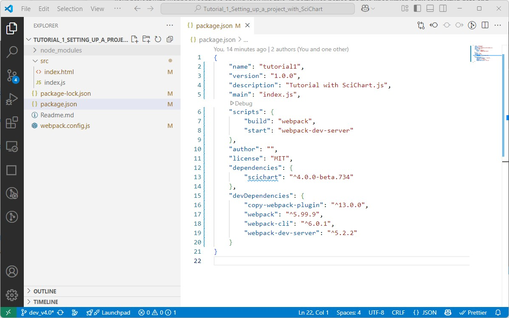
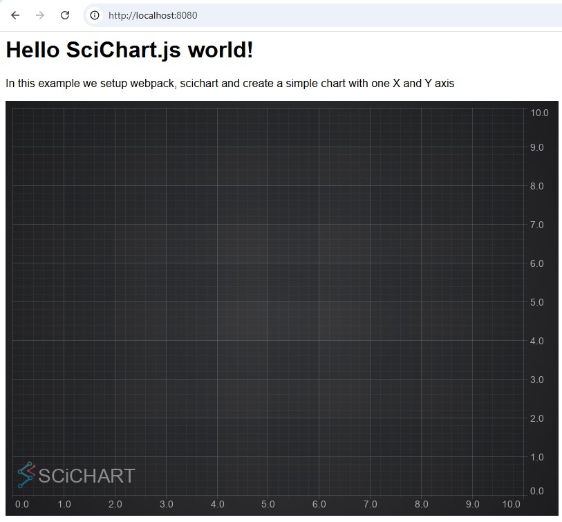

# ✅ Tutorial 01 - Setting up a npm Project with SciChart.js

Creating a New SciChart.js Project
----------------------------------

In this tutorial we will create a simple line chart with SciChart.js. We'll show you how to create a new JavaScript project in [VSCode](https://code.visualstudio.com/) and adding SciChart libraries as dependencies to it.

<YouTubeVideo url="https://www.youtube.com/embed/PFYpCrZwqwU" title="Video tutorial for version 3. SciChart.js JavaScript Chart Tutorial 01 - Setting up a Project with WebPack, Node and SciChart.js" />

:::tip
Source code for this tutorial can be found at our [SciChart.Js.Examples Github Repository](https://github.com/ABTSoftware/SciChart.JS.Examples/tree/dev_v4.0/Tutorials/2D_Chart_Tutorials_JavaScript/Tutorial_1_Setting_up_a_project_with_SciChart).
:::

Pre-requisites
--------------

### VSCode

If you haven't done so already go ahead and download VSCode from [https://code.visualstudio.com/](https://code.visualstudio.com/). We will be using this for tutorials, but you can equally use [WebStorm](https://www.jetbrains.com/webstorm/) or any other IDE or text editor of your choice.

### NPM / Node.js

You will also need to have npm installed. You can get npm from here: [https://docs.npmjs.com](https://docs.npmjs.com/downloading-and-installing-node-js-and-npm)

Creating the Project
--------------------

Go ahead and open up VSCode and enter the terminal. Create a directory to host your tutorial, and type in the following command.

**Initialising an npm project**

```bash
npm init
```

Choose defaults, I have named it tutorial1 and I want to use **index.js** for my package.json. SciChart.js supports both TypeScript and JavaScript ES6, however for the purposes of these tutorials we're going to be using plain JavaScript.

Installing SciChart via npm
---------------------------

SciChart.js is hosted on npm.org, so to install the package to your poject simply use the command npm install scichart.

**Initialising an npm project**

```bash
npm install scichart
```

Configuring Webpack
-------------------

We're going to use webpack to make the smallest possible node.js JavaScript application for our tutorials. To install this, add the following commands.

**Initialising an npm project**

```bash
npm install --save-dev webpack
npm install --save-dev webpack-dev-server
npm install --save-dev webpack-cli
npm install --save-dev copy-webpack-plugin
```

Add Scripts to Package.json
---------------------------

Our package.json should look something like this.

**package.json**

```json
{
    "name": "tutorial1",
    "version": "1.0.0",
    "description": "Tutorial with SciChart.js",
    "main": "index.js",
    "scripts": {
        "build": "webpack",
        "start": "webpack-dev-server"
    },
    "author": "",
    "license": "MIT",
    "dependencies": {
        "scichart": "^4.0.0-beta.734"
    },
    "devDependencies": {
        "copy-webpack-plugin": "^13.0.0",
        "webpack": "^5.99.9",
        "webpack-cli": "^6.0.1",
        "webpack-dev-server": "^5.2.2"
    }
}
```

Let's add a few more items to it so we can build the application.

Creating webpack.config.js
--------------------------

Add a file to your project called webpack.config.js, and paste in the following code.

:::tip
Note, the following highlighted line is required to copy SciChart's WebAssembly file to your build directory.
:::

**webpack.config.js**

```js showLineNumbers {24}
const path = require("path");
const CopyPlugin = require("copy-webpack-plugin");

module.exports = {
    mode: "production",
    entry: "./src/index.js",
    performance: {
        hints: false
    },
    module: {
        rules: []
    },
    resolve: {
        extensions: [".js"]
    },
    output: {
        filename: "bundle.js",
        path: path.resolve(__dirname, "build")
    },
    plugins: [
        new CopyPlugin({
            patterns: [
                { from: "src/index.html", to: "" },
                { from: "node_modules/scichart/_wasm/scichart2d.wasm", to: "" }
            ]
        })
    ]
};
```

Your project with webpack.config.js should look like this. In particular, **notice the line which copies scichart2d.wasm to the output folder**.



Creating Index.js / Index.html
------------------------------

We're going to create a simple Index.js / Index.html. Create and add these two files to the root of your project, and add this code.

**index.html**

```html
<html lang="en-us">
    <head>
        <meta charset="utf-8" />
        <meta content="text/html; charset=utf-8" http-equiv="Content-Type" />
        <link rel="icon" href="data:,">
        <title>SciChart.js Tutorial 1</title>
        <script async type="text/javascript" src="bundle.js"></script>
        <style>
            body { font-family: 'Arial'}
        </style>
    </head>
    <body>
        <h1>Hello SciChart.js world!</h1>
        <p>In this example we setup webpack, scichart and create a simple chart with one X and Y axis</p>
        
        <!-- the Div where the SciChartSurface will reside -->
        <div id="scichart-root" style="width: 800px; height: 600px;"></div>
    </body>
</html>
```

SciChart.js simply needs a Div in your application to host the chart. We've added one above and given it the `id=scichart-root`.

Next we're going to add index.js, where we initialize and create a [SciChartSurface](/docs/2d-charts/surface/scichart-surface-type-overview/).

**index.js**

```js
import { SciChartSurface, NumericAxis } from "scichart";

async function initSciChart() {
  // LICENSING //
  // For community or trial usage, SciChart.js works out of the box

  // For commercial use of SciChart, you need a license.
  // Purchased license keys can be viewed at https://www.scichart.com/my-account/
  //
  // e.g.
  // Set your license code here
  // SciChartSurface.setRuntimeLicenseKey("YOUR_RUNTIME_KEY");
  //
  // Also, once activated (trial or paid license) having the licensing wizard open on your machine
  // will mean any or all applications you run locally will be fully licensed.

  // Create the SciChartSurface in the div 'scichart-root'
  // The SciChartSurface, and webassembly context 'wasmContext' are paired. This wasmContext
  // instance must be passed to other types that exist on the same surface.
  const { sciChartSurface, wasmContext } = await SciChartSurface.create(
    "scichart-root"
  );

  // Create an X,Y Axis and add to the chart
  const xAxis = new NumericAxis(wasmContext);
  const yAxis = new NumericAxis(wasmContext);

  sciChartSurface.xAxes.add(xAxis);
  sciChartSurface.yAxes.add(yAxis);

  // That's it! You just created your first SciChartSurface!
}

initSciChart();

```

The SciChart.js API is pretty simple. In the code sample above we declare an instance of a SciChartSurface like this.

**Declaring a SciChartSurface**

```ts
  const { sciChartSurface, wasmContext } = await SciChartSurface.create(
    "scichart-root"
  );
```

This function returns a [SciChartSurface](/docs/2d-charts/surface/scichart-surface-type-overview/) instance and a wasmContext (WebAssembly Context). You will need this context for all chart parts related to this chart.

Next, we add a single X,Y Axis. We do this by creating a new [NumericAxis](/docs/2d-charts/axis-api/axis-types/numeric-axis/), and adding it to the [SciChartSurface.xAxes:blue_book:](https://www.scichart.com/documentation/js/current/typedoc/classes/scichartsurface.html#xaxes) and [SciChartSurface.yAxes:blue_book:](https://www.scichart.com/documentation/js/current/typedoc/classes/scichartsurface.html#yaxes) collections.

**Declaring a SciChartSurface**

```ts
// Create an X,Y Axis and add to the chart
const xAxis = new NumericAxis(wasmContext);
const yAxis = new NumericAxis(wasmContext);
   
sciChartSurface.xAxes.add(xAxis);
sciChartSurface.yAxes.add(yAxis);
```

Don't forget you will need to add a license to use SciChart.js commercially (for community licensing, nothing needs to be done). You can do this once in code as follows. You can apply a license by following instructions at [www.scichart.com/licensing-scichart-js](https://www.scichart.com/licensing-scichart-js)

**src/index.js**

```ts
...
async function initSciChart() {
  // LICENSING //
  // For community or trial usage, SciChart.js works out of the box

  // For commercial use of SciChart, you need a license.
  // Purchased license keys can be viewed at https://www.scichart.com/my-account/
  //
  // e.g.
  // Set your license code here
  SciChartSurface.setRuntimeLicenseKey("YOUR_RUNTIME_KEY");
  //
  // Also, once activated (trial or paid license) having the licensing wizard open on your machine
  // will mean any or all applications you run locally will be fully licensed.

  const { sciChartSurface, wasmContext } = await SciChartSurface.create(
    "scichart-root"
  );
    ...
}
```

That's it! You have just created your first SciChartSurface using SciChart.js!

Building and Running the App
----------------------------

Ok now that we've set that all up, building and running should be pretty easy!

In the command line, simply type the following command.

**Running the Tutorial**

```bash
npm start
```

Now visit [http://localhost:8080](http://localhost:8080) in your browser and voila! You should see a SciChart.js Chart!



:::tip
Source code for this tutorial can be found at our [SciChart.Js.Examples Github Repository](https://github.com/ABTSoftware/SciChart.JS.Examples/tree/dev_v4.0/Tutorials/2D_Chart_Tutorials_JavaScript/Tutorial_1_Setting_up_a_project_with_SciChart).
:::

**A Note on Licensing SciChart.**  
  
The SciChart.js control comes with a community license which is watermarked. This can be used for commercial trial use for a reasonable time period.

  
For commercial licenses, a license key can be applied following the instructions at [www.scichart.com/licensing-scichart-js](https://www.scichart.com/licensing-scichart-js).

#### See Also

* [Tutorial 02 - Adding Series and Data](/docs/get-started/tutorials-js-npm-webpack/tutorial-02-adding-series-and-data/index.md)
