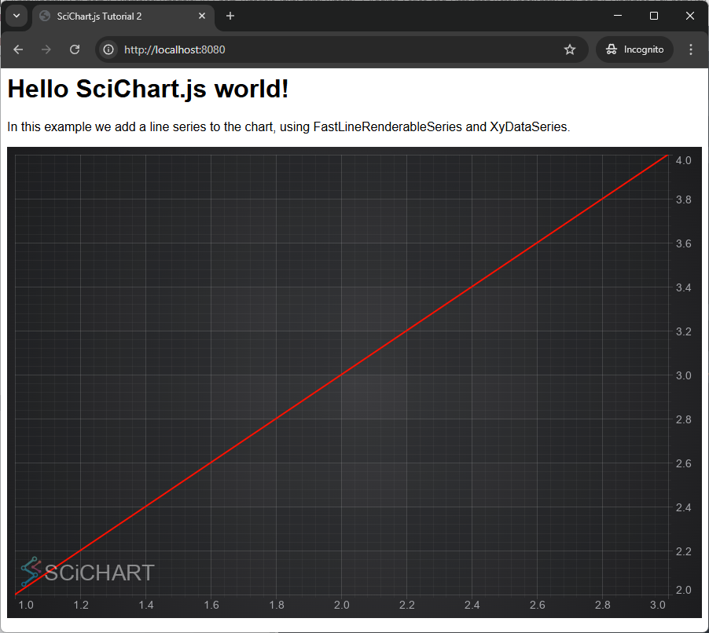

# Tutorial 02 - Adding Series and Data

In the [previous tutorial](/get-started/tutorials-js-npm-webpack/tutorial-01-setting-up-npm-project-with-scichart-js) we explained how to setup a project with a simple chart using SciChart.js. In this tutorial, we are going to show you how to add some data and a line series to the chart.

<YouTubeVideo url="https://www.youtube.com/embed/dQYnwPeacSA" title="Video tutorial for version 3. SciChart.js JavaScript Chart Tutorial 02 - Adding Series and Data" />

:::tip
Source code for this tutorial can be found at [SciChart.Js.Examples Github Repository](https://github.com/ABTSoftware/SciChart.JS.Examples/tree/dev_v4.0/Tutorials/2D_Chart_Tutorials_JavaScript/Tutorial_2_Adding_Series_and_Data)
:::

Adding Series to the Chart
--------------------------

In SciChart, there are special classes called [RenderableSeries](/2d-charts/chart-types/renderable-series-api-overview) that are responsible for drawing different chart types, such as lines ([FastLineRenderableSeries](/2d-charts/chart-types/fast-line-renderable-series)), columns ([FastColumnsRenderableSeries](/2d-charts/chart-types/fast-column-renderable-series/column-series-type)), candlestick series ([FastCandlestickRenderableSeries](/2d-charts/chart-types/fast-candlestick-renderable-series)), filled area ([FastMountainRenderableSeries](/2d-charts/chart-types/fast-mountain-area-renderable-series)), heat maps ([FastUniformHeatmapRenderableSeries](/2d-charts/chart-types/uniform-heatmap-renderable-series/uniform-heatmap-chart-type)) etc...

### Adding a Line Plot to the Chart

In this tutorial, we are going to add some Line series onto the chart.

First, we create a [XyDataSeries:blue_book:](https://www.scichart.com/documentation/js/current/typedoc/classes/xydataseries.html) which is the type which stores the data, and can accept dynamic updates (real-time updates) and manipulation of data. We will assign the dataseries to the [FastLineRenderableSeries](/2d-charts/chart-types/fast-line-renderable-series).

Next, we create a [FastLineRenderableSeries](/2d-charts/chart-types/fast-line-renderable-series) and add this to the [SciChartSurface.renderableSeries:blue_book:](https://www.scichart.com/documentation/js/current/typedoc/classes/scichartsurface.html#renderableseries) collection.

Try the code below:

<CodeSnippetBlock labels={["JS"]}>
  ```js {21-23,26-32} showLineNumbers
  import {
    SciChartSurface,
    NumericAxis,
    FastLineRenderableSeries,
    XyDataSeries,
  } from "scichart";

  async function initSciChart() {
    // Create the SciChartSurface in the div 'scichart-root'
    // The SciChartSurface, and webassembly context 'wasmContext' are paired. This wasmContext
    // instance must be passed to other types that exist on the same surface.
    const { sciChartSurface, wasmContext } = await SciChartSurface.create(
      "scichart-root"
    );

    // Create an X,Y Axis and add to the chart
    sciChartSurface.xAxes.add(new NumericAxis(wasmContext));
    sciChartSurface.yAxes.add(new NumericAxis(wasmContext));

    // Declare a DataSeries
    const xyDataSeries = new XyDataSeries(wasmContext);
    xyDataSeries.append(1, 2);
    xyDataSeries.append(3, 4);

    // Add a line series to the SciChartSurface
    sciChartSurface.renderableSeries.add(
      new FastLineRenderableSeries(wasmContext, {
        strokeThickness: 3,
        stroke: "rgba(255, 0, 0, 1)",
        dataSeries: xyDataSeries,
      })
    );

    // zoom to fit (optional, will occur automatically once on startup)
    sciChartSurface.zoomExtents();
  }

  initSciChart();
  ```
</CodeSnippetBlock>

Ensure you also have the index.html set, which must contain a div with id="scichart-root" (or whatever you pass to [SciChartSurface.create:blue_book:](https://www.scichart.com/documentation/js/current/typedoc/classes/scichartsurface.html#create))

<CodeSnippetBlock labels={["HTML"]}>
  ```html {21} showLineNumbers
<html lang="en-us">
  <head>
    <meta charset="utf-8" />
    <meta content="text/html; charset=utf-8" http-equiv="Content-Type" />
    <link rel="icon" href="data:," />
    <title>SciChart.js Tutorial 2</title>
    <script async type="text/javascript" src="bundle.js"></script>
    <style>
      body {
        font-family: "Arial";
      }
    </style>
  </head>
  <body>
    <h1>Hello SciChart.js world!</h1>
    <p>
      In this example we add a line series to the chart, using
      FastLineRenderableSeries and XyDataSeries.
    </p>
    <!-- the Div where the SciChartSurface will reside -->
    <div id="scichart-root" style="width: 100%; height: 600px"></div>
  </body>
</html>
  ```
</CodeSnippetBlock>

You should get this result: 



We've added a line series to the chart, styled it red, and added two data-points. Hardly ground-breaking, but it's a start!

Let's take this up a notch in the second part of the tutorial, by adding 100 series, each with 10,000 data-points.

Adding 100 Series, with 10,000 Datapoints to the Chart
------------------------------------------------------

We can take this a little bit further, by adding 100 series each with 10,000 datapoints to the Chart, for a total of one million data-points. SciChart's specialty is High Performance, Realtime Charts, and that means you can add large amounts of data to our JavaScript chart component with ease.

Modify the code in index.js to the following:

<CodeSnippetBlock labels={["JS"]}>
  ```js {20-39} showLineNumbers
  import {
    SciChartSurface,
    NumericAxis,
    XyDataSeries,
    FastLineRenderableSeries,
  } from "scichart";

  async function initSciChart() {
    // Create the SciChartSurface in the div 'scichart-root'
    // The SciChartSurface, and webassembly context 'wasmContext' are paired. This wasmContext
    // instance must be passed to other types that exist on the same surface.
    const { sciChartSurface, wasmContext } = await SciChartSurface.create(
      "scichart-root"
    );

    // Create an X,Y Axis and add to the chart
    sciChartSurface.xAxes.add(new NumericAxis(wasmContext));
    sciChartSurface.yAxes.add(new NumericAxis(wasmContext));

    // Create 100 dataseries, each with 10k points
    for (let seriesCount = 0; seriesCount < 100; seriesCount++) {
      const xyDataSeries = new XyDataSeries(wasmContext);

      const opacity = (1 - seriesCount / 120).toFixed(2);

      // Populate with some data
      for (let i = 0; i < 10000; i++) {
        xyDataSeries.append(i, Math.sin(i * 0.01) * Math.exp(i * (0.00001 * (seriesCount + 1))));
      }

      // Add and create a line series with this data to the chart
      // Create a line series
      const lineSeries = new FastLineRenderableSeries(wasmContext, {
        dataSeries: xyDataSeries,
        stroke: `rgba(176,196,222,${opacity})`,
        strokeThickness: 2,
      });
      sciChartSurface.renderableSeries.add(lineSeries);
    }
  }

  initSciChart();
  ```
</CodeSnippetBlock>

This code adds 100 series in a loop, each with 10,000 data-points using the [XyDataSeries.append:blue_book:](https://www.scichart.com/documentation/js/current/typedoc/classes/xydataseries.html#append) method. The mathematical function in there is just to create a nice looking waveform.

We create a [FastLineRenderableSeries](/2d-charts/chart-types/fast-line-renderable-series) for each trip around the outer loop and this time use the constructor parameters to set the [dataSeries:blue_book:](https://www.scichart.com/documentation/js/current/typedoc/classes/fastlinerenderableseries.html#dataseries), [stroke:blue_book:](https://www.scichart.com/documentation/js/current/typedoc/classes/fastlinerenderableseries.html#stroke) and [strokeThickness:blue_book:](https://www.scichart.com/documentation/js/current/typedoc/classes/fastlinerenderableseries.html#strokethickness) properties.

This is the result below:


There you go! One million data-points in a JavaScript Chart using SciChart.js!

Join us for [Tutorial 3](/get-started/tutorials-js-npm-webpack/tutorial-03-adding-zooming-panning-behavior) where we will be adding zooming and panning behaviour to the chart.

:::warning
**A Note on Licensing SciChart.**  
  
The SciChart.js control comes with a community license which is watermarked. This can be used for commercial trial use for a reasonable time period.

  
For commercial licenses, a license key can be applied following the instructions at [www.scichart.com/licensing-scichart-js](https://www.scichart.com/licensing-scichart-js).
:::
