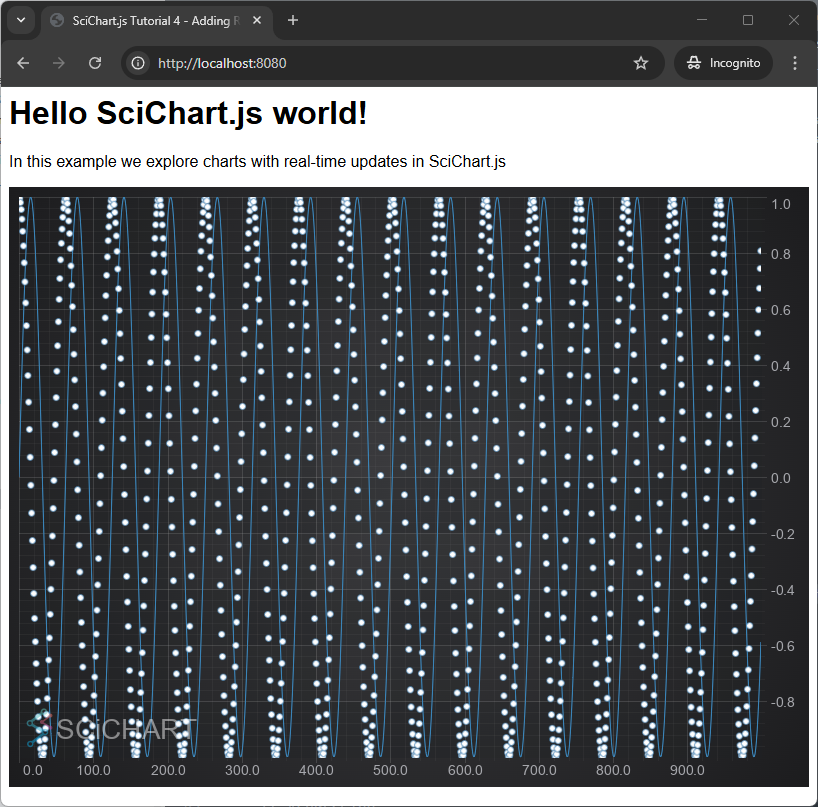
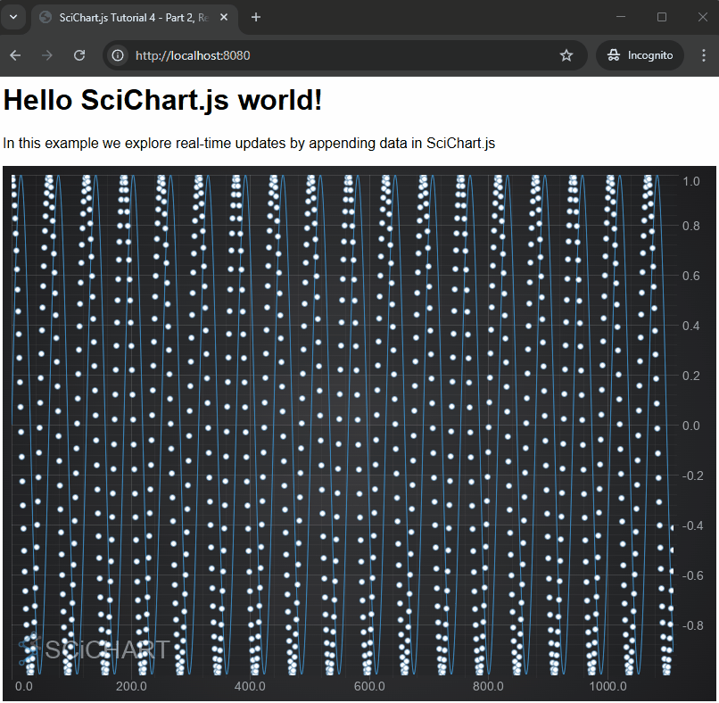

# ✅ Tutorial 04 - Adding Realtime Updates

In the [previous tutorial](/docs/get-started/tutorials-js-npm-webpack/tutorial-03-adding-zooming-panning-behavior) we explained how to add zooming and panning behavior to a JavaScript Chart using SciChart.js. In this tutorial, we are going to show you how to add realtime updates.

Realtime updates is where SciChart excels. Our software is designed to be ultra high-performance and really shines in circumstances where you want to manipulate data in real-time. There are a lot of options for dynamically updating data and getting rich, reactive charts. If you're interested to find out how, read on!

:::tip
The source code for this tutorial can be found at [SciChart.Js.Examples Github Repository](https://github.com/ABTSoftware/SciChart.JS.Examples/tree/dev_v4.0/Tutorials/2D_Chart_Tutorials_JavaScript/Tutorial_4_Adding_Realtime_Updates)  
:::

<YouTubeVideo url="https://www.youtube.com/embed/3TzRbpmx7T0" title="Video tutorial for version 3. SciChart.js JavaScript Chart Tutorial 04 - Realtime Chart Updates" />

Creating the Base Application
-----------------------------

SciChart has the concept of [RenderableSeries](/docs/2d-charts/chart-types/renderable-series-api-overview) and [DataSeries](/docs/2d-charts/chart-types/data-series-api/data-series-api-overview). RenderableSeries present the data, while DataSeries hold the X,Y data and manage updates.

Let's start the tutorial with some basic code like this to declare a SciChartSurface with an X,Y axis, and a two series:

<CodeSnippetBlock labels={["index.js", "index.html"]}>
    ```js {11-41} showLineNumbers
    import {
        SciChartSurface,
        NumericAxis,
        XyDataSeries,
        FastLineRenderableSeries,
        XyScatterRenderableSeries,
        EllipsePointMarker
    } from "scichart";

    async function initSciChart() {
        // Create the SciChartSurface in the div 'scichart-root'
        // The SciChartSurface, and webassembly context 'wasmContext' are paired. This wasmContext
        // instance must be passed to other types that exist on the same surface.
        const { sciChartSurface, wasmContext} = await SciChartSurface.create("scichart-root");

        // Create an X,Y Axis and add to the chart
        sciChartSurface.xAxes.add(new NumericAxis(wasmContext));
        sciChartSurface.yAxes.add(new NumericAxis(wasmContext));

        // Create a Scatter series, and Line series and add to chart
        const scatterSeries = new XyScatterRenderableSeries(wasmContext, { 
            pointMarker: new EllipsePointMarker(wasmContext, { width: 7, height: 7, fill: "White", stroke: "SteelBlue" }),
        });
        const lineSeries = new FastLineRenderableSeries(wasmContext, { stroke: "#4083B7", strokeThickness: 2 });
        sciChartSurface.renderableSeries.add(lineSeries, scatterSeries);

        // Create and populate some XyDataSeries with static data
        // Note: you can pass xValues, yValues arrays to constructors, and you can use appendRange for bigger datasets
        const scatterData = new XyDataSeries(wasmContext, { dataSeriesName: "Cos(x)" });
        const lineData = new XyDataSeries(wasmContext, { dataSeriesName: "Sin(x)" });

        for(let i = 0; i < 1000; i++) {
            lineData.append(i, Math.sin(i*0.1));
            scatterData.append(i, Math.cos(i*0.1));
        }

        // Assign these dataseries to the line/scatter renderableseries
        scatterSeries.dataSeries = scatterData;
        lineSeries.dataSeries = lineData;

        // SciChart will now redraw with static data
    }

    initSciChart();

    ```
    ```html {16-17} showLineNumbers
    <html lang="en-us">
        <head>
            <meta charset="utf-8" />
            <meta content="text/html; charset=utf-8" http-equiv="Content-Type" />
            <link rel="icon" href="data:," />
            <title>SciChart.js Tutorial 4 - Adding Realtime Updates</title>
            <script async type="text/javascript" src="bundle.js"></script>
            <style>
                body { font-family: 'Arial'}
            </style>
        </head>
        <body>
            <h1>Hello SciChart.js world!</h1>
            <p>In this example we explore charts with real-time updates in SciChart.js</p>

            <!-- the Div where the SciChartSurface will reside -->
            <div id="scichart-root" style="width: 800px; height: 600px;"></div>
        </body>
    </html>
    ```
</CodeSnippetBlock>

This code above creates a [Scatter series](/docs/2d-charts/chart-types/xy-scatter-renderable-series), a [Line series](/docs/2d-charts/chart-types/fast-line-renderable-series), appends some static data. You should now be looking at this if you npm start and run the application:



You can learn more about the [Scatter Series, which requires a pointmarker here](/docs/2d-charts/chart-types/xy-scatter-renderable-series). Also the [Line Series page](/docs/2d-charts/chart-types/fast-line-renderable-series) has further information for this chart type.

Part 1 - Updating Data Values
-----------------------------

Now let's update some data-values in JavaScript to see real-time changes to the chart.

We will use setTimeout to create a timer and call [xyDataSeries.update():blue_book:](https://www.scichart.com/documentation/js/current/typedoc/classes/xydataseries.html#update) to change the data. SciChart automatically redraws when the data is changed.

<CodeSnippetBlock labels={["index.js"]}>
    ```js {} showLineNumbers
    let phase = 0.0;    

    const updateDataFunc = () => {

        // update the datapoints in the dataseries
        // Note dataSeries.updateRange() passing in array is
        // higher performance for larger datasets vs. calling dataSeries.update() in a loop
        for(let i = 0; i < 1000; i++) {
            lineData.update(i, Math.sin(i * 0.1 + phase));
            scatterData.update(i, Math.cos(i * 0.1 + phase));
        }

        phase += 0.01;
    };

    // Update data at 60Hz
    setInterval(updateDataFunc, 1000/60);
     ```
</CodeSnippetBlock>

Breaking this down, we're using the [DataSeries API](/docs/2d-charts/chart-types/data-series-api/data-series-api-overview) to manipulate the data.

Specifically, [dataSeries.update():blue_book:](https://www.scichart.com/documentation/js/current/typedoc/classes/xydataseries.html#update), which updates a Y-value at a specific index. There are also functions to [append:blue_book:](https://www.scichart.com/documentation/js/current/typedoc/classes/xydataseries.html#append), [appendRange:blue_book:](https://www.scichart.com/documentation/js/current/typedoc/classes/xydataseries.html#appendrange), [insert:blue_book:](https://www.scichart.com/documentation/js/current/typedoc/classes/xydataseries.html#insert), [insertRange:blue_book:](https://www.scichart.com/documentation/js/current/typedoc/classes/xydataseries.html#insertrange), [remove:blue_book:](https://www.scichart.com/documentation/js/current/typedoc/classes/xydataseries.html#removeat), [removeRange:blue_book:](https://www.scichart.com/documentation/js/current/typedoc/classes/xydataseries.html#removerange) and [clear:blue_book:](https://www.scichart.com/documentation/js/current/typedoc/classes/xydataseries.html#clear), which will remove all data. Any changes to the DataSeries immediately reflect in the chart as SciChart is a fully reactive, dynamic JavaScript chart component.

You can learn more about the [dynamic DataSeries API in SciChart here](/docs/2d-charts/chart-types/data-series-api/data-series-api-overview).

Now run the application, you should see this!


Part 2 - Appending Data Values
------------------------------

As well as using dataSeries.update(), you can also use [dataSeries.append():blue_book:](https://www.scichart.com/documentation/js/current/typedoc/classes/xydataseries.html#append) to add new data-values to the end of a DataSeries. Make some changes in your updateDataFunc() as follows:

<CodeSnippetBlock labels={["index.js"]}>
  ```js {} showLineNumbers
    // Update the updateDataFunc() to append a point to the end of the data series
    
    const updateDataFunc = () => {

        // Append another data-point to the chart. We use dataSeries.count()
        // to determine the current length before appending
        const i = lineData.count();
        lineData.append(i, Math.sin(i * 0.1));
        scatterData.append(i, Math.cos(i * 0.1));

        // ZoomExtents after appending data.
        // Also see XAxis.AutoRange, and XAxis.VisibleRange for more options
        sciChartSurface.zoomExtents();
    };

    // Repeat at 60Hz
    setInterval(updateDataFunc, 1000/60);
  ```
</CodeSnippetBlock>

Now run the application again. You sould see the series growing larger as new data is appended.



:::tip
By default, when you append data, SciChart does not resize the viewport to fit the new data. In the code sample above we have called [sciChartSurface.zoomExtents():blue_book:](https://www.scichart.com/documentation/js/current/typedoc/classes/scichartsurface.html#zoomextents) to fit the data.

Other options to manipulate the viewport can be seen at the pages [Axis Ranging - AutoRange](/docs/2d-charts/axis-api/ranging-scaling/auto-range) and [Axis Ranging - Setting and Getting VisibleRange](/docs/2d-charts/axis-api/ranging-scaling/set-range-zoom-to-fit).
:::

Part 3 - Scrolling Realtime Charts
----------------------------------

What if you wanted to scroll as new data was appended? You have a few choices.

*   If you simply want to scroll the viewport, you can manipulate [XAxis.visibleRange:blue_book:](https://www.scichart.com/documentation/js/current/typedoc/classes/axiscore.html#visiblerange) (see [Getting and Setting VisibleRange](/docs/2d-charts/axis-api/ranging-scaling/set-range-zoom-to-fit)) as you append new data.
*   If you want to be memory efficient and discard old data, you can use dataSeries.removeAt, or dataSeries.removeRange to remove old values as well.

We're going to show you how to scroll data in a JavaScript chart below.

### Scrolling the Chart via XAxis.visibleRange

To scroll in SciChart.js, all we have to do is manipulate the [XAxis.visibleRange:blue_book:](https://www.scichart.com/documentation/js/current/typedoc/classes/axiscore.html#visiblerange). This accepts a type: [NumberRange:blue_book:](https://www.scichart.com/documentation/js/current/typedoc/classes/numberrange.html), which defines a minimum and maximum value to display on the chart.

Modify the updateData() function as follows:

<CodeSnippetBlock labels={["index.js"]}>
    ```js {} showLineNumbers
    // Scrolling the chart by appending and manipulating xAxis.visibleRange
    
    const updateDataFunc = () => {

        // Append another data-point to the chart. We use dataSeries.count()
        // to determine the current length before appending
        const i = lineData.count();
        lineData.append(i, Math.sin(i * 0.1));
        scatterData.append(i, Math.cos(i * 0.1));

        // Apply scrolling to the chart by updating xAxis.visibleRange
        // Also see dataSeries.fifoCapacity and dataSeries.fifoSweeping for more options
        const xAxis = sciChartSurface.xAxes.get(0);
        xAxis.visibleRange = new NumberRange(i-1000, i);
    };

    // Repeat at 60Hz
    setInterval(updateDataFunc, 1000/60);
    ```
</CodeSnippetBlock>

This results in the following.


The above example is simple, but it never removes points from the XyDataSeries, so memory will grow forever. Consider if you are streaming lots of data-points calling [XyDataSeries.removeAt:blue_book:](https://www.scichart.com/documentation/js/current/typedoc/classes/xydataseries.html#removeat), or [removeRange:blue_book:](https://www.scichart.com/documentation/js/current/typedoc/classes/xydataseries.html#removerange) or using [FIFO Modes](/docs/2d-charts/chart-types/data-series-api/realtime-updates) to discard old data.

Also, once you are done with a DataSeries, call [DataSeries.delete():blue_book:](https://www.scichart.com/documentation/js/current/typedoc/classes/xydataseries.html#delete) to remove WebAssembly memory.

We've written live examples with how to Append Data, Update Data, Scroll or Sweep using FIFO Modes at the page [DataSeries Realtime Updates](/docs/2d-charts/chart-types/data-series-api/realtime-updates). Read this page and the [DataSeries API pages](/docs/2d-charts/chart-types/data-series-api/data-series-api-overview) to learn more about dynamic data updates in SciChart.
