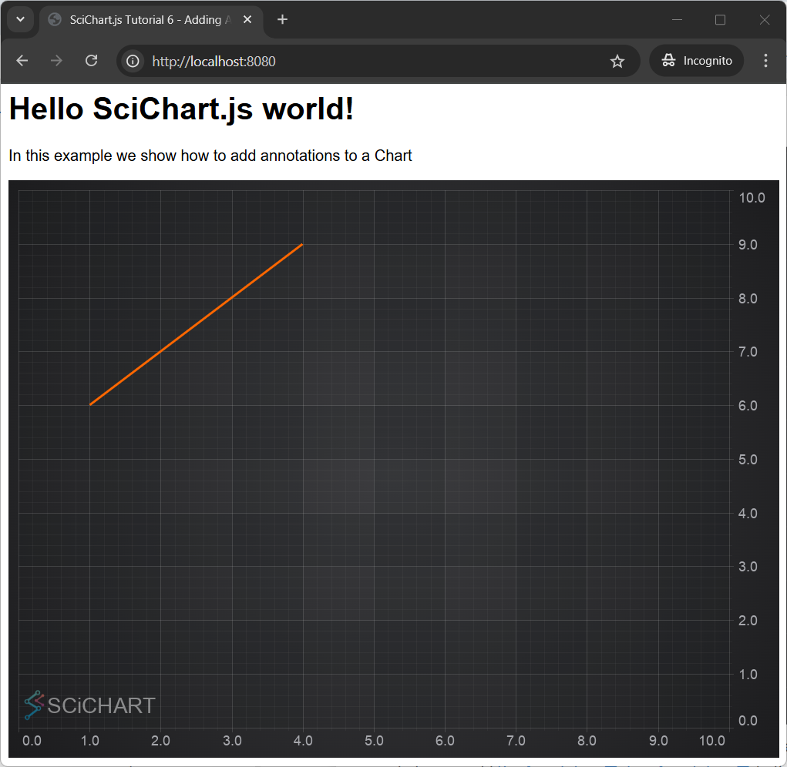
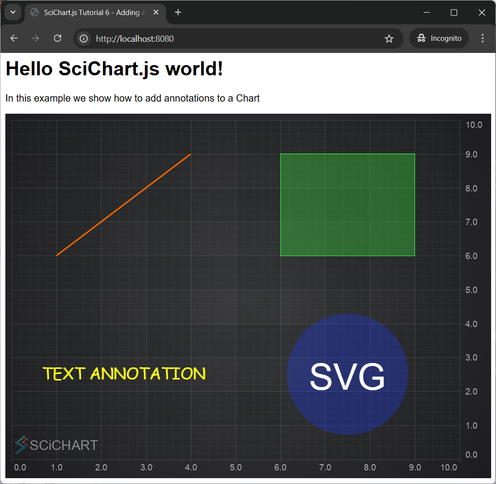
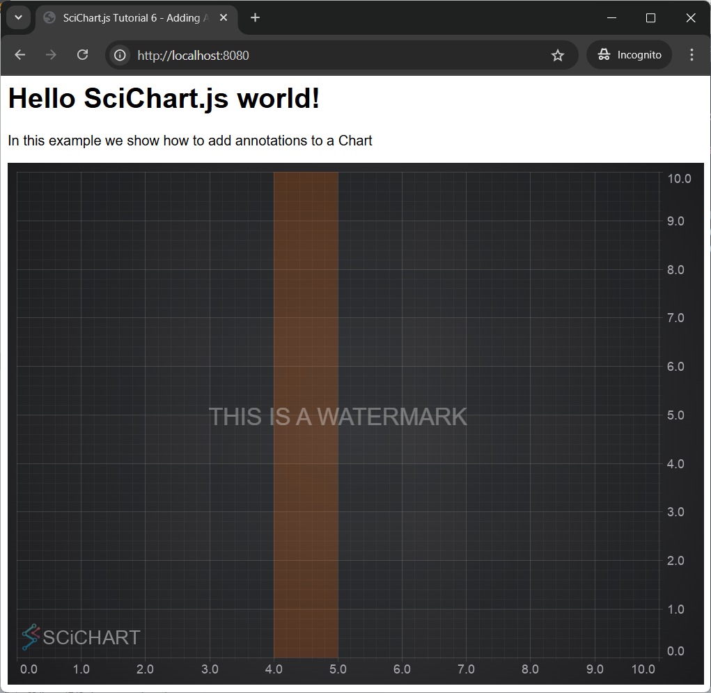

# Tutorial 06 - Adding Annotations

In [Tutorial 5 - Zoom and Pan with Realtime Updates](/get-started/tutorials-js-npm-webpack/tutorial-05-zoom-and-pan-with-realtime-updates), we showed you how to do zooming and panning having realtime updates. In this tutorial, were going to show you how to add annotations.

The annotation API allows you to add other UI elements, markers or labels to a chart, like **Lines, **Text, **Boxes, **SVG elements and more.********

:::tip
Source code for this tutorial can be found at [SciChart.JS.Examples Github Repository](https://github.com/ABTSoftware/SciChart.JS.Examples/tree/dev_v4.0/Tutorials/2D_Chart_Tutorials_JavaScript/Tutorial_6_Adding_Annotations).
:::

<YouTubeVideo url="https://www.youtube.com/embed/kUsMslHD_YE" title="Video tutorial for version 3. SciChart.js JavaScript Chart Tutorial 06 - Adding Annotations to Charts" />

Chart Annotations in SciChart
-----------------------------

The SciChart annotations derive from the [IAnnotation:blue_book:](https://www.scichart.com/documentation/js/current/typedoc/interfaces/iannotation.html) interface.

The annotation types included with SciChart.js out of the box are: [LineAnnotation](/2d-charts/annotations-api/line-annotation), [BoxAnnotation](/2d-charts/annotations-api/box-annotation), [TextAnnotation](/2d-charts/annotations-api/text-annotation), [VerticalLineAnnotation](/2d-charts/annotations-api/vertical-line-annotation), [HorizontalLineAnnotation](/2d-charts/annotations-api/horizontal-line-annotation), [AxisMarkerAnnotation](/2d-charts/annotations-api/axis-marker-annotation/axis-marker-annotation-overview), [NativeTextAnnotation](/2d-charts/annotations-api/native-text-annotation) and other.

It's also possible to add custom shapes and markers to the chart using [CustomAnnotation](/2d-charts/annotations-api/custom-annotation).

:::tip
The full list of supported annotations can be found on the [Annotations API Overview](/2d-charts/annotations-api/annotations-api-overview) page.
:::

Adding Annotations to the Chart
-------------------------------

In this tutorial we will create a simple example showing how to add different annotation types to a chart.

First we create a [SciChartSurface:blue_book:](https://www.scichart.com/documentation/js/current/typedoc/classes/scichartsurface.html), then we add X and Y Axes as normal, and finally we add a [LineAnnotation](/2d-charts/annotations-api/line-annotation) by adding an instance to the [SciChartSurface.annotations:blue_book:](https://www.scichart.com/documentation/js/current/typedoc/classes/scichartsurface.html#annotations) collection.

The code is shown below:

<CodeSnippetBlock labels={["Part1/index.js"]}>
    ```js {16-25} showLineNumbers
    import { SciChartSurface, NumericAxis, LineAnnotation } from "scichart";

    async function initSciChart() {
        // Create the SciChartSurface in the div 'scichart-root'
        // The SciChartSurface, and webassembly context 'wasmContext' are paired. This wasmContext
        // instance must be passed to other types that exist on the same surface.
        const { sciChartSurface, wasmContext } = await SciChartSurface.create(
            "scichart-root"
        );

        // Create an X,Y Axis and add to the chart
        sciChartSurface.xAxes.add(new NumericAxis(wasmContext));
        sciChartSurface.yAxes.add(new NumericAxis(wasmContext));

        // Add line annotation
        sciChartSurface.annotations.add(
            new LineAnnotation({
            stroke: "#FF6600",
            strokeThickness: 3,
            x1: 1.0,
            x2: 4.0,
            y1: 6.0,
            y2: 9.0,
            })
        );
    }

    initSciChart();
    ```
</CodeSnippetBlock>

This code produces this following chart with an X,Y axis and a single [LineAnnotation](/2d-charts/annotations-api/line-annotation).

 

In order to add other annotation types to the chart pass appropriate annotation to [sciChartSurface.annotations.add():blue_book:](https://www.scichart.com/documentation/js/current/typedoc/classes/scichartsurface.html#annotations). In the code below we add [LineAnnotation](/2d-charts/annotations-api/line-annotation) and [BoxAnnotation](/2d-charts/annotations-api/box-annotation) to the chart.

<CodeSnippetBlock labels={["Part2/index.js region A"]}>
    ```js
    // Add line annotation
    sciChartSurface.annotations.add(
        new LineAnnotation({
        stroke: "#FF6600",
        strokeThickness: 3,
        x1: 1.0,
        x2: 4.0,
        y1: 6.0,
        y2: 9.0,
        })
    );

    // Add box annotation
    sciChartSurface.annotations.add(
        new BoxAnnotation({
        stroke: "#33FF33",
        strokeThickness: 1,
        fill: "rgba(50, 255, 50, 0.3)",
        x1: 6.0,
        x2: 9.0,
        y1: 6.0,
        y2: 9.0,
        })
    );
    ```
</CodeSnippetBlock>

Let's also try to add a [TextAnnotation](/2d-charts/annotations-api/text-annotation).

Note that this annotation type only requires x1,y1, whereas [LineAnnotation](/2d-charts/annotations-api/line-annotation) and [BoxAnnotation](/2d-charts/annotations-api/box-annotation) require x1,x2,y1,y2 to define their bounds.

Instead the [TextAnnotation](/2d-charts/annotations-api/text-annotation) is placed at a single x,y point, and the location of that point is defined by the [horizontalAnchorPoint:blue_book:](https://www.scichart.com/documentation/js/current/typedoc/classes/textannotation.html#horizontalanchorpoint) and [verticalAnchorPoint:blue_book:](https://www.scichart.com/documentation/js/current/typedoc/classes/textannotation.html#verticalanchorpoint) properties.

<CodeSnippetBlock labels={["Part2/index.js region B"]}>
    ```js
    // Add text annotation
    sciChartSurface.annotations.add(
        new TextAnnotation({
        x1: 0.25,
        y1: 0.75,
        xCoordinateMode: ECoordinateMode.Relative,
        yCoordinateMode: ECoordinateMode.Relative,
        horizontalAnchorPoint: EHorizontalAnchorPoint.Center,
        verticalAnchorPoint: EVerticalAnchorPoint.Center,
        textColor: "yellow",
        fontSize: 26,
        fontFamily: "Comic Sans MS",
        text: "TEXT ANNOTATION",
        })
    );
    ```
</CodeSnippetBlock>

The next annotation type we're going to add is a [CustomAnnotation](/2d-charts/annotations-api/custom-annotation).

This allows you to create custom SVG markers and add them to the chart. CustomAnnotations require only x1,y1 properties and obey [horizontalAnchorPoint:blue_book:](https://www.scichart.com/documentation/js/current/typedoc/classes/textannotation.html#horizontalanchorpoint) and [verticalAnchorPoint:blue_book:](https://www.scichart.com/documentation/js/current/typedoc/classes/textannotation.html#verticalanchorpoint) properties like TextAnnotations do.

<CodeSnippetBlock labels={["Part2/index.js region C"]}>
    ```js
    // Add custom SVG annotation
    const svgString = `
    <svg baseProfile="full" width="200" height="200" xmlns="http://www.w3.org/2000/svg">
        <circle cx="100" cy="100" r="100" fill="rgba(50,50,255,0.3)" />
        <text x="100" y="125" font-size="60" text-anchor="middle" fill="white">SVG</text>
    </svg>`;
    sciChartSurface.annotations.add(
        new CustomAnnotation({
        x1: 7.5,
        y1: 2.5,
        horizontalAnchorPoint: EHorizontalAnchorPoint.Center,
        verticalAnchorPoint: EVerticalAnchorPoint.Center,
        svgString,
        })
    );
    ```
</CodeSnippetBlock>

This results in a chart with four different annotation.



Further APIs
------------

Annotations support the ability to be docked to the left/right/top/bottom of the chart viewport. You can adjust the docking using the [xCoordinateMode:blue_book:](https://www.scichart.com/documentation/js/current/typedoc/classes/textannotation.html#xcoordinatemode) / [yCoordinateMode:blue_book:](https://www.scichart.com/documentation/js/current/typedoc/classes/textannotation.html#ycoordinatemode) properties.

Some annotations support [verticalAnchorPoint:blue_book:](https://www.scichart.com/documentation/js/current/typedoc/classes/textannotation.html#verticalanchorpoint) / [horizontalAnchorPoint:blue_book:](https://www.scichart.com/documentation/js/current/typedoc/classes/textannotation.html#horizontalanchorpoint) properties. These allow you to change the control point for annotations which have a single X,Y point.

A combination of anchor points and coordinate modes can allow you to create text watermarks on charts, or boxes which stretch horizontally or vertically over a chart.

For example:

<CodeSnippetBlock labels={["Part2/index.js region D"]}>
    ```js
    // Add a watermark centered on the chart
    sciChartSurface.annotations.add(
        new TextAnnotation({
        x1: 0.5,
        y1: 0.5,
        xCoordinateMode: ECoordinateMode.Relative,
        yCoordinateMode: ECoordinateMode.Relative,
        horizontalAnchorPoint: EHorizontalAnchorPoint.Center,
        verticalAnchorPoint: EVerticalAnchorPoint.Center,
        text: "THIS IS A WATERMARK",
        opacity: 0.33,
        fontSize: 27,
        })
    );

    // Add a box vertically stretched between data-points X=4, X=5
    sciChartSurface.annotations.add(
        new BoxAnnotation({
        x1: 4,
        x2: 5,
        // y:0-1 Relative means stretch vertically
        y1: 0,
        y2: 1,
        yCoordinateMode: ECoordinateMode.Relative,
        strokeThickness: 0,
        fill: "#ff660033",
        })
    );
    ```
</CodeSnippetBlock>



View our Annotations Demos online
---------------------------------

You can find out more about the Annotations API in the relevant section of the documentation: [The Annotations API Overview](/2d-charts/annotations-api/annotations-api-overview).

Also, there is a couple of examples showcasing annotations in our Examples Suite. See the [JavaScript Chart Annotations example](https://www.scichart.com/demo/react/chart-annotations) for more details.

<ChartFromSciChartDemo src="https://www.scichart.com/demo/iframe/chart-annotations" title="Chart Annotations" description="showing how create various kinds of annotations and animate them in javascript charts." />

In this example we show how to create multiple annotation types, including liners, text, watermarks, stretched boxes, images, vectors (SVG) and horizontal/vertical lines.

:::tip
The full source code for the Annotations demo can be found below, as well as on [Github](https://github.com/ABTSoftware/SciChart.JS.Examples/blob/master/Examples/src/components/Examples/Charts2D/ChartAnnotations/AnnotationsAreEasy/drawExample.ts).
:::

#### See Also

* [Tutorial 04 - Adding Realtime Updates](/get-started/tutorials-js-npm-webpack/tutorial-04-adding-realtime-updates)
* [Tutorial 08 - Adding Multiple Axis](/get-started/tutorials-js-npm-webpack/tutorial-08-adding-multiple-axis)