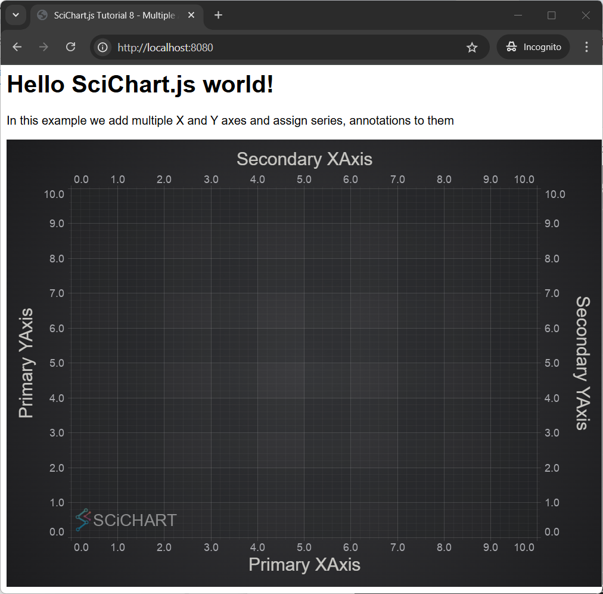

# ✅ Tutorial 08 - Adding Multiple Axis

In [Tutorial 7 - Adding Tooltips and Legends](/docs/get-started/tutorials-js-npm-webpack/tutorial-07-adding-tooltips-and-legends/index.md), we showed you how to add tooltips and legends to a JavaScript Chart using SciChart.js. Now we are going to learn how to add a second **YAxis**.

SciChart supports unlimited axes. This unlocks different possibilities, such as **rotated (vertical)** charts.

:::tip
Source code for this tutorial can be found at [SciChart.JS.Examples Github Repository](https://github.com/ABTSoftware/SciChart.JS.Examples/tree/dev_v4.0/Tutorials/2D_Chart_Tutorials_JavaScript/Tutorial_8_Multiple_Axis)
:::

<YouTubeVideo url="https://www.youtube.com/embed/XDqTYGgEDKo" title="Video tutorial for version 3. SciChart.js JavaScript Chart Tutorial 08 - Adding Multiple X and Y Axis" />

In this tutorial, we are going to add a second **YAxis** to the chart. We are going to show how to register line series and annotations on the second axis. We are also going to show how to ensure Axis drag behavior works on both axis.

Adding a Second Y Axis
----------------------

The procedure to add a second axis to a **SciChartSurface** is pretty much the same as with one axis with one difference.

:::warning
Prior to version 4 you must assign a **unique string ID** to all axes via the [axis.id:blue_book:](https://www.scichart.com/documentation/js/current/typedoc/classes/axiscore.html#id) property if there is more than one. However, starting from version 4 axis IDs are assigned automatically.
:::

To see the axis to appear to the either side of a chart, you set [axis.axisAlignment:blue_book:](https://www.scichart.com/documentation/js/current/typedoc/classes/axisbase2d.html#axisalignment) to **EAxisAlignment.Left**, **EAxisAlignment.Right**, etc. [EAxisAlignment:blue_book:](https://www.scichart.com/documentation/js/current/typedoc/enums/eaxisalignment.html) is an enumeration.

Let's start by placing two Y-Axis on the left and right of the chart, and two X-Axis on the top and bottom.

<CodeSnippetBlock labels={["index.js", "html"]}>
```js {22-42} showLineNumbers
import {
  SciChartSurface,
  NumericAxis,
  EAxisAlignment,
  FastLineRenderableSeries,
  XyDataSeries,
  YAxisDragModifier,
  XAxisDragModifier,
  TextAnnotation,
} from "scichart";

async function initSciChart() {
  // #region ExampleA

  // Create the SciChartSurface in the div 'scichart-root'
  // The SciChartSurface, and webassembly context 'wasmContext' are paired. This wasmContext
  // instance must be passed to other types that exist on the same surface.
  const { sciChartSurface, wasmContext } = await SciChartSurface.create(
    "scichart-root"
  );

  // Create an X,Y Axis and add to the chart
  const xAxis = new NumericAxis(wasmContext, {
    axisTitle: "Primary XAxis",
    axisAlignment: EAxisAlignment.Bottom,
  });
  const xAxis2 = new NumericAxis(wasmContext, {
    axisTitle: "Secondary XAxis",
    axisAlignment: EAxisAlignment.Top,
  });
  const yAxis = new NumericAxis(wasmContext, {
    axisTitle: "Primary YAxis",
    axisAlignment: EAxisAlignment.Left,
  });
  const yAxis2 = new NumericAxis(wasmContext, {
    axisTitle: "Secondary YAxis",
    axisAlignment: EAxisAlignment.Right,
  });
  sciChartSurface.xAxes.add(xAxis);
  sciChartSurface.xAxes.add(xAxis2);
  sciChartSurface.yAxes.add(yAxis);
  sciChartSurface.yAxes.add(yAxis2);

  // #endregion
}

initSciChart();
```
```html {15} showLineNumbers
<html lang="en-us">
    <head>
        <meta charset="utf-8" />
        <meta content="text/html; charset=utf-8" http-equiv="Content-Type" />
        <title>SciChart.js Tutorial 8 - Multiple Axes</title>
        <script async type="text/javascript" src="bundle.js"></script>
        <style>
            body { font-family: 'Arial'}
        </style>
    </head>
    <body>
        <h1>Hello SciChart.js world!</h1>
        <p>In this example we add multiple X and Y axes and assign series, annotations to them</p>
        <!-- the Div where the SciChartSurface will reside -->
        <div id="scichart-root" style="width: 800px; height: 600px;"></div>
    </body>
</html>
```
</CodeSnippetBlock>

Now we can see the primary and secondary X & Y axis in our application:



Registering RenderableSeries on an Axis
---------------------------------------

If there are several Y or X axes, you need to register other chart parts, like **RenderableSeries** and **Annotations**, on a particular axis to be measured against its scale.

We do this by setting the RenderableSeries.xAxisId and yAxisId properties. These must match the axis Id, which has been assigned automatically or set manually. If you leave an xAxisId/yAxisId unset, it will default to the first X/Y axis added to the surface.

<CodeSnippetBlock labels={["index.js region B"]}>
```js
  // Create first series and bind to the first X and Y axis
  const lineSeries1 = new FastLineRenderableSeries(wasmContext, {
    // If not set, xAxisId, yAxisId will default to the first X and Y axes added to sciChartSurface
    // therefore this series will bind to the Primary XAxis and YAxis
    stroke: "#33F9FF",
    strokeThickness: 6,
    dataSeries: new XyDataSeries(wasmContext, {
      xValues: [0, 1, 2, 3],
      yValues: [0, 60, 160, 300],
    }),
  });
  sciChartSurface.renderableSeries.add(lineSeries1);

  // Create second series and bind to the second Y axis
  const lineSeries2 = new FastLineRenderableSeries(wasmContext, {
    // Specify xAxisId, yAxisId.
    // Therefore this series will bind to the Secondary XAxis and YAxis
    xAxisId: xAxis2.id,
    yAxisId: yAxis2.id,
    stroke: "#33ff33",
    strokeThickness: 2,
    dataSeries: new XyDataSeries(wasmContext, {
      xValues: [0, 1, 2, 3, 4],
      yValues: [0, 101, 240, 500, 600],
    }),
  });
  sciChartSurface.renderableSeries.add(lineSeries2);
```
</CodeSnippetBlock>

This results in the chart shown below, where the thicker blue line is bound to the primary axes:


Registering Annotations on an Axis
----------------------------------

Annotations can also be added to a multi-axis chart, and registered with a specific axis pair. Add a [TextAnnotation](/docs/2d-charts/annotations-api/text-annotation/index.md) as follows.

<CodeSnippetBlock labels={["index.js region C"]}>
```js
  sciChartSurface.annotations.add(
    new TextAnnotation({
      text: "Annotations on Axis!",
      x1: 2,
      y1: 400,
      // If not set, yAxisId, xAxisId will default to the first X and Y axes
      // This annotation will be bound to the Secondary XAxis and YAxis
      xAxisId: xAxis2.id,
      yAxisId: yAxis2.id,
      horizontalAnchorPoint: EHorizontalAnchorPoint.Center,
      verticalAnchorPoint: EVerticalAnchorPoint.Center
    })
  );
```
</CodeSnippetBlock>

Now we can see a [TextAnnotation](TextAnnotation.html) in the middle of the chart, bound to the Secondary X,Y axis at `X,Y={2, 400}`


Adding Axis Drag Behaviour
--------------------------

If you want to visualize more clearly which series or annotation is bound to which axis pair, add some Axis Drag behaviours.

<CodeSnippetBlock labels={["index.js region D"]}>
```js
  sciChartSurface.chartModifiers.add(new XAxisDragModifier());
  sciChartSurface.chartModifiers.add(new YAxisDragModifier());
```
</CodeSnippetBlock>

Now if we hover over an Y Axis, click the mouse button and drag the scaling occurs.

Moreover we can notice that the scaling only affects the series and annotations attached to that axis.


Further Reading
---------------

Here is related documentation for further reading:   

*   [Axis Types in SciChart.js](/docs/2d-charts/axis-api/axis-api-overview/index.md)
*   [Secondary and Multiple Axis](/docs/2d-charts/axis-api/multi-axis-and-layout/secondary-and-multiple-axis-overview/index.md)
*   [Vertically Stacked Axis](/docs/2d-charts/axis-api/multi-axis-and-layout/vertically-stacked-axis-layout/index.md)
*   [Advanced Options - Custom Layouts](/docs/2d-charts/axis-api/multi-axis-and-layout/advanced-options-custom-layout-managers/index.md)

#### See Also

* [Tutorial 06 - Adding Annotations](/docs/get-started/tutorials-js-npm-webpack/tutorial-06-adding-annotations/index.md)
* [Tutorial 09 - Linking Multiple Charts](/docs/get-started/tutorials-js-npm-webpack/tutorial-09-linking-multiple-charts/index.md)