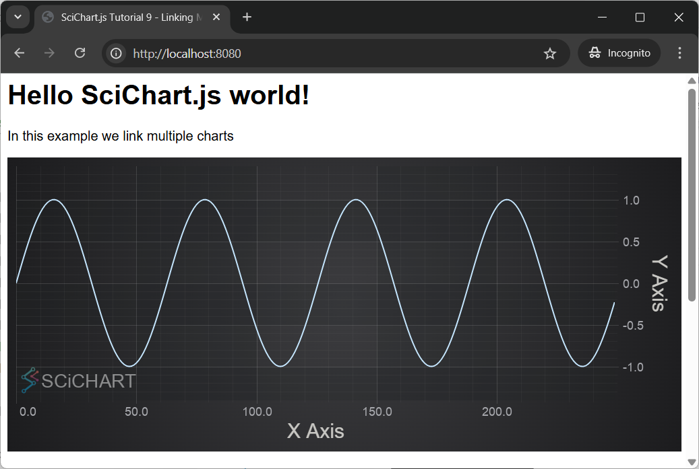
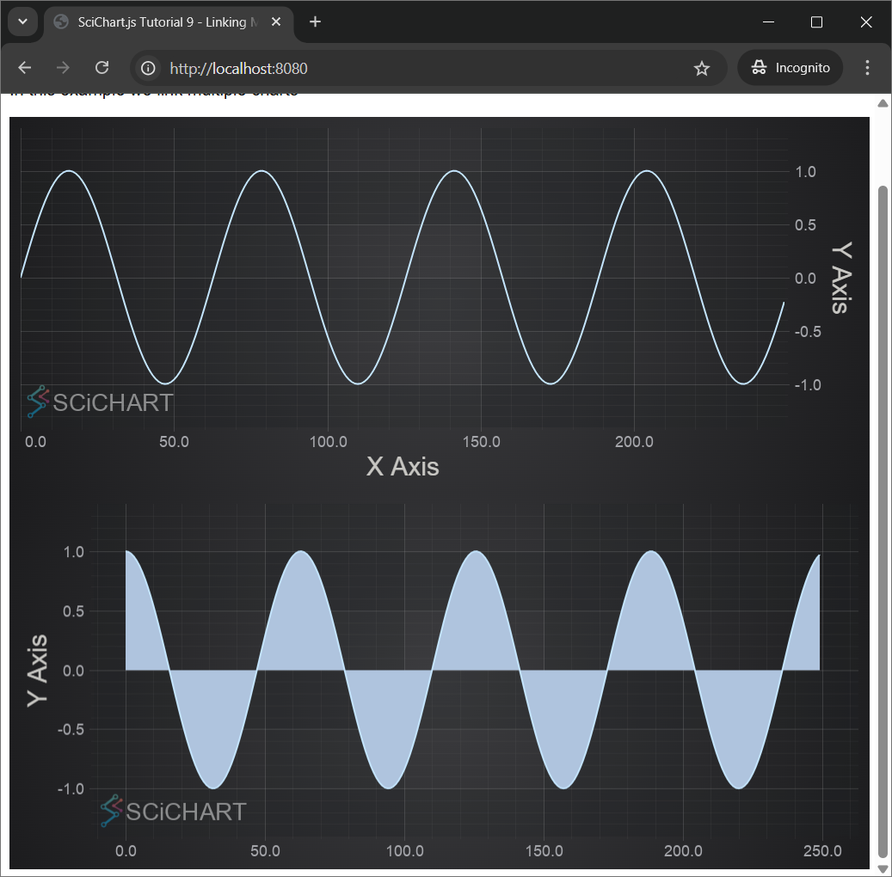
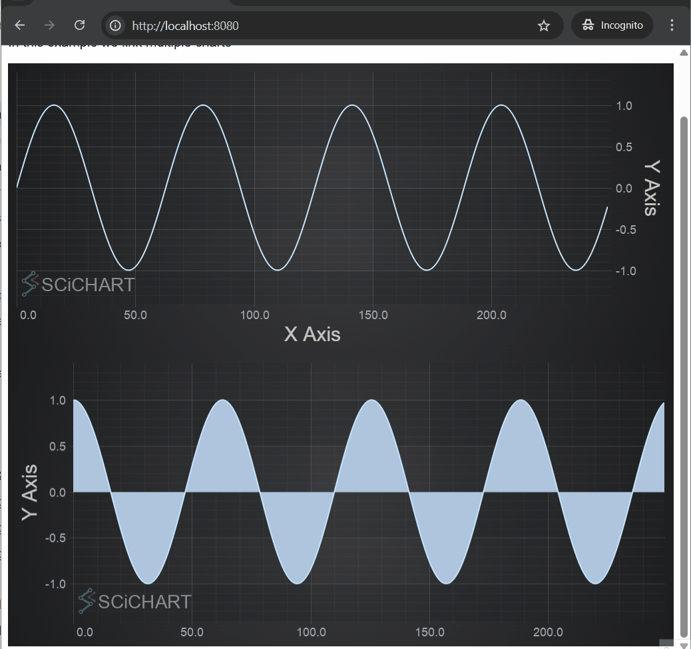
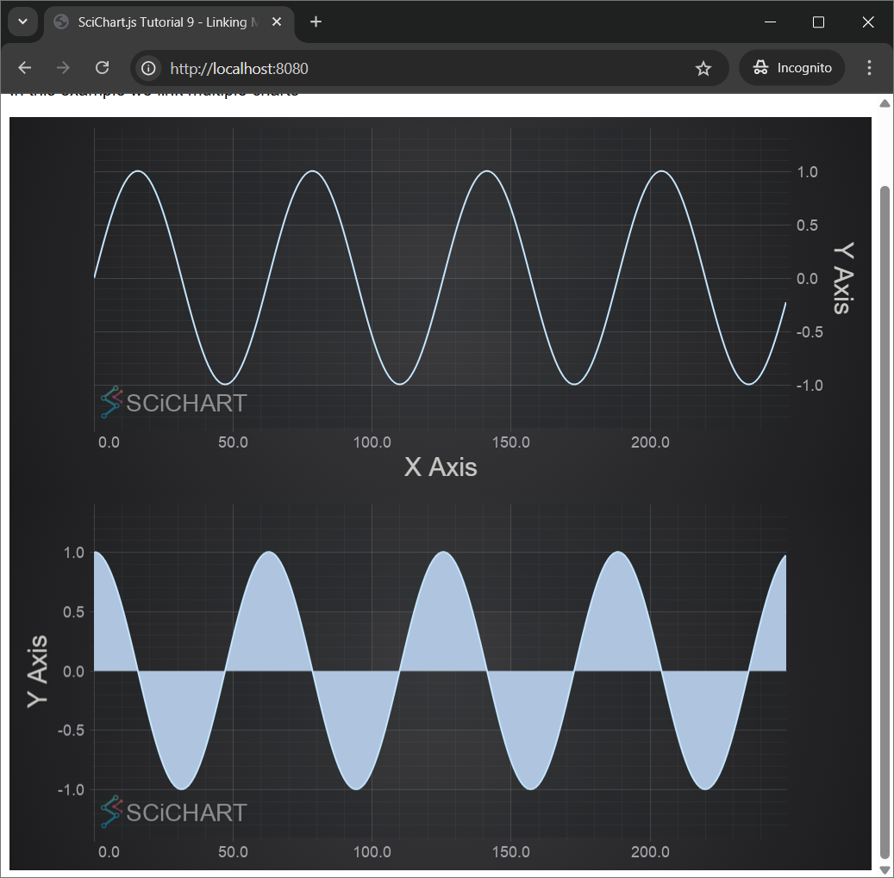
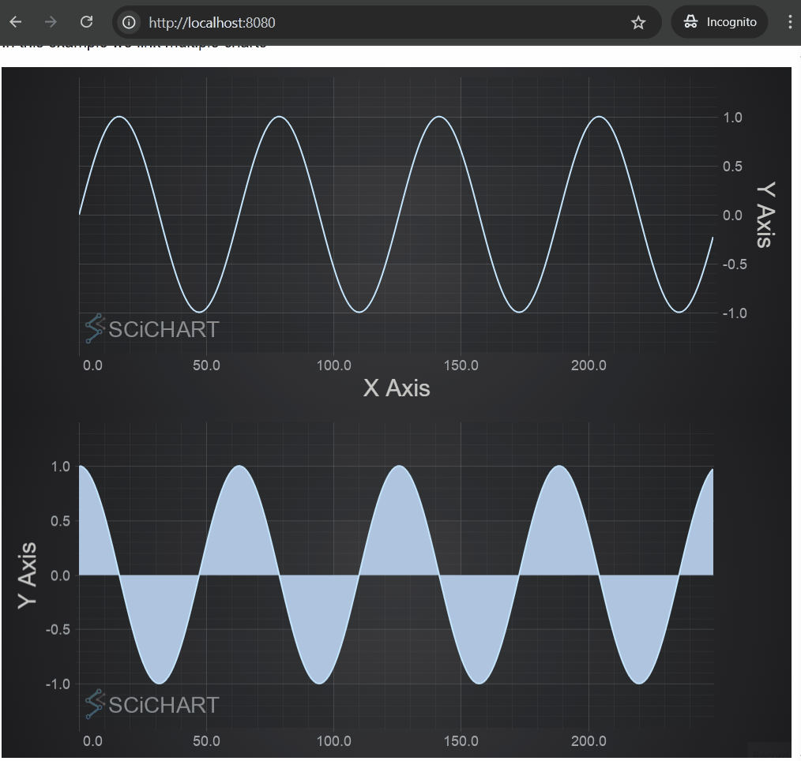

# ✅ Tutorial 09 - Linking Multiple Charts

In [Tutorial 08 - Adding Multiple Axis](/docs/get-started/tutorials-js-npm-webpack/tutorial-08-adding-multiple-axis/index.md), we showed you how to add a second **YAxis**.  
Now we are going to show you how to create multiple charts and link them together.

:::tip
Source code for this tutorial can be found at [SciChart.JS.Examples Github Repository](https://github.com/ABTSoftware/SciChart.JS.Examples/tree/dev_v4.0/Tutorials/2D_Chart_Tutorials_JavaScript/Tutorial_9_Linking_Multiple_Charts)
:::

Adding a First Chart
--------------------

Let's create a first [SciChartSurface](/docs/2d-charts/surface/scichart-surface-type-overview/index.md) with X and Y [NumericAxis](https://www.scichart.com/documentation/js/current/typedoc/classes/numericaxis.html), [Line Series](/docs/2d-charts/chart-types/fast-line-renderable-series/index.md) and data to display a sine wave. To make the chart interactive we add several chart modifiers, such as: [ZoomPanModifier](/docs/2d-charts/chart-modifier-api/zooming-and-panning/zoom-pan-modifier/index.md), [MouseWheelZoomModifier](/docs/2d-charts/chart-modifier-api/zooming-and-panning/mouse-wheel-zoom-modifier/index.md), [ZoomExtentsModifier](/docs/2d-charts/chart-modifier-api/zooming-and-panning/zoom-extents-modifier/index.md), [RolloverModifier](/docs/2d-charts/chart-modifier-api/rollover-modifier/index.md).

<CodeSnippetBlock labels={["index.js region A", "index.html"]}>
```js {20-69} showLineNumbers
import {
  SciChartSurface,
  NumericAxis,
  NumberRange,
  EAxisAlignment,
  XyDataSeries,
  FastLineRenderableSeries,
  FastMountainRenderableSeries,
  ZoomPanModifier,
  MouseWheelZoomModifier,
  ZoomExtentsModifier,
  SciChartVerticalGroup,
  RolloverModifier,
  EAutoRange,
} from "scichart";

async function initSciChart() {
  // #region ExampleA

  // CREATE FIRST CHART
  const createFirstChart = async () => {
    // Create the SciChartSurface in the div 'scichart-root'
    // The SciChartSurface, and webassembly context 'wasmContext' are paired. This wasmContext
    // instance must be passed to other types that exist on the same surface.

    // Create the first chart
    const { sciChartSurface, wasmContext } = await SciChartSurface.create(
      "scichart-root-1"
    );

    // Create an X Axis and add to the chart
    sciChartSurface.xAxes.add(
      new NumericAxis(wasmContext, { axisTitle: "X Axis" })
    );

    // Create Y Axis and add to the chart
    sciChartSurface.yAxes.add(
      new NumericAxis(wasmContext, {
        axisTitle: "Y Axis",
        axisAlignment: EAxisAlignment.Right,
        autoRange: EAutoRange.Always,
        growBy: new NumberRange(0.2, 0.2),
      })
    );

    // Create data for line series
    const dataForLineSeries = new XyDataSeries(wasmContext);
    for (let x = 0; x < 250; x++) {
      dataForLineSeries.append(x, Math.sin(x * 0.1));
    }

    // Create line series and add to the chart
    const lineSeries = new FastLineRenderableSeries(wasmContext, {
      dataSeries: dataForLineSeries,
    });
    lineSeries.rolloverModifierProps.tooltipColor = "green";
    lineSeries.rolloverModifierProps.tooltipLabelX = "X";
    lineSeries.rolloverModifierProps.tooltipLabelY = "Y";
    sciChartSurface.renderableSeries.add(lineSeries);

    sciChartSurface.chartModifiers.add(
      new ZoomPanModifier(),
      new MouseWheelZoomModifier(),
      new ZoomExtentsModifier(),
      new RolloverModifier()
    );
    return { sciChartSurface };
  };
  createFirstChart();
  // #endregion
}

initSciChart();
```
```html {16-17} showLineNumbers
<html lang="en-us">
  <head>
    <meta charset="utf-8" />
    <meta content="text/html; charset=utf-8" http-equiv="Content-Type" />
    <title>SciChart.js Tutorial 9 - Linking Multiple Charts</title>
    <script async type="text/javascript" src="bundle.js"></script>
    <style>
      body {
        font-family: "Arial";
      }
    </style>
  </head>
  <body>
    <h1>Hello SciChart.js world!</h1>
    <p>In this example we link multiple charts</p>
    <!-- the Div where first SciChartSurface will reside -->
    <div id="scichart-root-1" style="width: 800px; height: 350px"></div>
    <!-- the Div where second SciChartSurface will reside -->
    <div id="scichart-root-2" style="width: 800px; height: 350px"></div>
  </body>
</html>
```
</CodeSnippetBlock>

Now we can see the first chart.

 

Adding a Second Chart
---------------------

Now we repeat the same procedure to configure the second chart with some differences. We need to use a different div element ID and it should be present in index.html file.

<CodeSnippetBlock labels={["index.html"]}>
```html {18-19} showLineNumbers
<html lang="en-us">
  <head>
    <meta charset="utf-8" />
    <meta content="text/html; charset=utf-8" http-equiv="Content-Type" />
    <title>SciChart.js Tutorial 9 - Linking Multiple Charts</title>
    <script async type="text/javascript" src="bundle.js"></script>
    <style>
      body {
        font-family: "Arial";
      }
    </style>
  </head>
  <body>
    <h1>Hello SciChart.js world!</h1>
    <p>In this example we link multiple charts</p>
    <!-- the Div where first SciChartSurface will reside -->
    <div id="scichart-root-1" style="width: 800px; height: 350px"></div>
    <!-- the Div where second SciChartSurface will reside -->
    <div id="scichart-root-2" style="width: 800px; height: 350px"></div>
  </body>
</html>
```
</CodeSnippetBlock>

Other things we change: align **Y Axis** left, use [Mountain Series Type](/docs/2d-charts/chart-types/fast-mountain-area-renderable-series/index.md) Series Type.html) instead of **Line Series,** populate data with **cosine** function instead of **sine**. 

<CodeSnippetBlock labels={["index.js region B"]}>
```js showLineNumbers
  // CREATE SECOND CHART
  const createSecondChart = async () => {
    const { sciChartSurface, wasmContext } = await SciChartSurface.create(
      "scichart-root-2"
    );

    // Create an X Axis and add to the chart
    sciChartSurface.xAxes.add(new NumericAxis(wasmContext));

    // Create Y Axis and add to the chart
    sciChartSurface.yAxes.add(
      new NumericAxis(wasmContext, {
        axisTitle: "Y Axis",
        axisAlignment: EAxisAlignment.Left,
        autoRange: EAutoRange.Always,
        growBy: new NumberRange(0.2, 0.2),
      })
    );

    // Create data for mountain series
    const dataForMountainSeries = new XyDataSeries(wasmContext);
    for (let x = 0; x < 250; x++) {
      dataForMountainSeries.append(x, Math.cos(x * 0.1));
    }

    // Don't forget to
    // import { FastMountainRenderableSeries } from "scichart";

    // Create mountain series, bind to primary axis and add to the chart
    const mountainSeries = new FastMountainRenderableSeries(wasmContext, {
      dataSeries: dataForMountainSeries,
      fill: "LightSteelBlue",
    });
    mountainSeries.rolloverModifierProps.tooltipColor = "green";
    sciChartSurface.renderableSeries.add(mountainSeries);

    sciChartSurface.chartModifiers.add(
      new ZoomPanModifier(),
      new MouseWheelZoomModifier(),
      new ZoomExtentsModifier(),
      new RolloverModifier()
    );

    return { sciChartSurface };
  };
  createSecondChart();
```
</CodeSnippetBlock>

Our web application should now shows two charts:



Synchronizing VisibleRanges on Axes
-----------------------------------

To make both charts show the same [VisibleRange](/docs/2d-charts/axis-api/ranging-scaling/listen-to-visible-range-changes/index.md) on X axes, we subscribe to [AxisCore.visibleRangeChanged](https://www.scichart.com/documentation/js/current/typedoc/classes/axiscore.html#visiblerangechanged) event and [update VisibleRange](/docs/2d-charts/axis-api/ranging-scaling/set-range-zoom-to-fit/index.md) of the second chart if has been changed for the first chart and visa versa. In the beginning of _initSciChart()_ function we declare two variables and use them to store X Axis object for each [SciChartSurface](/docs/2d-charts/surface/scichart-surface-type-overview/index.md). In the end of _initSciChart()_ function we synchronize visible ranges.

Instead of calling `createFirstChart()` and `createSecondChart()` separately we use `Promise.all([createFirstChart(), createSecondChart()])` to create charts in parallel.

<CodeSnippetBlock labels={["index.js region C"]}>
```js {3} showLineNumbers
  // Creation of charts. Given the functions createFirstChart() and createSecondChart() return promises,
  // we await both.
  const res = await Promise.all([createFirstChart(), createSecondChart()]);

  // Both functions return a promise of { sciChartSurface } so we can access the chart instances as follows
  const allCharts = res.map((r) => r.sciChartSurface);
  const [scs0, scs1] = allCharts;

  // Now we can access chart properties, such as XAxis, YAxis, RenderableSeries, Annotations, etc.
  const [xAxis0, xAxis1] = allCharts.map((scs) => scs.xAxes.get(0));

  // To Synchronize two charts

  // Synchronize visible ranges. When one chart xAxis.visibleRange changes, update the other
  xAxis0.visibleRangeChanged.subscribe((data1) => {
    xAxis1.visibleRange = data1.visibleRange;
  });
  xAxis1.visibleRangeChanged.subscribe((data1) => {
    xAxis0.visibleRange = data1.visibleRange;
  });
```
</CodeSnippetBlock>

Now if we do panning or zooming for one chart the other chart is being updated accordingly.



Synchronizing Chart Widths
--------------------------

We've got two charts with synchronyzed X **VisibleRanges**. However it would be even better if they had the same width and were placed exactly under each other.

To achieve it we create [SciChartVerticalGroup](/docs/2d-charts/chart-synchronization-api/synchronizing-multiple-charts/index.md) and add both surfaces to the group.


<CodeSnippetBlock labels={["index.js region D"]}>
```js
  // Synchronize the chart axis sizes uses SciChartVerticalGroup
  // This is useful in case the Y-axis have different sizes due to differing visibleRange
  // text formatting or size
  const verticalGroup = new SciChartVerticalGroup();
  verticalGroup.addSurfaceToGroup(scs0);
  verticalGroup.addSurfaceToGroup(scs1);
```
</CodeSnippetBlock>

 Results in this:

 

Linking Cursor and Other Modifiers
----------------------------------

Next we are going to link chart modifiers.

Both charts have an array of **ChartModifiers** set up to handle zooming, panning and tooltips.

```js
...
    sciChartSurface.chartModifiers.add(
      new ZoomPanModifier(),
      new MouseWheelZoomModifier(),
      new ZoomExtentsModifier(),
      new RolloverModifier()
    );
...
```

If you run the application now, you will notice that you have zooming behaviour and tooltips on both charts, but the mouse events still aren't linked. To link them we need to make one small change to set the [chartModifierBase.modifierGroup](https://www.scichart.com/documentation/js/current/typedoc/classes/chartmodifierbase2d.html#modifiergroup) property:

<CodeSnippetBlock labels={["index.js region E"]}>
```js
  // For each chart modifier on both charts, set the modifierGroup. This
  // ensures that mouse events which occur on one chart are sent to the other
  scs0.chartModifiers.asArray().forEach((m) => (m.modifierGroup = "MyGroup"));
  scs1.chartModifiers.asArray().forEach((m) => (m.modifierGroup = "MyGroup"));
```
</CodeSnippetBlock>

Run the application again. Now we can see that [RolloverModifier](/docs/2d-charts/chart-modifier-api/rollover-modifier/index.md) events are linked and the Tooltips are now synchronizing across the charts.  



Congrats! Your charts are now linked!

Final Source Code
-----------------

That was a complex tutorial, so here is the final source code for the Linking Multiple Charts tutorial. Don't forget you need two div elements in the HTML with different IDs to load the two SciChartSurfaces!

<CodeSnippetBlock labels={["index.js", "index.html"]}>
```js
import {
  SciChartSurface,
  NumericAxis,
  NumberRange,
  EAxisAlignment,
  XyDataSeries,
  FastLineRenderableSeries,
  FastMountainRenderableSeries,
  ZoomPanModifier,
  MouseWheelZoomModifier,
  ZoomExtentsModifier,
  SciChartVerticalGroup,
  RolloverModifier,
  EAutoRange,
} from "scichart";

async function initSciChart() {
  // #region ExampleA

  // CREATE FIRST CHART
  const createFirstChart = async () => {
    // Create the SciChartSurface in the div 'scichart-root'
    // The SciChartSurface, and webassembly context 'wasmContext' are paired. This wasmContext
    // instance must be passed to other types that exist on the same surface.

    // Create the first chart
    const { sciChartSurface, wasmContext } = await SciChartSurface.create(
      "scichart-root-1"
    );

    // Create an X Axis and add to the chart
    sciChartSurface.xAxes.add(
      new NumericAxis(wasmContext, { axisTitle: "X Axis" })
    );

    // Create Y Axis and add to the chart
    sciChartSurface.yAxes.add(
      new NumericAxis(wasmContext, {
        axisTitle: "Y Axis",
        axisAlignment: EAxisAlignment.Right,
        autoRange: EAutoRange.Always,
        growBy: new NumberRange(0.2, 0.2),
      })
    );

    // Create data for line series
    const dataForLineSeries = new XyDataSeries(wasmContext);
    for (let x = 0; x < 250; x++) {
      dataForLineSeries.append(x, Math.sin(x * 0.1));
    }

    // Create line series and add to the chart
    const lineSeries = new FastLineRenderableSeries(wasmContext, {
      dataSeries: dataForLineSeries,
    });
    lineSeries.rolloverModifierProps.tooltipColor = "green";
    lineSeries.rolloverModifierProps.tooltipLabelX = "X";
    lineSeries.rolloverModifierProps.tooltipLabelY = "Y";
    sciChartSurface.renderableSeries.add(lineSeries);

    sciChartSurface.chartModifiers.add(
      new ZoomPanModifier(),
      new MouseWheelZoomModifier(),
      new ZoomExtentsModifier(),
      new RolloverModifier()
    );
    return { sciChartSurface };
  };
  // createFirstChart();
  // #endregion

  // #region ExampleB

  // CREATE SECOND CHART
  const createSecondChart = async () => {
    const { sciChartSurface, wasmContext } = await SciChartSurface.create(
      "scichart-root-2"
    );

    // Create an X Axis and add to the chart
    sciChartSurface.xAxes.add(new NumericAxis(wasmContext));

    // Create Y Axis and add to the chart
    sciChartSurface.yAxes.add(
      new NumericAxis(wasmContext, {
        axisTitle: "Y Axis",
        axisAlignment: EAxisAlignment.Left,
        autoRange: EAutoRange.Always,
        growBy: new NumberRange(0.2, 0.2),
      })
    );

    // Create data for mountain series
    const dataForMountainSeries = new XyDataSeries(wasmContext);
    for (let x = 0; x < 250; x++) {
      dataForMountainSeries.append(x, Math.cos(x * 0.1));
    }

    // Don't forget to
    // import { FastMountainRenderableSeries } from "scichart";

    // Create mountain series, bind to primary axis and add to the chart
    const mountainSeries = new FastMountainRenderableSeries(wasmContext, {
      dataSeries: dataForMountainSeries,
      fill: "LightSteelBlue",
    });
    mountainSeries.rolloverModifierProps.tooltipColor = "green";
    sciChartSurface.renderableSeries.add(mountainSeries);

    sciChartSurface.chartModifiers.add(
      new ZoomPanModifier(),
      new MouseWheelZoomModifier(),
      new ZoomExtentsModifier(),
      new RolloverModifier()
    );

    return { sciChartSurface };
  };
  // createSecondChart();
  // #endregion

  // #region ExampleC

  // Creation of charts. Given the functions createFirstChart() and createSecondChart() return promises,
  // we await both.
  const res = await Promise.all([createFirstChart(), createSecondChart()]);

  // Both functions return a promise of { sciChartSurface } so we can access the chart instances as follows
  const allCharts = res.map((r) => r.sciChartSurface);
  const [scs0, scs1] = allCharts;

  // Now we can access chart properties, such as XAxis, YAxis, RenderableSeries, Annotations, etc.
  const [xAxis0, xAxis1] = allCharts.map((scs) => scs.xAxes.get(0));

  // To Synchronize two charts

  // Synchronize visible ranges. When one chart xAxis.visibleRange changes, update the other
  xAxis0.visibleRangeChanged.subscribe((data1) => {
    xAxis1.visibleRange = data1.visibleRange;
  });
  xAxis1.visibleRangeChanged.subscribe((data1) => {
    xAxis0.visibleRange = data1.visibleRange;
  });

  // #endregion

  // #region ExampleD

  // Synchronize the chart axis sizes uses SciChartVerticalGroup
  // This is useful in case the Y-axis have different sizes due to differing visibleRange
  // text formatting or size
  const verticalGroup = new SciChartVerticalGroup();
  verticalGroup.addSurfaceToGroup(scs0);
  verticalGroup.addSurfaceToGroup(scs1);

  // #endregion

  // #region ExampleE

  // For each chart modifier on both charts, set the modifierGroup. This
  // ensures that mouse events which occur on one chart are sent to the other
  scs0.chartModifiers.asArray().forEach((m) => (m.modifierGroup = "MyGroup"));
  scs1.chartModifiers.asArray().forEach((m) => (m.modifierGroup = "MyGroup"));

  // #endregion
}

initSciChart();
```
```html
<html lang="en-us">
  <head>
    <meta charset="utf-8" />
    <meta content="text/html; charset=utf-8" http-equiv="Content-Type" />
    <title>SciChart.js Tutorial 9 - Linking Multiple Charts</title>
    <script async type="text/javascript" src="bundle.js"></script>
    <style>
      body {
        font-family: "Arial";
      }
    </style>
  </head>
  <body>
    <h1>Hello SciChart.js world!</h1>
    <p>In this example we link multiple charts</p>
    <!-- the Div where first SciChartSurface will reside -->
    <div id="scichart-root-1" style="width: 800px; height: 350px"></div>
    <!-- the Div where second SciChartSurface will reside -->
    <div id="scichart-root-2" style="width: 800px; height: 350px"></div>
  </body>
</html>
```
</CodeSnippetBlock>

Further Reading
---------------

[demo.scichart.com](https://demo.scichart.com/react) contains a couple of examples that show chart synchronization techniques.

For instance, take a look at the [Sync Multi Chart demo](https://demo.scichart.com/react/sync-multi-chart) which shows how to dynamically add/remove chart panes to a synchronization group.

<ChartFromSciChartDemo src="https://demo.scichart.com/iframe/sync-multi-chart" title="Sync Multi Chart" description="" />

The [Server Traffic Dashboard](https://demo.scichart.com/react/server-traffic-dashboard) also has complex example of synchronizing zoom and tooltips between charts of different sizes in a more complex layout.

<ChartFromSciChartDemo src="https://demo.scichart.com/iframe/server-traffic-dashboard" title="Server Traffic Dashboard" description="" />
