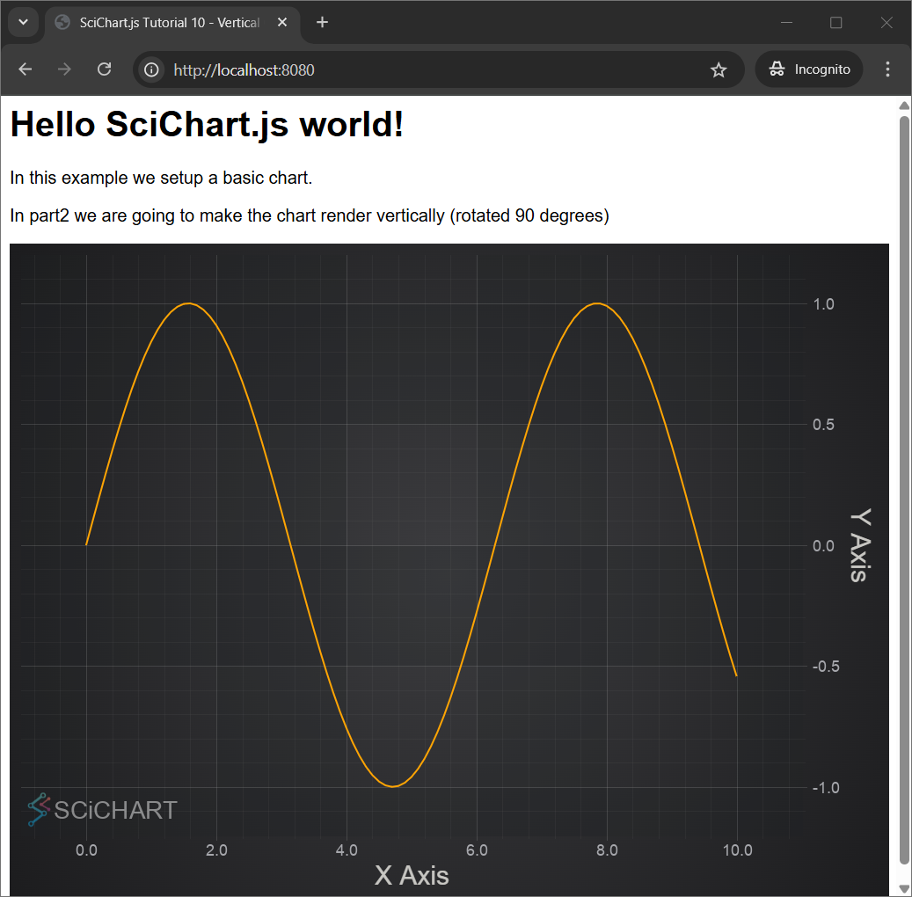
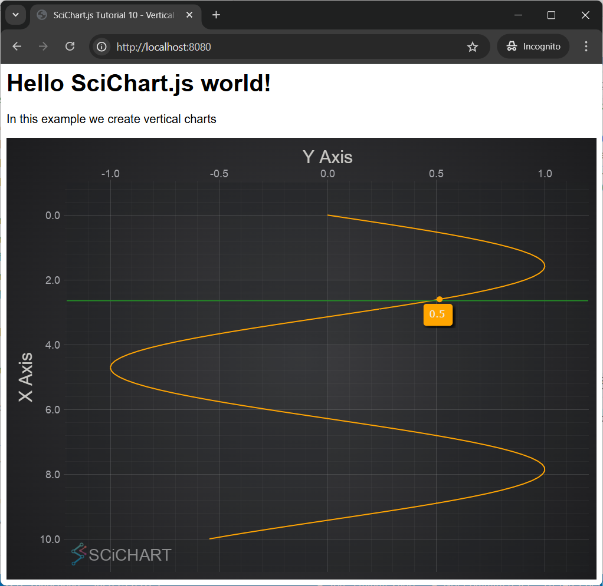

# ✅ Tutorial 10 - Vertical Charts

In the [previous tutorial](/docs/get-started/tutorials-js-npm-webpack/tutorial-09-linking-multiple-charts/index.md) we explained how to link multiple charts using SciChart.js. In this tutorial, we are going to show you how to add a **Vertical Chart**.

:::tip
Source code for this tutorial can be found at [SciChart.JS.Examples](https://github.com/ABTSoftware/SciChart.JS.Examples/tree/dev_v4.0/Tutorials/2D_Chart_Tutorials_JavaScript/Tutorial_10_Vertical_Charts) Github Repository
:::

Adding a Chart
--------------

First let's create a simple [Line Chart](/docs/2d-charts/chart-types/fast-line-renderable-series/index.md). In this example we generate a data set for sine wave and add [SciChartSurface](/docs/2d-charts/surface/scichart-surface-type-overview/index.md) with two [NumericAxis:blue_book:](https://www.scichart.com/documentation/js/current/typedoc/classes/numericaxis.html) and [FastLineRenderableSeries:blue_book:](https://www.scichart.com/documentation/js/current/typedoc/classes/fastlinerenderableseries.html) to produce the **Line Chart**.

<CodeSnippetBlock labels={["index.js", "index.html"]}>
```js showLineNumbers
import {
  SciChartSurface,
  NumericAxis,
  NumberRange,
  XyDataSeries,
  FastLineRenderableSeries,
} from "scichart";

async function initSciChart() {
  const { wasmContext, sciChartSurface } = await SciChartSurface.create(
    "scichart-root"
  );

  // Generate a data set for sine wave
  const xValues = [];
  const yValues = [];
  for (let i = 0; i <= 100; i++) {
    const x = 0.1 * i;
    xValues.push(x);
    yValues.push(Math.sin(x));
  }

  sciChartSurface.xAxes.add(
    new NumericAxis(wasmContext, {
      axisTitle: "X Axis",
      growBy: new NumberRange(0.1, 0.1),
    })
  );

  sciChartSurface.yAxes.add(
    new NumericAxis(wasmContext, {
      axisTitle: "Y Axis",
      growBy: new NumberRange(0.1, 0.1),
    })
  );

  sciChartSurface.renderableSeries.add(
    new FastLineRenderableSeries(wasmContext, {
      dataSeries: new XyDataSeries(wasmContext, { xValues, yValues }),
      stroke: "orange",
    })
  );
}

initSciChart();
```
```html showLineNumbers
<html lang="en-us">
  <head>
    <meta charset="utf-8" />
    <meta content="text/html; charset=utf-8" http-equiv="Content-Type" />
    <title>SciChart.js Tutorial 10 - Vertical Charts</title>
    <script async type="text/javascript" src="bundle.js"></script>
    <style>
      body {
        font-family: "Arial";
      }
    </style>
  </head>
  <body>
    <h1>Hello SciChart.js world!</h1>
    <p>In this example we setup a basic chart.</p>
    <p>
      In part2 we are going to make the chart render vertically (rotated 90
      degrees)
    </p>
    <!-- the Div where SciChartSurface will reside -->
    <div id="scichart-root" style="width: 800px; height: 600px"></div>
  </body>
</html>
```
</CodeSnippetBlock>

This gives us this chart:



Making the Chart Vertical
-------------------------

In fact, just setting [xAxis.axisAlignment:blue_book:](https://www.scichart.com/documentation/js/current/typedoc/classes/axisbase2d.html#axisalignment) to [EAxisAlignment.Left:blue_book:](https://www.scichart.com/documentation/js/current/typedoc/enums/eaxisalignment.html) or Right and [yAxis.axisAlignment:blue_book:](https://www.scichart.com/documentation/js/current/typedoc/classes/axisbase2d.html#axisalignment) to [EAxisAlignment.Top:blue_book:](https://www.scichart.com/documentation/js/current/typedoc/enums/eaxisalignment.html) or EAxisAlignment.Bottom makes the chart vertical.

Moreover if the axes orientation needs to be inverted there is [axis.flippedCoordinates:blue_book:](https://www.scichart.com/documentation/js/current/typedoc/classes/axisbase2d.html#flippedcoordinates) property on [AxisCore:blue_book:](https://www.scichart.com/documentation/js/current/typedoc/classes/axiscore.html) class. 

In order to make the chart interactive we add chart modifiers such as [ZoomPanModifier](/docs/2d-charts/chart-modifier-api/zooming-and-panning/zoom-pan-modifier/index.md), [ZoomExtentsModifier](/docs/2d-charts/chart-modifier-api/zooming-and-panning/zoom-extents-modifier/index.md), [MouseWheelZoomModifier](/docs/2d-charts/chart-modifier-api/zooming-and-panning/mouse-wheel-zoom-modifier/index.md) and [RolloverModifier](/docs/2d-charts/chart-modifier-api/rollover-modifier/index.md).

<CodeSnippetBlock labels={["Part2 index.js", "Part2 index.html"]}>
```js {7-11,33,42,44,57-60} showLineNumbers
import {
  SciChartSurface,
  NumericAxis,
  NumberRange,
  XyDataSeries,
  FastLineRenderableSeries,
  EAxisAlignment,
  ZoomPanModifier,
  ZoomExtentsModifier,
  MouseWheelZoomModifier,
  RolloverModifier
} from "scichart";

async function initSciChart() {
  const { wasmContext, sciChartSurface } = await SciChartSurface.create(
    "scichart-root"
  );

  // Generate a data set for sine wave
  const xValues = [];
  const yValues = [];
  for (let i = 0; i <= 100; i++) {
    const x = 0.1 * i;
    xValues.push(x);
    yValues.push(Math.sin(x));
  }

  // Make the chart vertical by setting X Axis Alignment to Left or Right
  sciChartSurface.xAxes.add(
    new NumericAxis(wasmContext, {
      axisTitle: "X Axis",
      growBy: new NumberRange(0.1, 0.1),
      axisAlignment: EAxisAlignment.Left
    })
  );

  // Make the chart vertical by setting Y Axis Alignment to Top or Bottom
  sciChartSurface.yAxes.add(
    new NumericAxis(wasmContext, {
      axisTitle: "Y Axis",
      growBy: new NumberRange(0.1, 0.1),
      axisAlignment: EAxisAlignment.Top,
      // Flip the axis orientation with this property
      flippedCoordinates: true,
    })
  );

  sciChartSurface.renderableSeries.add(
    new FastLineRenderableSeries(wasmContext, {
      dataSeries: new XyDataSeries(wasmContext, { xValues, yValues }),
      stroke: "orange",
    })
  );

  // Add some interactivity modifiers. Everything is transposed in a vertical chart
  // so zoom/pan and rollover works vertically
  sciChartSurface.chartModifiers.add(new ZoomPanModifier());
  sciChartSurface.chartModifiers.add(new ZoomExtentsModifier());
  sciChartSurface.chartModifiers.add(new MouseWheelZoomModifier());
  sciChartSurface.chartModifiers.add(new RolloverModifier());
}

initSciChart();
```
```html showLineNumbers
<html lang="en-us">
  <head>
    <meta charset="utf-8" />
    <meta content="text/html; charset=utf-8" http-equiv="Content-Type" />
    <title>SciChart.js Tutorial 10 - Vertical Charts</title>
    <script async type="text/javascript" src="bundle.js"></script>
    <style>
      body {
        font-family: "Arial";
      }
    </style>
  </head>
  <body>
    <h1>Hello SciChart.js world!</h1>
    <p>In this example we create vertical charts (Part2)</p>
    <!-- the Div where SciChartSurface will reside -->
    <div id="scichart-root" style="width: 800px; height: 600px"></div>
  </body>
</html>
```
</CodeSnippetBlock>

 This gives us the **Vertical Chart**:



Further Reading
---------------

Here is related documentation for further reading:   

*   [Axis Types in SciChart.js](/docs/2d-charts/axis-api/axis-types/common-axis-base-type/index.md)
*   [Axis Docs - Create a Vertical Chart](/docs/2d-charts/axis-api/multi-axis-and-layout/vertical-charts-rotate-transpose-axis/index.md)
*   [Synchronizing Vertical Charts](/docs/2d-charts/chart-synchronization-api/synchronizing-vertical-charts/index.md)