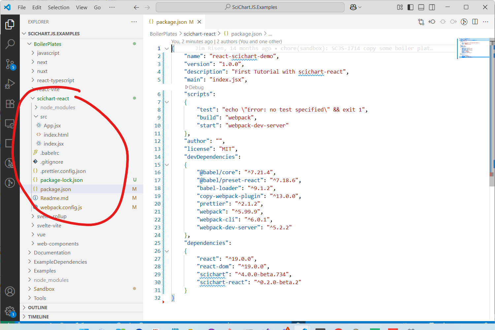
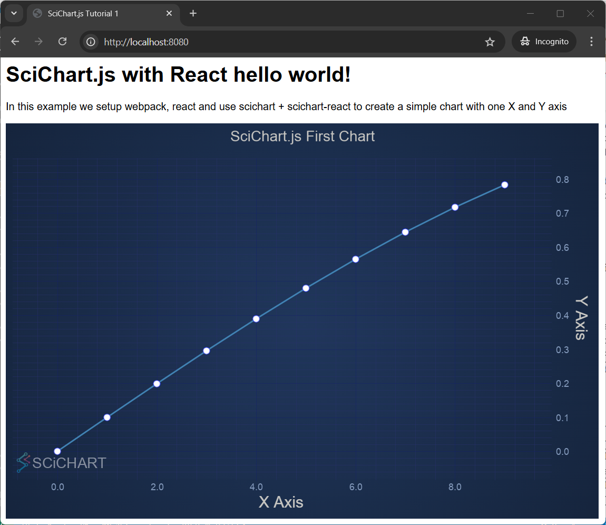

# Tutorial 01 - Setting up a project with scichart-react and config object

In this tutorial we will show you how to setup a new npm project with [scichart.js](https://www.npmjs.com/package/scichart) and [scichart-react](https://www.npmjs.com/package/scichart-react).

React requires a little setup so we'd like to do this boilerplate once, which will be used as a basis for future tutorials.

We'll show you how to create a new JavaScript project and adding **scichart** and **scichart-react** libraries as dependencies to it. Then how to use webpack to initialize the application and show an empty chart.

Finally, we'll show how to show a static chart using the **config** property which uses the [JSON Builder API](/docs/2d-charts/builder-api/builder-api-overview) to provide a chart definition.

:::tip
Source code for this tutorial [can be found in SciChart.JS.Examples repo](https://github.com/ABTSoftware/SciChart.JS.Examples/tree/dev_v4.0/BoilerPlates/scichart-react)
:::

What is SciChart-React?
-----------------------

[scichart-react](https://www.npmjs.com/package/scichart-react) is a free open source React Chart component for use with scichart.js. This simplifies the development of React Charts by handling initialisation, deletion and lifecycle of the chart and allows multiple options for creating simple to advanced options. Find out more at the links below:

*   [Blog: Introducing scichart-react](https://www.scichart.com/blog/react-charts-with-scichart-js)
*   [github.com/abtsoftware/scichart-react](https://github.com/abtsoftware/scichart-react)
*   [npmjs.com/package/scichart-react](https://www.npmjs.com/package/scichart-react)

How to Setup A Project with SciChart-React
------------------------------------------

Before starting the tutorial, lets briefly go over project initialization for React, SciChart.js and scichart-react.

### Creating the Project

Go ahead and open up VSCode or WebStorm and enter the terminal. Create a directory to host your tutorial, and type in the following command.

<CodeSnippetBlock labels={["Initialising an npm project"]}>
```bash
npm init
```
</CodeSnippetBlock>

Next, install packages. We will need react-dom, scichart and scichart-react

<CodeSnippetBlock labels={["Initialising an npm project"]}>
```bash
npm install scichart scichart-react react react-dom
```
</CodeSnippetBlock>

We will also need Webpack for npm start, and copying wasm files

<CodeSnippetBlock labels={["Initialising an npm project"]}>
```bash
npm install --save-dev webpack webpack-dev-server webpack-cli copy-webpack-plugin
```
</CodeSnippetBlock>

Finally, Babel is required for JSX files

<CodeSnippetBlock labels={["Initialising an npm project"]}>
```bash
npm install --save-dev @babel.core
npm install --save-dev @babel/preset-react
npm install --save-dev babel-loader
```
</CodeSnippetBlock>

By the time you've completed this your **package.json** should look like this:

<CodeSnippetBlock labels={["package.json"]}>
```json
{
    "name": "react-scichart-demo",
    "version": "1.0.0",
    "description": "First Tutorial with scichart-react",
    "main": "index.jsx",
    "scripts":
    {
        "test": "echo \"Error: no test specified\" && exit 1",
        "build": "webpack",
        "start": "webpack-dev-server"
    },
    "author": "",
    "license": "MIT",
    "devDependencies":
    {
        "@babel/core": "^7.21.4",
        "@babel/preset-react": "^7.18.6",
        "babel-loader": "^9.1.2",
        "copy-webpack-plugin": "^13.0.0",
        "prettier": "^2.1.2",
        "webpack": "^5.99.9",
        "webpack-cli": "^6.0.1",
        "webpack-dev-server": "^5.2.2"
    },
    "dependencies":
    {
        "react": "^19.0.0",
        "react-dom": "^19.0.0",
        "scichart": "^4.0.0-beta.734",
        "scichart-react": "^0.2.0-beta.2"
    }
}
```
</CodeSnippetBlock>



Setting up Webpack
------------------

Whichever package bundler you use, some configuration will need to be done to setup the project for React and loading JSX (or TSX if you use Typescript).

You'll have to add a **webpack.config.js** to your project which needs to load JSX/JS files, compiled to bundle.js and copy scichart wasm files to the output.

<CodeSnippetBlock labels={["webpack.config.js"]}>
```js {35-37} showLineNumbers
const path = require("path");
const CopyPlugin = require("copy-webpack-plugin");
const webpack = require("webpack");

module.exports = {
  mode: "production",
  entry: "./src/index.jsx",
  performance: {
    hints: false,
  },
  module: {
    rules: [
      {
        test: /\.(js|jsx)$/,
        exclude: /node_modules/,
        use: {
          loader: "babel-loader",
        },
      },
    ],
  },
  resolve: {
    extensions: [".js", ".jsx"],
  },
  output: {
    filename: "bundle.js",
    path: path.resolve(__dirname, "build"),
  },
  plugins: [
    new CopyPlugin({
      patterns: [
        { from: "src/index.html", to: "" },
        // Required for scichart to load wasm files for 2D charts
        // Loading from CDN is also possible by calling SciChartSurface.loadWasmFromCDN()
        { from: "node_modules/scichart/_wasm/scichart2d.wasm", to: "" },
        // Optional: if including 3D charts copy these files
        { from: "node_modules/scichart/_wasm/scichart3d.wasm", to: "" },
      ],
    }),
  ],
  devServer: {
    client: {
      overlay: {
        warnings: false,
        errors: true,
      },
    },
  },
};
```
</CodeSnippetBlock>

Note in particular the use of **CopyPlugin** (from **copy-webpack-plugin**) which copies `scichart2d.wasm` and `scichart3d.wasm` (optional for 3D charts) to the output directory.

:::tip
Other methods of loading wasm and more detail is provided in the page [Deploying Wasm (WebAssembly) files with your app](/docs/2d-charts/surface/deploying-wasm). It's even possible to load wasm from our CDN and skip this step entirely for the purpose of learning.
:::

Creating the code
-----------------

:::tip
This boilerplate/tutorial is currently optimised to work with **React 19**. Project templates with earlier versions of React (React 16, 18) as well as Electron are also demonstrated in the [scichart-react](https://github.com/ABTSoftware/scichart-react/tree/main/demos) repository on Github.
:::

Let's go ahead and create the code for our first chart with **scichart-react**. Create a folder called /src and create **index.html** and **index.jsx** file.

<CodeSnippetBlock labels={["index.html", "index.jsx"]}>
```html showLineNumbers
<html lang="en-us">
  <head>
    <meta charset="utf-8" />
    <meta content="text/html; charset=utf-8" http-equiv="Content-Type" />
    <title>SciChart.js Tutorial 1</title>
    <script async type="text/javascript" src="bundle.js"></script>
    <style>
      body {
        font-family: "Arial";
      }
    </style>
  </head>
  <body>
    <div id="root"></div>
  </body>
</html>
```
```jsx showLineNumbers
import { createRoot } from "react-dom/client";
import App from "./App";
import React from "react";

function Main() {
  return (
    <React.StrictMode>
      <App />
    </React.StrictMode>
  );
}
const root = createRoot(document.getElementById("root"));
root.render(<Main />);
```
</CodeSnippetBlock>

These two initialize the React DOM and load the root component `<Main/>` found in index.jsx.

Adding App.jsx and Creating the React Chart
-------------------------------------------

Next, add an **App.jsx** file to the project. This is where we're going to initialize our SciChart.js chart using scichart-react.

<CodeSnippetBlock labels={["App.jsx"]}>
```jsx {11,13-76,78-85,104-108} showLineNumbers
import {
  SweepAnimation,
  SciChartJsNavyTheme,
  NumberRange,
  EAxisType,
  EChart2DModifierType,
  ESeriesType,
  EPointMarkerType,
} from "scichart";
import React from "react";
import { SciChartReact } from "scichart-react";

const chartConfig = {
  surface: {
    theme: new SciChartJsNavyTheme(),
    title: "SciChart.js First Chart",
    titleStyle: { fontSize: 22 },
  },
  // Create an XAxis and YAxis with growBy padding
  xAxes: [
    {
      type: EAxisType.NumericAxis,
      options: {
        axisTitle: "X Axis",
        growBy: new NumberRange(0.1, 0.1),
      },
    },
  ],
  yAxes: [
    {
      type: EAxisType.NumericAxis,
      options: {
        axisTitle: "Y Axis",
        growBy: new NumberRange(0.1, 0.1),
      },
    },
  ],
  // Create a line series with some initial data
  series: [
    {
      type: ESeriesType.LineSeries,
      xyData: {
        xValues: [0, 1, 2, 3, 4, 5, 6, 7, 8, 9],
        yValues: [
          0, 0.0998, 0.1986, 0.2955, 0.3894, 0.4794, 0.5646, 0.6442, 0.7173,
          0.7833,
        ],
      },
      options: {
        stroke: "steelblue",
        strokeThickness: 3,
        pointMarker: {
          type: EPointMarkerType.Ellipse,
          options: {
            width: 11,
            height: 11,
            fill: "#fff",
          },
        },
        animation: new SweepAnimation({
          duration: 300,
          fadeEffect: true,
        }),
      },
    },
  ],
  // Add some interaction modifiers to show zooming and panning
  modifiers: [
    { type: EChart2DModifierType.MouseWheelZoom },
    {
      type: EChart2DModifierType.ZoomPan,
      options: { enableZoom: true },
    },
    { type: EChart2DModifierType.ZoomExtents },
  ],
};

const onInit = (initTemplate) => {
  // After creation with the builder API, onInit allows you to access and modify the chart state
  const sciChartSurface = initTemplate.sciChartSurface;
  const wasmContext = sciChartSurface.webAssemblyContext2D;

  // for example. adding extra series
  // sciChartSurface.renderableSeries.add(new FastLineRenderableSeries(wasmContext, { ... options }));
};

function App() {
  // LICENSING
  // Commercial licenses set your license code here
  // SciChartSurface.setRuntimeLicenseKey("YOUR_RUNTIME_KEY");

  // to use WebAssembly and Data files from CDN instead of the same origin
  // SciChartSurface.loadWasmFromCDN();

  return (
    <div className="App">
      <header className="App-header">
        <h1>SciChart.js with React hello world!</h1>
        <p>
          In this example we setup webpack, react and use scichart +
          scichart-react to create a simple chart with one X and Y axis
        </p>
      </header>
      <SciChartReact
        config={chartConfig}
        onInit={onInit}
        style={{ maxWidth: 900, height: 600 }}
      />
    </div>
  );
}

export default App;
```
</CodeSnippetBlock>

The `<SciChartReact />` component renders a single scichart chart. **config** is a prop which requires a JSON object matching the [Builder API schema](/docs/2d-charts/builder-api/builder-api-overview) which can define your chart. Check the `chartConfig` in the code above.

:::tip
Another option to create chart using standard API (not the Builder API) is to use `onInit` property.
:::

### Breaking down App.jsx

This example demonstrates how to build a basic chart using **SciChart.js** with React and the `<SciChartReact />` component. SciChart.js is a powerful charting library for high-performance data visualization, and this code shows one way to initialize a chart using a **configuration object** with the [Builder API](/docs/2d-charts/builder-api/builder-api-overview) in SciChart.

The `<SciChartReact />` component from the SciChart library acts as a React wrapper for the SciChartSurface. It allows you to create charts using a configuration object: A declarative, JSON-like way to define the chart, or, an **initialization function**: A programmatic way to define the chart.

In this example, the `chartConfig` object contains all the details needed to set up the chart, such as axes, series, modifiers, and themes. You pass this configuration to the `<SciChartReact config={chartConfig} />` component, and SciChart automatically builds the chart for you.

Using a `chartConfig` object is simple and quick, and ideal for creating static charts. However, if you wish to dynamically create or update charts and have better access to the SciChart API, you can also pass an initialization function to `<SciChartReact />`

### Understanding chartConfig

**config**: is the JSON object which defines the chart.  In this code we initialize a [SciChartSurface:blue_book:](https://www.scichart.com/documentation/js/current/typedoc/classes/scichartsurface.html) with the [SciChartJsNavyTheme:blue_book:](https://www.scichart.com/documentation/js/current/typedoc/classes/scichartjsnavytheme.html), set the title equal to "SciChart.js First Chart" and set `titleStyle` to have a `fontSize` of 22. We create a single XAxis and YAxis of type [NumericAxis:blue_book:](https://www.scichart.com/documentation/js/current/typedoc/classes/numericaxis.html), with an `axisTitle` and set `growBy` - a property which allows you to set padding on the top/bottom of an axis when autofitting to the data.

We define a single series of [ESeriesType.LineSeries:blue_book:](https://www.scichart.com/documentation/js/current/typedoc/enums/eseriestype.html#lineseries) and pass some xyData with predefined xValues and yValues. Options to the series include `stroke`, `strokeThickness`, `pointMarker` (whch renders an Ellipse at each datapoint) and a [SweepAnimation:blue_book:](https://www.scichart.com/documentation/js/current/typedoc/classes/sweepanimation.html) which animates the chart on startup.

Finally, we add modifiers - or [Chart Modifiers](/docs/2d-charts/chart-modifier-api/chart-modifier-api-overview) - behaviours which modify the chart such as [zoomEChart2DModifierType.MouseWheelZoom:blue_book:](https://www.scichart.com/documentation/js/current/typedoc/enums/echart2dmodifiertype.html#mousewheel), [ZoomPan:blue_book:](https://www.scichart.com/documentation/js/current/typedoc/enums/echart2dmodifiertype.html#zoompan), and [ZoomExtents:blue_book:](https://www.scichart.com/documentation/js/current/typedoc/enums/echart2dmodifiertype.html#zoomextents). Further modifiers are possible which allow you to add tooltips, legends, selection and more.

This config object hydrates the chart and presents you with a static chart that you can interact with. Further modification of the chart is possible by adding an `onInit` callback to `<SciChartReact />` which allows you to access the hydrated SciChartSurface instance.

Future tutorials will dig into the specifics of initializing and configuring charts, but this one serves to show you how to get a SciChart.js chart into React quickly.

The Output Result
-----------------

If you run the application by typing **npm start** in the terminal, you should see this!



:::tip
It's advisable to check out the [SciChart.Js.Examples](https://github.com/ABTSoftware/SciChart.JS.Examples/) Github Repository and run the project under [Boilerplates/scichart-react](https://github.com/ABTSoftware/SciChart.JS.Examples/tree/dev_v4.0/BoilerPlates/scichart-react). You can use this as a basis for future projects with scichart-react and our next set of tutorials will be based on it. Happy coding!
:::

:::warning
**A note about SciChartSurface.delete():**

`<SciChartReact />` automatically calls [sciChartSurface.delete():blue_book:](https://www.scichart.com/documentation/js/current/typedoc/classes/scichartsurface.html#delete), ensuring that all wasm memory is disposed on component unmount. This cascades and calls [dataSeries.delete():blue_book:](https://www.scichart.com/documentation/js/current/typedoc/classes/xydataseries.html#delete) on all data currently in the chart. If you dynamically add/remove series however you will need to delete these as you go along. For more info see the article on [Deleting DataSeries Memory](/docs/2d-charts/chart-types/data-series-api/deleting-memory).
:::