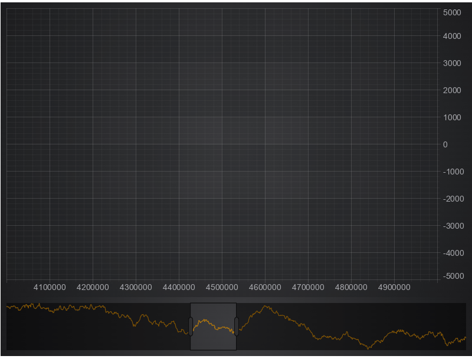

# Virtualized data example JS RxJS from CDN without NPM

A customer asked how to create this https://scichart.com/demo/react/chart-with-virtualized-data example in JavaScript.
The difficulty was not converting TypeScript to JavaScript but how to handle imports for `SciChart.js` and `RxJS`.

First we need to create `index.html` file

<CodeSnippetBlock labels={["index.html"]}>
```html {7,11,15,21-22} showLineNumbers
<html lang="en-us">

<head>
  <meta charset="utf-8" />
  <meta content="text/html; charset=utf-8" http-equiv="Content-Type" />
  <title>SciChart.js Browser Bundle Tutorial 1</title>
  <script src="https://unpkg.com/rxjs@^7/dist/bundles/rxjs.umd.min.js"></script>
  <script type="importmap">
    {
      "imports": {
        "scichart": "https://cdn.jsdelivr.net/npm/scichart@4.0.0-beta.788/_wasm/scichart.browser.mjs"
      }
    }
  </script>
  <script type="module" src="index.js"></script>
</head>

<body>
  <h1>Hello SciChart.js world!</h1>
  <!-- the Div where the SciChartSurface will reside -->
  <div id="scichart-root" style="width: 800px; height: 500px"></div>
  <div id="scichart-overview" style="width: 800px; height: 100px"></div>
</body>

</html>
```
</CodeSnippetBlock>

First we load RxJS from CDN. Next we add importmap to define `scichart` module which we also load from CDN. Finally we add the main `index.js` file which have `type="module"` this means it is ES module and we can use imports in the browser.

Second we create index.js file

<CodeSnippetBlock labels={["index.html"]}>
```js {1,182-184} showLineNumbers
const { Subject, debounceTime } = rxjs;

import {
  easing,
  EAutoRange,
  EAxisAlignment,
  EHorizontalAnchorPoint,
  EVerticalAnchorPoint,
  EWrapTo,
  EXyDirection,
  FastLineRenderableSeries,
  MouseWheelZoomModifier,
  NativeTextAnnotation,
  NumberRange,
  NumericAxis,
  SciChartOverview,
  SciChartSurface,
  XAxisDragModifier,
  XyDataSeries,
  YAxisDragModifier,
  ZoomExtentsModifier,
  ZoomPanModifier,
  ECoordinateMode,
} from "scichart";

export const getChartsInitializationApi = () => {
  let mainSurface;
  let mainXAxis;
  let mainDataSeries;

  const createMainChart = async (rootElement) => {
    const { wasmContext, sciChartSurface } = await SciChartSurface.create(
      rootElement
    );
    const xAxis = new NumericAxis(wasmContext, {
      axisAlignment: EAxisAlignment.Bottom,
      visibleRange: new NumberRange(4000000, 5000000),
      autoRange: EAutoRange.Never,
      labelPrecision: 0,
      useNativeText: true,
    });

    sciChartSurface.xAxes.add(xAxis);
    const yAxis = new NumericAxis(wasmContext, {
      axisAlignment: EAxisAlignment.Right,
      visibleRange: new NumberRange(-5000, 5000),
      autoRange: EAutoRange.Never,
      labelPrecision: 0,
      useNativeText: true,
    });
    sciChartSurface.yAxes.add(yAxis);

    const dataSeries = new XyDataSeries(wasmContext, {
      containsNaN: false,
      isSorted: true,
    });
    const rendSeries = new FastLineRenderableSeries(wasmContext, {
      dataSeries,
      strokeThickness: 2,
      stroke: "orange",
    });
    sciChartSurface.renderableSeries.add(rendSeries);
    rendSeries.rolloverModifierProps.tooltipTextColor = "black";
    rendSeries.rolloverModifierProps.showRollover = true;

    sciChartSurface.chartModifiers.add(
      new ZoomExtentsModifier({ xyDirection: EXyDirection.YDirection }),
      new XAxisDragModifier(),
      new YAxisDragModifier(),
      new ZoomPanModifier({ enableZoom: true }),
      new MouseWheelZoomModifier()
    );

    // Create an observable stream
    const subject = new Subject();

    // Push visible range changes into the observable
    xAxis.visibleRangeChanged.subscribe(async (args) => {
        subject.next(args.visibleRange);
    });

    // subscribe to the observable with a debounce
    subject.pipe(debounceTime(250)).subscribe((r) => {
        // Fetch data and update the dataSeries
        loadPoints(r.min, r.max, sciChartSurface.domCanvas2D.width, dataSeries)
            .then(() => {
                // Update the y axis
                const yRange = yAxis.getWindowedYRange(null);
                yAxis.animateVisibleRange(yRange, 250, easing.outExpo);
            })
            .catch((err) =>
                showError(
                    sciChartSurface,
                    "Server data is unavailable.  Please do npm run build, then npm start and access the site at localhost:3000"
                )
            );
    });

    mainSurface = sciChartSurface;
    mainXAxis = xAxis;
    mainDataSeries = dataSeries;

    return { sciChartSurface };
  };

  const createOverview = async (rootElement) => {
    const overview = await SciChartOverview.create(mainSurface, rootElement);
    const overviewData = new XyDataSeries(mainSurface.webAssemblyContext2D, {
      containsNaN: false,
      isSorted: true,
    });
    // Load the full dataSet
    loadPoints(
      0,
      10000000,
      overview.overviewSciChartSurface.domCanvas2D.width,
      overviewData
    ).catch((err) => {});

    const overviewSeries =
      overview.overviewSciChartSurface.renderableSeries.get(0);
    overviewSeries.dataSeries = overviewData;
    overview.overviewSciChartSurface.zoomExtents();

    return { sciChartSurface: overview.overviewSciChartSurface };
  };

  const afterOverviewInit = () => {
    // Load initial data
    loadPoints(
      mainXAxis.visibleRange.min,
      mainXAxis.visibleRange.max,
      mainSurface.domCanvas2D.width,
      mainDataSeries
    )
      .then(() => {
        mainSurface.zoomExtents();
      })
      .catch((err) =>
        showError(
          mainSurface,
          "Server data is unavailable.  Please do npm run build, then npm start and access the site at localhost:3000"
        )
      );
  };

  return { createMainChart, createOverview, afterOverviewInit };
};

const loadPoints = async (xFrom, xTo, chartWidth, dataSeries) => {
  chartWidth = Math.floor(chartWidth);

  const response = await fetch(`https://scichart.com/demo/api/data/${xFrom}-${xTo}/${chartWidth}`);
  const data = await response.json();
  console.log(`Loaded ${data.x.length} points`);
  dataSeries.clear();
  dataSeries.appendRange(data.x, data.y);
};

const showError = (sciChartSurface, message) => {
  if (!sciChartSurface.annotations.getById("error")) {
    sciChartSurface.annotations.add(
      new NativeTextAnnotation({
        id: "error",
        text: message,
        x1: 0.5,
        y1: 0.5,
        textColor: "red",
        fontSize: 24,
        horizontalAnchorPoint: EHorizontalAnchorPoint.Center,
        verticalAnchorPoint: EVerticalAnchorPoint.Center,
        xCoordinateMode: ECoordinateMode.Relative,
        yCoordinateMode: ECoordinateMode.Relative,
        lineSpacing: 5,
        wrapTo: EWrapTo.ViewRect,
      })
    );
  }
};

const api = getChartsInitializationApi();
api
  .createMainChart("scichart-root")
  .then(() => api.createOverview("scichart-overview"));
```
</CodeSnippetBlock>

RxJS does not provide ES module export, which is why we can not include script with type "module" and therefore we must use global constant instead
`const { Subject, debounceTime } = rxjs;`

The overview must be created after the main chart

```js
api
  .createMainChart("scichart-root")
  .then(() => api.createOverview("scichart-overview"));
```

We can run the example by starting python server in the folder 

```bash
python3 -m http.server 8000
```

This results in



Each time we change the visible range new data gets loaded.