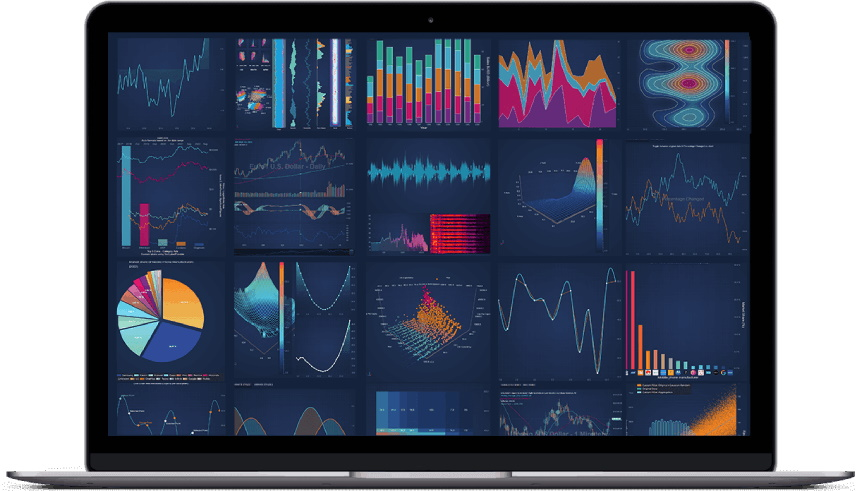

# SciChart.js Documentation version 4

:::tip
Are you new to SciChart? Check out our most popular pages to get started below:

* [Table of Content](/user-manual/toc/index.md)
* [Tutorials (JavaScript APIs / npm / webpack)](/get-started/tutorials-js-npm-webpack/tutorial-01-setting-up-npm-project-with-scichart-js/index.md)
* [The SciChartSurface Type](/2d-charts/surface/scichart-surface-type-overview/index.md)        
* [Series or Chart Types](/2d-charts/chart-types/renderable-series-api-overview/index.md)
* [Axis Types and Configuration](/2d-charts/axis-api/axis-api-overview/index.md)
* [Zooming & Panning](/2d-charts/chart-modifier-api/zooming-and-panning/zoom-pan-modifier/index.md)
* [Tooltips](/2d-charts/chart-modifier-api/rollover-modifier/index.md)
* [Annotations and Markers](/2d-charts/annotations-api/annotations-api-overview/index.md)
* [Styling and Themeing](/2d-charts/styling-and-theming/theme-manager-api/index.md)
* [Chart Synchronization APIs](/2d-charts/chart-synchronization-api/synchronizing-multiple-charts/index.md)
* [3D charts Basics](/3d-charts/scichart-3d-basics/scichart-3d-basics-overview/index.md)
:::

# What is SciChart.js?

SciChart.js is a [High-Performance Real-time 2D and 3D JavaScript Charting Library](https://www.scichart.com/javascript-chart-features).
Designed for use in scientific, financial, trading, engineering, medical and business apps where you require extreme speed, rich interactivity and depth of features and flexibility in a [JavaScript chart](https://www.scichart.com/javascript-chart-features).

Across [Windows](https://www.scichart.com/wpf-chart-features), [iOS/macOS](https://www.scichart.com/ios-charts), [Android](https://www.scichart.com/android-charts) and now [JavaScript](https://www.scichart.com/javascript-chart-features), the SciChart Family is now in its 7th generation, and provides an extremely rich, fast and interactive JavaScript charting experience with a wide array of chart types, and the [JavaScript Charting Library](https://www.scichart.com/javascript-chart-features) is the newest edition to our portfolio, bringing high-performance, realtime charts to web browsers and JavaScript applications.

The SciChart family is used by thousands of customers in over 80 countries worldwide, in sectors ranging from Defence to Medical,
Financial and Trading to Oil & Gas, Process Management to Formula 1.

When you become a SciChart customer, you join a community of developers support by a world-class **JavaScript**, **WebGL** and **WebAssembly** graphics & visualisation team and domain-experts around scientific visualisation, performance optimisation and low-level software techniques.

We want you to enjoy using our products as much as we enjoy making them, as well as to succeed, so if you have any feedback good or bad, please get in touch as **we want to hear from you**.

The following document serves as a reference and an overview of the features in the SciChart.js JavaScript SDK. For a complete code
reference, see the [TypeDoc API Documentation:blue_book:](https://www.scichart.com/documentation/js/v4/typedoc/index.html)
and the [SciChart.js Examples Suite](https://www.scichart.com/demo), which contains many code samples you can run, export and modify for yourself.