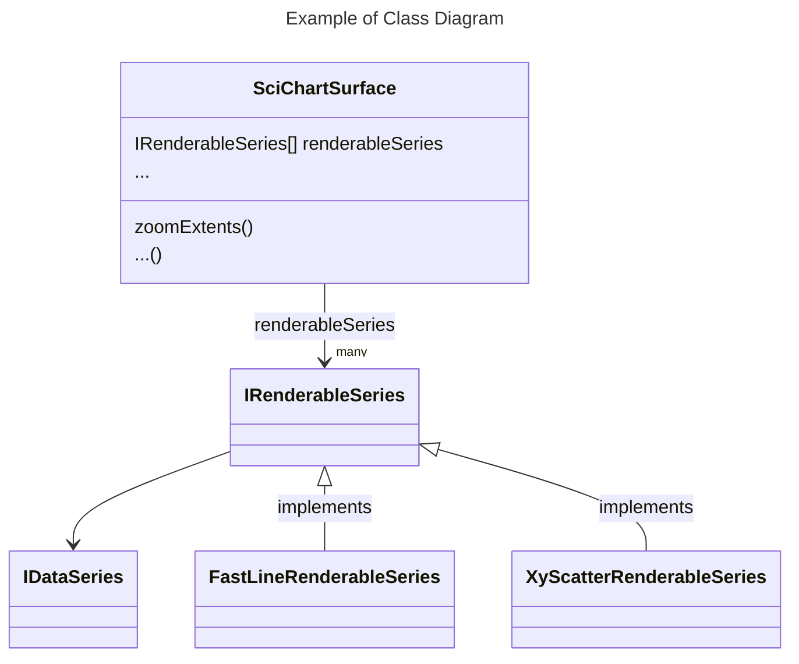

# SciChart.js Docs Contributing Guide

## For Creating Examples we use TypeScript where it is possible

Create a `demo.ts` file and run snippets compiler in watch mode ` npm run compileSnippets:watch` it will watch for changes and generate `demo.js` file.

In the documentation always reference the ts file, for example:

```text
ts showLineNumbers file=./PaletteProvider/demo.ts start=region_A_start end=region_A_end
```

If after changing `demo.ts` file the code snippet does not update, delete and insert it again.

## Use titles wisely

The title h1, h2, h3 can be created using one, two or three hash symbols (#, ##, ###). The docusaurus uses these title for the search autocomplete. Therefore, give titles wisely to have a useful search. For example, in order to see PolarBandRenderableSeries in the search, I've created a h2 title with 
```
## Create PolarBandRenderableSeries
```

## Formatting suggestions

It would be nice to have a fixed set of markdown formatting and to stick to it. Here are elements I find useful.

### Tip

Tip Example

:::tip
Info about the properties and functions available can be found at the [TypeDoc API Documentation for SciChart:blue_book:](https://www.scichart.com/documentation/js/v4/typedoc/index.html).
:::

### Quotation

Quotation Example

> For more information about Chart Modifier types in SciChart, head over to the [ChartModifier API documentation](/docs/2d-charts/chart-modifier-api/chart-modifier-api-overview/README.md) or see our [Examples](https://scichart.com/demo/react).


### Class diagram

Mermaid class diagram example



## TypeDoc links

In order to make all TypeDoc links distinct I would suggest to use a book icon `:blue_book:`, this is an example of SciChartSurface class typedoc link

[SciChartSurface:blue_book:](https://www.scichart.com/documentation/js/v4/typedoc/classes/scichartsurface.html)

## Marking document status

Use this symbols to mark the status of menu items

⭕ - new documentation to write

⚠️ - existing doc to update

🔄 - in progress

✅ - done

# Naming convention

1. It is recommended to **create a separate folder for each document** and to put `index.md` or `index.mdx` file inside. Having a separate folder is preferable because often documentation contains doc-snippets and it is nice to have them in the same folder.
2. In order to have nice URLs it is recommended to create folder names in a **kebab-case notation** like `my-folder-name`.
