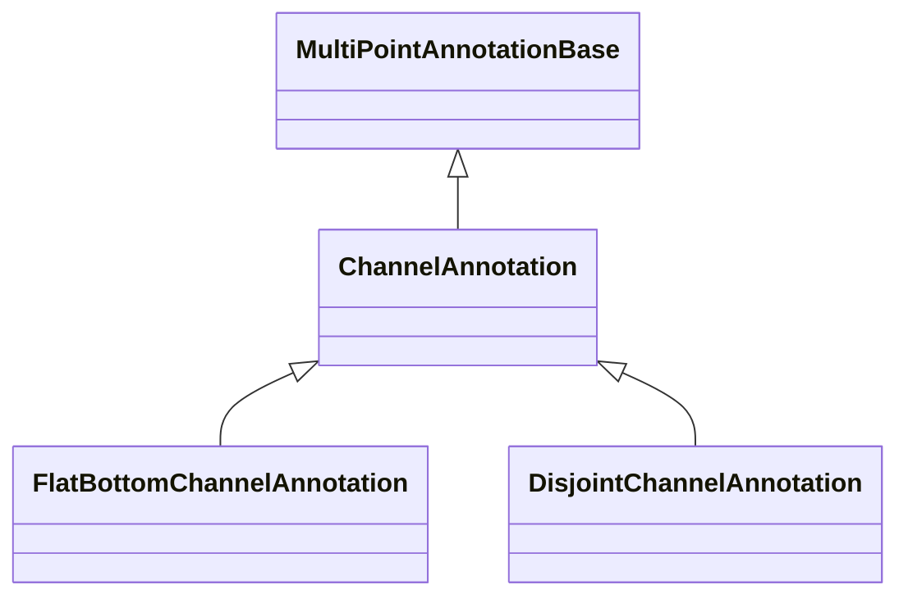

# Channel Annotations

Channel annotations draw channels from three placement points. The first two points define the first edge; the third point controls how the second edge is derived.

| Annotation | Channel behavior |
| --- | --- |
| [ChannelAnnotation](/scichart-extensions/scichart-financial-tools/annotation-types/channel-annotations/channel-annotation/) | The default [ChannelAnnotation:blue_book:](https://www.scichart.com/documentation/js/v5/typedoc-fin-tools/classes/channelannotation.html), with parallel top and bottom edges. |
| [FlatBottomChannelAnnotation](/scichart-extensions/scichart-financial-tools/annotation-types/channel-annotations/flat-bottom-channel/) | Keeps the lower edge horizontal so it can represent a fixed support level. |
| [DisjointChannelAnnotation](/scichart-extensions/scichart-financial-tools/annotation-types/channel-annotations/disjoint-channel/) | Mirrors the first edge from a constrained offset point, allowing disjoint channel edges. |

All channel variants inherit multi-point labels, segment labels, edit grips, midpoint grips and axis labels from [MultiPointAnnotationBase:blue_book:](https://www.scichart.com/documentation/js/v5/typedoc-fin-tools/classes/multipointannotationbase.html).

:::tip
- `ChannelAnnotation` gives you `showMidLine`, `midLineStrokeDashArray`, `showMidPointGrips` and `fill` so you can tune both the geometry and the visual weight of the channel.
- `FlatBottomChannelAnnotation` keeps the lower edge horizontal while still reusing the same channel styling model.
- `DisjointChannelAnnotation` defaults `showMidPointGrips` to `false` and renders its third grip as a square, vertical-only handle.
:::

#### See Also

- [ChannelAnnotation](/scichart-extensions/scichart-financial-tools/annotation-types/channel-annotations/channel-annotation/)
- [FlatBottomChannelAnnotation](/scichart-extensions/scichart-financial-tools/annotation-types/channel-annotations/flat-bottom-channel/)
- [DisjointChannelAnnotation](/scichart-extensions/scichart-financial-tools/annotation-types/channel-annotations/disjoint-channel/)
- [Fibonacci channel](/scichart-extensions/scichart-financial-tools/annotation-types/fibonacci-annotations/fibonacci-channel/)
- [Multi-Point Labels Deep Dive](/scichart-extensions/scichart-financial-tools/annotation-types/multipoint-annotations/)
