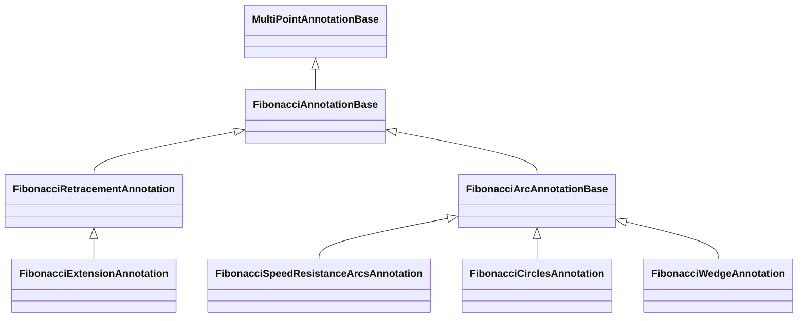

# Fibonacci Annotations

Fibonacci annotations share a common base: [FibonacciAnnotationBase:blue_book:](https://www.scichart.com/documentation/js/v5/typedoc-fin-tools/classes/fibonacciannotationbase.html). It provides the level thresholds, colored regions, connector lines and level labels used by retracements, extensions and arc-based Fibonacci tools.

<LiveDocSnippet maxWidth={"100%"} includeFinTools name="./demo" />

<CodeSnippetBlock labels={["TS"]}>
    ```ts {8,17,29,36} showLineNumbers file=./demo.ts start=#region_A_start end=#region_A_end
    ```
</CodeSnippetBlock>

## Shared Properties

Use [thresholds:blue_book:](https://www.scichart.com/documentation/js/v5/typedoc-fin-tools/classes/fibonacciannotationbase.html#thresholds) to choose which levels are drawn.  
The default list includes common ratios: 
```ts
[0, 0.236, 0.382, 0.5, 0.618, 0.786, 1, 1.618, 2.618, 3.618, 4.236]
```

Use [regionColors:blue_book:](https://www.scichart.com/documentation/js/v5/typedoc-fin-tools/classes/fibonacciannotationbase.html#regioncolors) and [fillOpacity:blue_book:](https://www.scichart.com/documentation/js/v5/typedoc-fin-tools/classes/fibonacciannotationbase.html#fillopacity) to style the bands between consecutive thresholds. If `regionColors` has fewer colors than the number of bands, SciChart interpolates the missing colors. If it has one color, that color is reused for every band.  
The default is: 
```ts
["#F87171","#FB8B62","#FBA55A","#FBC35A","#F5D86A","#D2E26F","#9EDB7E","#70CEA5","#7FAECE","#A1A1AA"]
```

Use [showConnectorLine:blue_book:](https://www.scichart.com/documentation/js/v5/typedoc-fin-tools/classes/fibonacciannotationbase.html#showconnectorline), [connectorLineStroke:blue_book:](https://www.scichart.com/documentation/js/v5/typedoc-fin-tools/classes/fibonacciannotationbase.html#connectorlinestroke) and [connectorLineStrokeDashArray:blue_book:](https://www.scichart.com/documentation/js/v5/typedoc-fin-tools/classes/fibonacciannotationbase.html#connectorlinestrokedasharray) to show how the placement points define the annotation.

## Line and Connector Styling

Use [strokeDashArray:blue_book:](https://www.scichart.com/documentation/js/v5/typedoc-fin-tools/classes/fibonacciannotationbase.html#strokedasharray) to style the Fibonacci level lines or arcs. This is independent from `connectorLineStrokeDashArray`, which styles only the placement connector.

Line-based Fibonacci tools also support [extendStart:blue_book:](https://www.scichart.com/documentation/js/v5/typedoc-fin-tools/classes/fibonacciannotationbase.html#extendstart) and [extendEnd:blue_book:](https://www.scichart.com/documentation/js/v5/typedoc-fin-tools/classes/fibonacciannotationbase.html#extendend). Both default to `false`. They extend retracement, extension, and skewed Fibonacci-channel level lines and colored bands to the chart boundary. “Start” and “end” follow the calculated level-line point order, so they are not always the same as screen-left and screen-right.

:::note
`extendStart` and `extendEnd` do not extend Fibonacci circles, speed-resistance arcs, or wedges. Their level geometry can still use `strokeDashArray`.
:::

Fibonacci annotations have two label systems. Inherited multi-point labels describe anchors or segments. Fibonacci level labels describe each threshold and are configured with [fibonacciLabelPlacement:blue_book:](https://www.scichart.com/documentation/js/v5/typedoc-fin-tools/classes/fibonacciannotationbase.html#fibonaccilabelplacement), [fibonacciLabelColorMode:blue_book:](https://www.scichart.com/documentation/js/v5/typedoc-fin-tools/classes/fibonacciannotationbase.html#fibonaccilabelcolormode), [fibonacciLabelFontSize:blue_book:](https://www.scichart.com/documentation/js/v5/typedoc-fin-tools/classes/fibonacciannotationbase.html#fibonaccilabelfontsize), [fibonacciLabelLinePadding:blue_book:](https://www.scichart.com/documentation/js/v5/typedoc-fin-tools/classes/fibonacciannotationbase.html#fibonaccilabellinepadding) and [formatFibonacciLabel:blue_book:](https://www.scichart.com/documentation/js/v5/typedoc-fin-tools/classes/fibonacciannotationbase.html#formatfibonaccilabel).

:::tip
- `FibonacciRetracementAnnotation` is the one Fibonacci tool that can switch between 2-point vertical mode and 3-point skewed mode via `verticalOnly`.
- The new [Fibonacci channel](/scichart-extensions/scichart-financial-tools/annotation-types/fibonacci-annotations/fibonacci-channel/) page shows the 3-point skewed retracement recipe in a channel-like layout.
:::

## Placement Points

| Annotation | Placement points | Meaning |
| --- | ---: | --- |
| [FibonacciRetracementAnnotation](/scichart-extensions/scichart-financial-tools/annotation-types/fibonacci-annotations/retracement/) | 2 by default, 3 in skewed mode | Point 1 to point 2 defines the retraced move. In skewed mode point 3 defines the parallel level direction. |
| [Fibonacci channel](/scichart-extensions/scichart-financial-tools/annotation-types/fibonacci-annotations/fibonacci-channel/) | 3 | Skewed retracement recipe: a retracement that behaves like a channel when `verticalOnly: false`. |
| [FibonacciExtensionAnnotation](/scichart-extensions/scichart-financial-tools/annotation-types/fibonacci-annotations/extension/) | 3 | Points 1 and 2 define the measured trend. Point 3 anchors the projected levels. |
| [FibonacciSpeedResistanceArcsAnnotation](/scichart-extensions/scichart-financial-tools/annotation-types/fibonacci-annotations/speed-resistance-arcs/) | 2 | Point 1 is the center. Point 2 defines threshold `1` radius and top/bottom direction. |
| [FibonacciCirclesAnnotation](/scichart-extensions/scichart-financial-tools/annotation-types/fibonacci-annotations/circles/) | 2 | The points are opposite corners of the threshold `1` oval. |
| [FibonacciWedgeAnnotation](/scichart-extensions/scichart-financial-tools/annotation-types/fibonacci-annotations/wedge/) | 3 | Point 1 is the center. Points 2 and 3 define the wedge angle at the same radius. |



#### See Also

- [FibonacciRetracementAnnotation](/scichart-extensions/scichart-financial-tools/annotation-types/fibonacci-annotations/retracement/)
- [Fibonacci channel](/scichart-extensions/scichart-financial-tools/annotation-types/fibonacci-annotations/fibonacci-channel/)
- [FibonacciExtensionAnnotation](/scichart-extensions/scichart-financial-tools/annotation-types/fibonacci-annotations/extension/)
- [FibonacciCirclesAnnotation](/scichart-extensions/scichart-financial-tools/annotation-types/fibonacci-annotations/circles/)
- [FibonacciSpeedResistanceArcsAnnotation](/scichart-extensions/scichart-financial-tools/annotation-types/fibonacci-annotations/speed-resistance-arcs/)
- [FibonacciWedgeAnnotation](/scichart-extensions/scichart-financial-tools/annotation-types/fibonacci-annotations/wedge/)
- [Adorner properties](/scichart-extensions/scichart-financial-tools/annotation-types/adorner-properties/)
